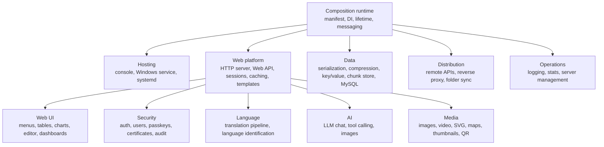
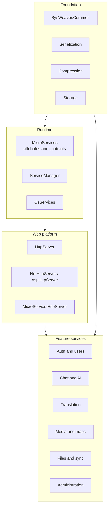
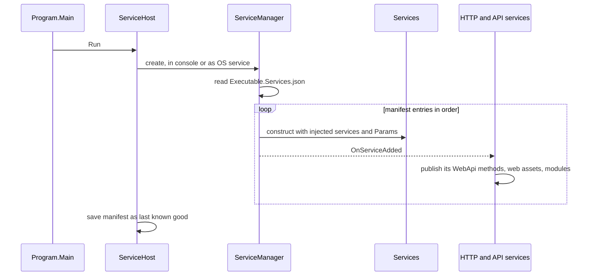
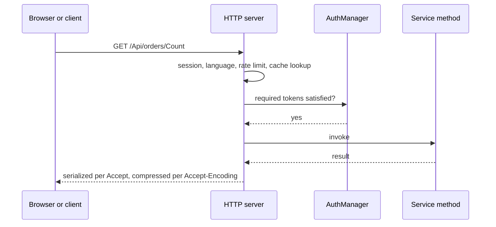
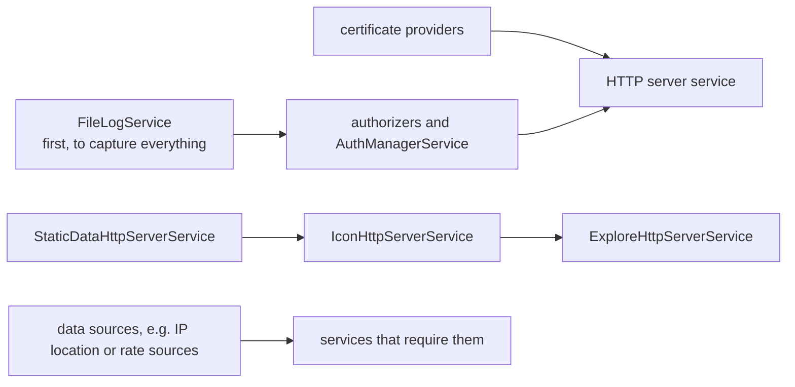

```
                                //////////\   ////\       ////\   //////////\
                              ////\_\_\_////\ ////\       ////\ ////\_\_\_////\
                              ////\     \_\_/ \_////\   ////\_/ ////\     \_\_/
                              \_//////////\     \_////////\_/   \_//////////\
                                \_\_\_\_////\     \_////\_/       \_\_\_\_////\
                              ////\     ////\       ////\       ////\     ////\
                              \_//////////\_/       ////\       \_//////////\_/
                                \_\_\_\_\_/         \_\_/         \_\_\_\_\_/

              ////\     ////\ ////////////\         ////\   ////\ ////////////\ //////////\
              ////\     ////\ ////\_\_\_\_/       //////\   ////\ ////\_\_\_\_/ ////\_\_////\
              ////\     ////\ ////\             ////////\   ////\ ////\         ////\   ////\
              ////\ //\ ////\ ////////\       ////\_////\ ////\_/ ////////\     //////////\_/
              ////\ //\ ////\ ////\_\_/     ////\_/ ////////\_/   ////\_\_/     ////\_\_////\
              //////\_//////\ ////\         ////\   //////\_/     ////\         ////\   ////\
              ////\_/ \_////\ ////////////\ ////\   ////\_/       ////////////\ ////\   ////\
              \_\_/     \_\_/ \_\_\_\_\_\_/ \_\_/   \_\_/         \_\_\_\_\_\_/ \_\_/   \_\_/
```

> ⚠️ **DISCLAIMER**  
>         SysWeaver is used in my personal and proffesional work.  
>         It's **not** intended for wide public consumption.  
>         I move fast, refactor and break things regulary.  
>         Use at your own risk!  

# OVERVIEW

A framework for building services in .NET on Linux and Windows.  
Focus is on building robust primitives for large systems.  
Functionality is centered around a web server and an easy way to add API's.  


Functionality of a specific service is configured in a single json file that declares what micro-services to use and their parameters.  
  
  
  
⚠ All README.md's are generated by AI, there might be mistakes!  
  
    

# SysWeaver — architecture overview

> SysWeaver is a .NET framework for building server applications out of small, annotated micro services that are composed by configuration and exposed through a built-in web platform. This documentation describes the architecture and the role of each project; the source code remains the reference for member-level details.

> **Note from the repository README (paraphrased):** SysWeaver is used in the author's personal and professional work, is not aimed at wide public consumption, is refactored frequently and may break. It is MIT licensed.

## Contents

- [What SysWeaver is](#what-sysweaver-is)
- [Capability map](#capability-map)
- [Architecture](#architecture)
- [Runtime model](#runtime-model)
- [Core concepts](#core-concepts)
- [Hello world](#hello-world)
- [Manifest ordering rules](#manifest-ordering-rules)
- [Project map](#project-map)
- [Platform and build notes](#platform-and-build-notes)
- [Repository layout](#repository-layout)

## What SysWeaver is

An application built on SysWeaver is a small executable plus a **service manifest** (JSON). The manifest lists the services to run and their parameters; the framework creates them, connects them and serves them over HTTP. Most functionality — web server, authentication, user accounts, file sync, chat, AI, translation, media — is itself delivered as services you switch on by adding a manifest entry.

Design principles visible throughout the code base:

| Principle | How it shows up |
|---|---|
| **Composition by configuration** | Services are instantiated from the manifest with constructor injection; changing what runs requires no code change. |
| **Plain classes, declarative behaviour** | A service is an ordinary class; attributes publish methods as web APIs, add menu entries, set auth, caching, rate limits and auditing. |
| **Discovery through the registry** | Services find each other through the service manager at runtime and react to services added later, so features plug into each other without references. |
| **Contracts over implementations** | Serializers, compressors, translators, certificate providers, authorizers, browsers and more are interfaces with interchangeable implementations. |
| **Local or remote, same interface** | An interface can be served by a local implementation or a generated HTTP proxy to another server, chosen in the manifest. |
| **Self-describing systems** | XML documentation becomes help text, API docs, config comments and table descriptions; every server exposes diagnostic tables about itself. |
| **Batteries included** | A complete web UI shell, table/chart/editor components, icons, login pages and admin tools are embedded in the assemblies. |

## Capability map



## Architecture



| Layer | Responsibility | Entry points |
|---|---|---|
| Foundation | Environment, configuration, folders, messaging, toolbox, data formats and codecs, local storage | [SysWeaver.Common](SysWeaver.Common/README.md), [SysWeaver.Serialization](SysWeaver.Serialization/README.md), [SysWeaver.Compression](SysWeaver.Compression/README.md), [SysWeaver.Storage](SysWeaver.Storage/README.md) |
| Runtime | Service declaration vocabulary, composition and lifetime, OS hosting | [SysWeaver.MicroServices](SysWeaver.MicroServices/README.md), [SysWeaver.MicroServices.ServiceManager](SysWeaver.MicroServices.ServiceManager/README.md), [SysWeaver.OsServices](SysWeaver.OsServices/README.md) |
| Web platform | HTTP pipeline, Web API engine, file serving, sessions, UI shell, service integration | [SysWeaver.HttpServer](SysWeaver.HttpServer/README.md), [SysWeaver.MicroService.HttpServer](SysWeaver.MicroService.HttpServer/README.md) |
| Features | Optional capabilities delivered as services | see [Project map](#project-map) |

## Runtime model

### Startup



### Handling a web request



### Late binding between services

Infrastructure services subscribe to the manager's *service added/removed* events. That is why adding, say, the chat service automatically adds its APIs, its web pages and its menu entries — nobody registers them explicitly.

## Core concepts

### Service manifest

A JSON array of `{ "Type": "Namespace.Class, Assembly", "Name": "...", "Params": { ... } }` entries, read from `<Executable>.Services.<Os>.json` (OS-specific) or `<Executable>.Services.json`. Comments and trailing commas are allowed. Entries are processed in order; each is constructed with the richest constructor whose parameters can be satisfied from already registered services, the manager itself and the entry's `Params`. Serializer and compressor plug-ins are registered instead of instantiated, and an *interface* type with connection parameters becomes a remote proxy. Details: [SysWeaver.MicroServices.ServiceManager](SysWeaver.MicroServices.ServiceManager/README.md).

### Web APIs

Public methods marked `[WebApi]` on any registered service are published under `/Api/<class url>/<method>`. A method takes one parameter (plus an optional request context); GET requests carry it as a single URL-encoded value in the query string (typically JSON), POST requests in the body. Output format and compression are negotiated with the client. Auth is declared per method or class as a list of role tokens. Details: [SysWeaver.HttpServer](SysWeaver.HttpServer/README.md).

### Web UI

The HTTP server embeds a single-page application shell. Services extend it declaratively: `[WebMenu*]` attributes add menu items; table-data APIs are shown in a generic, sortable, filterable grid ([SysWeaver.TableData](SysWeaver.TableData/README.md)); charts ([SysWeaver.MicroService.ChartJs](SysWeaver.MicroService.ChartJs/README.md)), an object editor ([SysWeaver.MicroService.Edit](SysWeaver.MicroService.Edit/README.md)), dashboards and exporters build on the same model. Files in a project's `web/` folder, embedded as resources, are served automatically.

### Security

Authentication is delegated to an `AuthManager` that consults pluggable authorizers (static users, a MySQL user manager, passkeys). Roles are plain tokens — standard ones are Admin, Ops, Dev, Debug and Service. Certificates come from provider services (file, self-signed, own CA, LAN manager, ACME). Sensitive calls can be audited.

### Configuration and folders

Besides the manifest, applications read layered JSON configuration (machine defaults, `<Executable>.Config.json`, machine-enforced values) and use standard data folders (all users / per user, shared / per application) with `$(Variable)` path templates. Details: [SysWeaver.Common](SysWeaver.Common/README.md).

### Observability

All services log through the manager's message hub (console, file). Services implementing the statistics and performance interfaces are collected automatically and shown as tables; every server can describe its APIs, sessions, caches and services.

## Hello world

The repository contains no sample application; the steps below use only the framework's public mechanisms.

**1. Project** — an executable referencing the hosting, HTTP server and API projects:

```xml
<Project Sdk="Microsoft.NET.Sdk">
  <PropertyGroup>
    <OutputType>Exe</OutputType>
    <TargetFramework>net10.0</TargetFramework>
    <GenerateDocumentationFile>True</GenerateDocumentationFile>
  </PropertyGroup>
  <ItemGroup>
    <ProjectReference Include="..\SysWeaver\SysWeaver.OsServices\SysWeaver.OsServices.csproj" />
    <ProjectReference Include="..\SysWeaver\SysWeaver.OsServices.ServiceHostFactoryWin32NT\SysWeaver.OsServices.ServiceHostFactoryWin32NT.csproj" />
    <ProjectReference Include="..\SysWeaver\SysWeaver.OsServices.ServiceHostFactoryUnix\SysWeaver.OsServices.ServiceHostFactoryUnix.csproj" />
    <ProjectReference Include="..\SysWeaver\SysWeaver.MicroService.NetHttpServer\SysWeaver.MicroService.NetHttpServer.csproj" />
    <ProjectReference Include="..\SysWeaver\SysWeaver.MicroService.HttpServer\SysWeaver.MicroService.HttpServer.csproj" />
  </ItemGroup>
  <ItemGroup>
    <None Update="HelloService.Services.json" CopyToOutputDirectory="PreserveNewest" />
  </ItemGroup>
</Project>
```

**2. A service**:

```csharp
using SysWeaver.MicroService;

namespace HelloService
{
    public sealed class GreetingParams
    {
        /// <summary>The greeting to use</summary>
        public string Greeting = "Hello";
    }

    [IsMicroService]
    [WebApiUrl("hello")]
    public sealed class GreetingService
    {
        public GreetingService(ServiceManager manager, GreetingParams p = null) => P = p ?? new GreetingParams();
        readonly GreetingParams P;

        /// <summary>Greet someone</summary>
        [WebApi]
        public string Greet(string name) => P.Greeting + " " + name;
    }
}
```

**3. Entry point**:

```csharp
public static class Program
{
    public static int Main() => SysWeaver.OsServices.ServiceHost.Run(new SysWeaver.OsServices.ServiceParams
    {
        Name = "HelloService", DisplayName = "Hello Service", Description = "SysWeaver hello world",
    });
}
```

**4. Manifest** `HelloService.Services.json`:

```json
[
  { "Type": "SysWeaver.MicroService.NetHttpServerService, SysWeaver.MicroService.NetHttpServer",
    "Params": { "ListenOn": [ { "Prefix": "http://localhost:8080" } ] } },
  { "Type": "SysWeaver.MicroService.StaticDataHttpServerService, SysWeaver.MicroService.HttpServer" },
  { "Type": "SysWeaver.MicroService.ApiHttpServerService, SysWeaver.MicroService.HttpServer" },
  { "Type": "HelloService.GreetingService, HelloService", "Params": { "Greeting": "Hello" } }
]
```

Always set `ListenOn` explicitly: the server's default is public HTTPS, which needs a certificate provider.

**5. Run and call**:

```text
dotnet run -- debug
curl "http://localhost:8080/Api/hello/Greet?%22World%22"
"Hello World"
```

**6. Grow it** — add log file output ([SysWeaver.MicroServices.Log](SysWeaver.MicroServices.Log/README.md)), login ([SysWeaver.MicroService.Auth](SysWeaver.MicroService.Auth/README.md)), the menu, icons and explorer ([SysWeaver.MicroService.HttpServer](SysWeaver.MicroService.HttpServer/README.md)), your own pages (embed files under `web/`), and finally install it as an OS service with `HelloService install` ([SysWeaver.OsServices](SysWeaver.OsServices/README.md)).

## Manifest ordering rules

Services are created in manifest order, and some look up their dependencies once, in their constructor.



| Rule | Reason |
|---|---|
| Log service first | Only messages after its registration reach the file. |
| Auth manager, certificate providers (and firewall handler) before the HTTP server service | The server reads them once at construction. |
| Static data → icons → explorer | Each resolves the previous module in its constructor. |
| Sources before consumers (IP location, exchange rates, translators before the translation cache, a web thumbnail service before media thumbnails) | Declared as required dependencies. |
| API service, HTTP server service, auth manager (for authorizers) | Order-insensitive for services registered later: they listen for new services. |

## Project map

### Foundation

| Project | Purpose |
|---|---|
| [SysWeaver.Common](SysWeaver.Common/README.md) | The foundation every other SysWeaver project stands on: environment and configuration, folders, messaging/logging, async and collection primitives, and — importantly — the shared *vocabulary* of contracts and attributes that the rest of the framework implements. |
| [SysWeaver.Common.Windows](SysWeaver.Common.Windows/README.md) | Windows implementation of the platform abstraction (`IPlatformTools`): system metrics, reboot, disk flush and directory permissions. |
| [SysWeaver.Common.Linux](SysWeaver.Common.Linux/README.md) | Linux implementation of the platform abstraction (`IPlatformTools`): system metrics, reboot, disk flush, directory permissions and OS identification. |
| [SysWeaver.Docs](SysWeaver.Docs/README.md) | Reads the compiler-generated XML documentation of assemblies at runtime, so that `///` comments become user-facing text: help screens, config file comments, API documentation and table column descriptions. |
| [SysWeaver.CommandLine](SysWeaver.CommandLine/README.md) | Command line parsing into typed option objects, auto-generated help from XML docs, a console log handler, and a ready-made shell for "files in → folder out" tools. |
| [SysWeaver.ExpressionEvaluator](SysWeaver.ExpressionEvaluator/README.md) | A compiling expression engine: text expressions are parsed and turned into LINQ expression trees for fast repeated evaluation in several numeric types. Also exposes a small calculator web API. |
| [SysWeaver.Math](SysWeaver.Math/README.md) | Algorithms that do not belong in the general toolbox: spatial search (KD-trees), earth geometry, bounded priority lists, rational numbers and a genetic-algorithm optimiser. |
| [SysWeaver.Script](SysWeaver.Script/README.md) | Runtime C# scripting: compile a snippet with Roslyn into an unloadable assembly and call it like a function. |
| [SysWeaver.Inspection](SysWeaver.Inspection/README.md) | A reflection-driven "inspection" engine that compiles, per type, the code needed to walk an object's data in a versioned way — the foundation of SysWeaver's own binary serialization. |
| [SysWeaver.Inspection.Binary](SysWeaver.Inspection.Binary/README.md) | Binary reader and writer inspectors: the concrete wire format for SysWeaver's binary serializer. |
| [SysWeaver.IsoData](SysWeaver.IsoData/README.md) | Built-in reference data for countries, currencies, languages and international phone prefixes, with currency-aware amount formatting. |
| [SysWeaver.Knowledge](SysWeaver.Knowledge/README.md) | An offline knowledge base — people, places, cities, countries, artists, art styles, movies, series, cars, sports, historical events and more — shipped as embedded databases with a search facility. |

### Runtime and hosting

| Project | Purpose |
|---|---|
| [SysWeaver.MicroServices](SysWeaver.MicroServices/README.md) | The declarative vocabulary for writing SysWeaver services: attributes that mark a class as a micro service, publish methods as web APIs, add menu entries and dashboards, and describe dependencies — plus a handful of cross-service interfaces. |
| [SysWeaver.MicroServices.ServiceManager](SysWeaver.MicroServices.ServiceManager/README.md) | The composition root and runtime registry of every SysWeaver application: it reads the service manifest, constructs services through constructor injection, owns their lifetime, routes messages between them, and exposes the running system for diagnostics. |
| [SysWeaver.MicroServices.Log](SysWeaver.MicroServices.Log/README.md) | A micro service that writes all application messages to a size-limited log file and makes that file available in the web UI. |
| [SysWeaver.OsServices](SysWeaver.OsServices/README.md) | Turns a SysWeaver application into a proper operating-system service — Windows service, systemd unit or SysVinit script — controlled with simple command line verbs, with an interactive console mode and automatic recovery from broken manifests. |
| [SysWeaver.OsServices.ServiceHostFactoryWin32NT](SysWeaver.OsServices.ServiceHostFactoryWin32NT/README.md) | Windows back-end for `ServiceHost`: installs, configures and runs the application as a Windows service. |
| [SysWeaver.OsServices.ServiceHostFactoryUnix](SysWeaver.OsServices.ServiceHostFactoryUnix/README.md) | Linux back-end for `ServiceHost`: installs the application as a systemd unit (or a SysVinit script on systems without systemd). |

### Serialization

| Project | Purpose |
|---|---|
| [SysWeaver.Serialization](SysWeaver.Serialization/README.md) | The serialization abstraction of SysWeaver and its registry: every component serializes through named, prioritised serializer types selected by file extension / MIME type. Includes System.Text.Json and XML implementations. |
| [SysWeaver.Serialization.SafeJson](SysWeaver.Serialization.SafeJson/README.md) | A composite JSON serializer that writes with SysWeaver's fast JSON writer and reads with the tolerant Newtonsoft parser — and takes precedence over all other JSON serializers when registered. |
| [SysWeaver.Serialization.CompactJson](Serialization/SysWeaver.Serialization.CompactJson/README.md) | Serializer plug-in: **json** (text) backed by CompactJson. |
| [SysWeaver.Serialization.JilJson](Serialization/SysWeaver.Serialization.JilJson/README.md) | Serializer plug-in: **json** (text) backed by Jil. |
| [SysWeaver.Serialization.MessagePack](Serialization/SysWeaver.Serialization.MessagePack/README.md) | Serializer plug-in: **msgpack** (binary) backed by MessagePack-CSharp. |
| [SysWeaver.Serialization.NewtonsoftBson](Serialization/SysWeaver.Serialization.NewtonsoftBson/README.md) | Serializer plug-in: **bson** (binary) backed by Newtonsoft.Json.Bson. |
| [SysWeaver.Serialization.NewtonsoftJson](Serialization/SysWeaver.Serialization.NewtonsoftJson/README.md) | Serializer plug-in: **json** (text) backed by Newtonsoft.Json. |
| [SysWeaver.Serialization.ProtobufNet](Serialization/SysWeaver.Serialization.ProtobufNet/README.md) | Serializer plug-in: **proto** (binary) backed by protobuf-net. |
| [SysWeaver.Serialization.SpanJson](Serialization/SysWeaver.Serialization.SpanJson/README.md) | Serializer plug-in: **json** (text) backed by SpanJson. |
| [SysWeaver.Serialization.SwBinary](Serialization/SysWeaver.Serialization.SwBinary/README.md) | Serializer plug-in: **swbin** (binary) backed by SysWeaver binary inspectors. |
| [SysWeaver.Serialization.SwJson](Serialization/SysWeaver.Serialization.SwJson/README.md) | Serializer plug-in: **json** (text) backed by SysWeaver's own JSON reader/writer. |
| [SysWeaver.Serialization.Utf8Json](Serialization/SysWeaver.Serialization.Utf8Json/README.md) | Serializer plug-in: **json** (text) backed by Utf8Json. |

### Compression, storage and data

| Project | Purpose |
|---|---|
| [SysWeaver.Compression](SysWeaver.Compression/README.md) | The compression abstraction and registry: named, prioritised codecs (Brotli, Deflate, GZip built in; Zstandard and native Brotli as plug-ins) used for HTTP content encoding, pre-compressed web assets, storage and data transfer. |
| [SysWeaver.Compression.BrotliNativeNET](SysWeaver.Compression.BrotliNativeNET/README.md) | Brotli codec plug-in based on the native Brotli library, preferred over the built-in .NET Brotli codec when registered. |
| [SysWeaver.Compression.ZstdSharp](SysWeaver.Compression.ZstdSharp/README.md) | Zstandard (`zstd`) codec plug-in, fully managed. |
| [SysWeaver.Storage](SysWeaver.Storage/README.md) | Local persistence primitives: a redundant file-based key/value store, cached compressed copies of files, file meta-data databases and machine-wide locks. |
| [SysWeaver.Storage.Cdc](SysWeaver.Storage.Cdc/README.md) | Content-defined chunking (CDC) storage: files are split at content-dependent boundaries into hashed, compressed, de-duplicated chunks, and whole files or folders are represented as compact chunk lists. |
| [SysWeaver.TableData](SysWeaver.TableData/README.md) | The table engine behind every data grid in the SysWeaver web UI: turns any sequence of objects into paged, sorted, filtered, searchable, translatable and exportable table data, driven by attributes on the row type. |
| [SysWeaver.DbSimpleStack](SysWeaver.DbSimpleStack/README.md) | The relational database layer: a thin framework over the vendored SimpleStack.Orm that adds SysWeaver-style parameters, connection retry, automatic schema handling, object blobs, column attributes and in-memory table caches. |
| [SysWeaver.DbSimpleStack.MySql](SysWeaver.DbSimpleStack.MySql/README.md) | MySQL / MariaDB back-end for the SysWeaver database layer, including character set/collation control, table partition folders, and automatic creation and evolution of tables. |
| [SysWeaver.FileDatabase](SysWeaver.FileDatabase/README.md) | Indexes files and their meta data into a database table and searches them with text, date and value filters. |

### Web platform

| Project | Purpose |
|---|---|
| [SysWeaver.HttpServer](SysWeaver.HttpServer/README.md) | The server-agnostic heart of SysWeaver's web layer: request pipeline, module routing, the Web API engine, static/embedded/disc file serving, sessions and authentication hooks, caching, compression, templates, push messages, translation and the built-in web application shell. |
| [SysWeaver.NetHttpServer](SysWeaver.NetHttpServer/README.md) | HTTP listener adapter for the SysWeaver pipeline based on `System.Net.HttpListener`. |
| [SysWeaver.AspHttpServer](SysWeaver.AspHttpServer/README.md) | HTTP listener adapter for the SysWeaver pipeline based on ASP.NET Core Kestrel, with optional HTTP/3. |
| [SysWeaver.MicroService.HttpServer](SysWeaver.MicroService.HttpServer/README.md) | The micro services that assemble a complete web front-end from the manifest: API publishing, embedded web assets, icons, the developer explorer, the navigation menu and dashboards — plus the common base class of the HTTP server services. |
| [SysWeaver.MicroService.NetHttpServer](SysWeaver.MicroService.NetHttpServer/README.md) | Micro service that runs the HttpListener-based SysWeaver web server. |
| [SysWeaver.MicroService.AspHttpServer](SysWeaver.MicroService.AspHttpServer/README.md) | Micro service that runs the Kestrel-based SysWeaver web server. |
| [SysWeaver.HttpServer.ExploreModule](SysWeaver.HttpServer.ExploreModule/README.md) | Developer-facing explorer pages for a running SysWeaver server: API browser, generic interactive table viewer, icon browser, serializer/compression inventories and data references. |
| [SysWeaver.HttpServer.IconModule](SysWeaver.HttpServer.IconModule/README.md) | Serves SysWeaver's shared SVG icon library, plus icons for file extensions, MIME types and country flags. |
| [SysWeaver.HttpServer.IsoDataModule](SysWeaver.HttpServer.IsoDataModule/README.md) | HTTP module that publishes the ISO reference data (countries, currencies, languages, phone prefixes) as web tables and serves the related SVG assets. |
| [SysWeaver.HttpTransformer.Compress](SysWeaver.HttpTransformer.Compress/README.md) | File transformer for the SysWeaver web server that re-compresses served files losslessly (smaller files, identical content), caching the results on disc. |
| [SysWeaver.HttpTransformer.Image](SysWeaver.HttpTransformer.Image/README.md) | File transformer for the SysWeaver web server that converts and processes served images with ImageMagick, caching the results on disc. |
| [SysWeaver.HttpTransformer.Svg](SysWeaver.HttpTransformer.Svg/README.md) | File transformer for the SysWeaver web server that minifies served SVG files with SysWeaver.Minifier.Svg, caching the results on disc. |
| [SysWeaver.HttpTransformer.Translate](SysWeaver.HttpTransformer.Translate/README.md) | File transformer for the SysWeaver web server that translates served text files (e.g. HTML, JavaScript) into the session language with SysWeaver.FileTranslation, caching the results on disc. |
| [SysWeaver.ReverseProxy](SysWeaver.ReverseProxy/README.md) | Expose web services on machines that are not reachable from the internet: a client on the private machine keeps outbound connections to a public SysWeaver server, which forwards incoming requests through them. |

### Remote APIs and networking

| Project | Purpose |
|---|---|
| [SysWeaver.Remote](SysWeaver.Remote/README.md) | Declarative HTTP client contracts: describe a remote API as a C# interface with attributes, and SysWeaver generates the implementation. |
| [SysWeaver.Remote.Connection](SysWeaver.Remote.Connection/README.md) | Runtime engine for remote APIs: generates classes implementing `IRemoteApi` interfaces that perform HTTP calls with SysWeaver serialization, compression, caching, authentication and concurrency limits. Enables local and remote services to be interchangeable. |
| [SysWeaver.Remote.Services](SysWeaver.Remote.Services/README.md) | Ready-made remote API definitions for third-party services — currently the ip-api.com geolocation API. |
| [SysWeaver.Tor](SysWeaver.Tor/README.md) | An `HttpClient` that routes requests through the Tor network. |
| [SysWeaver.MicroService.Net](SysWeaver.MicroService.Net/README.md) | SMTP e-mail sending service implementing the framework's e-mail contract. |
| [SysWeaver.IpLocation](SysWeaver.IpLocation/README.md) | IP geolocation as a service, with pluggable data sources (commercial web APIs or another SysWeaver server) and pluggable caches. |
| [SysWeaver.IpLocation.MySqlCache](SysWeaver.IpLocation.MySqlCache/README.md) | Persistent MySQL cache for IP location lookups. |
| [SysWeaver.ExchangeRate](SysWeaver.ExchangeRate/README.md) | Currency exchange rates as a service: aggregates rates from pluggable sources, caches them on disc and can serve other SysWeaver instances. |

### Security and users

| Project | Purpose |
|---|---|
| [SysWeaver.Auth.Core](SysWeaver.Auth.Core/README.md) | Authentication core: the `AuthManager` that validates users across any number of pluggable authorizers with caching, the authorizer contract, a configuration-based `SimpleAuthorizer` with API keys, password policies and localizable message templates. |
| [SysWeaver.MicroService.Auth](SysWeaver.MicroService.Auth/README.md) | The login front-end of SysWeaver: creates and registers the `AuthManager`, serves the login pages, and provides login, one-time-token login and input validation APIs. |
| [SysWeaver.MicroService.UserManager](SysWeaver.MicroService.UserManager/README.md) | Self-service user accounts on MySQL: sign-up and invitations, passwords, e-mail and phone verification, nick names and account deletion — all driven by action tokens or short codes sent through e-mail/SMS with localized templates. |
| [SysWeaver.MicroService.PassKey](SysWeaver.MicroService.PassKey/README.md) | Passwordless login with passkeys (WebAuthn / FIDO2), including adding a passkey from another device via QR code. |
| [SysWeaver.MicroService.Avatar](SysWeaver.MicroService.Avatar/README.md) | Generated default profile pictures, composed from a library of SVG avatar parts. |
| [SysWeaver.MicroService.CustomUserImage](SysWeaver.MicroService.CustomUserImage/README.md) | User-uploaded profile pictures, processed into standard sizes and stored in an image repository. |
| [SysWeaver.MicroService.UserStorage](SysWeaver.MicroService.UserStorage/README.md) | Per-user file and link storage with access scopes (private, protected, public), retention, multi-disc distribution and on-disc compression. |
| [SysWeaver.MicroService.MySqlAudit](SysWeaver.MicroService.MySqlAudit/README.md) | Audit trail for web API calls: every method marked `[WebApiAudit]` is recorded with its caller in MySQL and browsable in the web UI. |
| [SysWeaver.TextMessage.Fake](SysWeaver.TextMessage.Fake/README.md) | A fake SMS provider for development and testing: "sent" messages are kept in memory and incoming messages can be simulated. |
| [SysWeaver.Security](SysWeaver.Security/README.md) | Certificate providers for HTTPS: certificates from files, self-signed certificates, certificates signed by your own CA, and LAN certificates issued by a central SysWeaver certificate manager. |
| [SysWeaver.Security.Acme](SysWeaver.Security.Acme/README.md) | Automatic public certificates via ACME (Let's Encrypt by default), validated through HTTP challenges served by SysWeaver itself. |
| [SysWeaver.MicroService.LanCertificateManager](SysWeaver.MicroService.LanCertificateManager/README.md) | Central issuer of certificates for LAN domains: other SysWeaver machines request and renew their certificates from this service. |

### AI, chat and translation

| Project | Purpose |
|---|---|
| [SysWeaver.AI](SysWeaver.AI/README.md) | API agnostic AI functionality: chat provider, tool calling, AI memory and the base classes / interfaces used by the AI provider projects. |
| [SysWeaver.AI.ComfyUi](SysWeaver.AI.ComfyUi/README.md) | Run ComfyUI workflows with typed inputs and outputs through the ComfyUI-Connect REST API, workflows loaded from disc with compiled and cached mappings. |
| [SysWeaver.AI.Google](SysWeaver.AI.Google/README.md) | LLM integration for SysWeaver using the Google Gemini API: chat provider with tool calling, image generation and AI memory. |
| [SysWeaver.AI.HostService](SysWeaver.AI.HostService/README.md) | OpenAI compatible (Chat Completions and Responses) and Google compatible (Gemini API and Vertex AI) APIs, with streaming and tool calls, in front of one or more SysWeaver AI services. |
| [SysWeaver.AI.LlamaSharp](SysWeaver.AI.LlamaSharp/README.md) | Local LLM integration for SysWeaver using LLamaSharp (llama.cpp): chat provider running GGUF models in process, with tool calling and AI memory. |
| [SysWeaver.AI.OpenAI](SysWeaver.AI.OpenAI/README.md) | LLM integration for SysWeaver: an OpenAI-API chat provider that can call methods of your services as tools, generate images, tokenize text and keep an AI memory — usable with OpenAI or any compatible endpoint. |
| [SysWeaver.AI.LlmTranslator](SysWeaver.AI.LlmTranslator/README.md) | A translation back-end that uses a large language model through the OpenAI service. |
| [SysWeaver.Chat](SysWeaver.Chat/README.md) | A chat framework: rooms/sessions with pluggable providers (simple in-memory rooms, MySQL-persisted rooms, AI assistants), real-time delivery, translation, file and link sharing and a web chat UI. |
| [SysWeaver.Chat.MySql](SysWeaver.Chat.MySql/README.md) | Chat provider whose rooms and messages are persisted in MySQL. |
| [SysWeaver.Translation.Google](SysWeaver.Translation.Google/README.md) | A translation back-end that uses Google's public translation web page. |
| [SysWeaver.MicroService.Translation](SysWeaver.MicroService.Translation/README.md) | Translation as a web API, and translation *from* another server: exposes the process's translator over HTTP and provides a remote translator client with memory caching. |
| [SysWeaver.MicroService.TranslationDbCache](SysWeaver.MicroService.TranslationDbCache/README.md) | The caching front of the translation pipeline: an `ITranslator` that serves translations from memory and MySQL and asks internal translators only for new texts. Includes a translation editor. |
| [SysWeaver.FileTranslation](SysWeaver.FileTranslation/README.md) | Translation of web files: extracts translatable text from HTML and JavaScript, translates it and rebuilds the file. |
| [SysWeaver.LanguageIdentifier.FastText](SysWeaver.LanguageIdentifier.FastText/README.md) | Language identification with Facebook's fastText model: very fast, local, no external calls. |
| [SysWeaver.LanguageIdentifier.Llm](SysWeaver.LanguageIdentifier.Llm/README.md) | Language identification using a large language model through the OpenAI service. |

### Media, visualisation and documents

| Project | Purpose |
|---|---|
| [SysWeaver.Media](SysWeaver.Media/README.md) | Media fundamentals shared by the media-related services: media type classification, media information, image processing helpers built on ImageMagick, and the contracts for screenshot and web-thumbnail services. |
| [SysWeaver.Media.Audio](SysWeaver.Media.Audio/README.md) | Audio file information (duration, format) using NAudio. |
| [SysWeaver.Media.Png](SysWeaver.Media.Png/README.md) | A dependency-free PNG decoder and chunk inspector. |
| [SysWeaver.Media.Psd](SysWeaver.Media.Psd/README.md) | Reader/writer for Adobe Photoshop (PSD) files: layers, masks, channels, groups and image resources. |
| [SysWeaver.Media.Svg](SysWeaver.Media.Svg/README.md) | Programmatic SVG creation and rendering: a canvas/scene API with paths, shapes, gradients, shadows, 3D-style extrusion, text with embedded fonts, barcodes, composition templates, and SVG-to-bitmap rendering. |
| [SysWeaver.Media.Video](SysWeaver.Media.Video/README.md) | Video decoding and information through FFmpeg, with native FFmpeg libraries shipped per platform. |
| [SysWeaver.Minifier.Svg](SysWeaver.Minifier.Svg/README.md) | SVG minifier/optimiser, used at build time for all framework icons and at runtime by the SVG transformer. |
| [SysWeaver.Map](SysWeaver.Map/README.md) | Generates styled SVG maps — world, continents, individual countries and country regions — from embedded map data. |
| [SysWeaver.MicroService.Map](SysWeaver.MicroService.Map/README.md) | Web API wrapper that generates maps with SysWeaver.Map for signed-in users. |
| [SysWeaver.MicroService.Media](SysWeaver.MicroService.Media/README.md) | A browser-based media player and viewer: images, video, audio, text and YouTube with WebGL shader effects, collages, animated counters and map views. |
| [SysWeaver.MicroService.MediaThumbnail](SysWeaver.MicroService.MediaThumbnail/README.md) | Thumbnails for media items rendered by a web client (headless browser), for media that cannot be thumbnailed server-side. |
| [SysWeaver.MicroService.Thumbnail](SysWeaver.MicroService.Thumbnail/README.md) | Instant thumbnails for any file served from disc: append a size key such as `?Thumb64x64` to the file's URL. |
| [SysWeaver.MicroService.Thumbnail.Web](SysWeaver.MicroService.Thumbnail.Web/README.md) | Thumbnails and screenshots of *web* content — image and video URLs, YouTube videos, Google Maps positions, media effects and arbitrary web pages — rendered with a headless browser. |
| [SysWeaver.MicroService.QR](SysWeaver.MicroService.QR/README.md) | QR code generation as SVG, provided as a service contract for other features. |
| [SysWeaver.Excel](SysWeaver.Excel/README.md) | Excel export of table data, using GemBox.Spreadsheet. |
| [SysWeaver.MicroService.ChartJs](SysWeaver.MicroService.ChartJs/README.md) | Charts for SysWeaver using Chart.js: a typed chart configuration model, automatic charts from table data, performance charts, chart export and AI tool integration. |
| [SysWeaver.MicroService.ChartJs.Excel](SysWeaver.MicroService.ChartJs.Excel/README.md) | Chart exporters to Excel and PDF. |
| [SysWeaver.WebBrowser](SysWeaver.WebBrowser/README.md) | Contracts for headless browser services, so browser automation features do not depend on a particular engine. |
| [SysWeaver.WebBrowser.Cef](SysWeaver.WebBrowser.Cef/README.md) | Headless Chromium (CEF, off-screen) implementation of the browser service. |
| [SysWeaver.WebBrowser.WebView2](SysWeaver.WebBrowser.WebView2/README.md) | Headless Microsoft Edge WebView2 implementation of the browser service. |

### Files, sync and administration

| Project | Purpose |
|---|---|
| [SysWeaver.FolderSync](SysWeaver.FolderSync/README.md) | Client side of SysWeaver folder synchronisation: push a local folder to a server, or pull a shared folder from it, transferring only changed content chunks. |
| [SysWeaver.MicroService.FolderSync](SysWeaver.MicroService.FolderSync/README.md) | Server side of folder synchronisation: managed folders that can be updated remotely, shared folders that clients pull, and remote folders the server keeps in sync from elsewhere — all with chunk-level transfer and change notification. |
| [SysWeaver.MicroService.FileUploader](SysWeaver.MicroService.FileUploader/README.md) | Browser file uploads into named repositories, with status tracking and chunk-based storage. |
| [SysWeaver.MicroService.Edit](SysWeaver.MicroService.Edit/README.md) | The generic object editor: type metadata and default instances for a browser-based editor that can edit any serializable object — used, for example, to edit the server's own service manifest. |
| [SysWeaver.MicroService.ServerManager](SysWeaver.MicroService.ServerManager/README.md) | Remote server administration for SysWeaver hosts: manage deployed SysWeaver services and folders (versions, backups), watch processes, CPU, memory and drives, view text files and hosts, and reboot. |


## Platform and build notes

- **Runtime:** applications run on Windows and Linux. OS-specific behaviour (platform tools, service hosting, native media libraries) lives in separate assemblies resolved at runtime; deploy the ones for your target.
- **Build:** many projects pre-compress or optimise their embedded web assets with pre-built Windows tools from `_tools` and use Windows shell commands in their build steps, so the repository builds as-is on Windows.
- **Windows-only components:** the WebView2 browser, the CEF runtime packages as configured, certificate binding for the HttpListener server, and the Windows service host.
- **Commercial or third-party terms:** Excel export uses a commercial spreadsheet library (free limited mode without a key); the Google translator uses a public web page rather than an official API; LLM features require an API account.
- **Not in the solution:** a number of projects (mostly experimental or specialised) exist on disk but are not part of `SysWeaver.sln`; they are marked in their own documents.

## Repository layout

| Location | Content |
|---|---|
| `SysWeaver.*` | Framework projects (one folder per project, each with its own README) |
| `Serialization/` | Serializer plug-in projects |
| `_external/` | Vendored third-party libraries — see [_external](_external/README.md) |
| `_tools/` | Pre-built build tools — see [_tools](_tools/README.md) |
| `_docs/` | Additional documents |
| `SysWeaver.sln` | Solution file |
