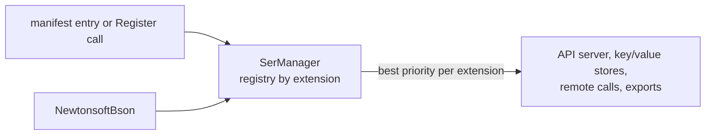

# SysWeaver.Serialization.NewtonsoftBson

[⬆ SysWeaver overview](../../README.md)

> Serializer plug-in: **bson** (binary) backed by Newtonsoft.Json.Bson.

| | |
|---|---|
| **Layer** | Serialization |
| **Kind** | Serializer plug-in (`ISerializerType`) |
| **Selection priority** | above default among serializers for `bson` |

## Purpose

Adds BSON (binary JSON) support. The API server lists `bson` among its default input/output formats, but the format is only actually available when this plug-in is registered.

## How it fits into SysWeaver



All data that SysWeaver moves — web API payloads, stored values, remote API calls, table exports — goes through the serializer registry in [SysWeaver.Serialization](../../SysWeaver.Serialization/README.md). Adding a plug-in makes its format available everywhere at once; clients choose it through HTTP `Accept` / `Content-Type` headers.

## Key features

- Binary JSON for clients that prefer it.
- Registered through the manifest like any service, or with one static call in code.

## Limitations and considerations

- BSON is rarely needed outside MongoDB-style ecosystems.
- Selection between serializers of the same extension is by priority, so the effective JSON implementation depends on which plug-ins are registered.

## Using it

The service manager recognises serializer types and registers them instead of creating an instance:

```json
{ "Type": "SysWeaver.Serialization.NewtonsoftBsonSerializer, SysWeaver.Serialization.NewtonsoftBson" }
```

Or register it from code at startup: `SysWeaver.Serialization.NewtonsoftBsonSerializer.Register();`

## Relationships

- **Project:** [`SysWeaver.Serialization.NewtonsoftBson.csproj`](SysWeaver.Serialization.NewtonsoftBson.csproj)
- **Builds on:** [SysWeaver.Serialization](../../SysWeaver.Serialization/README.md)
