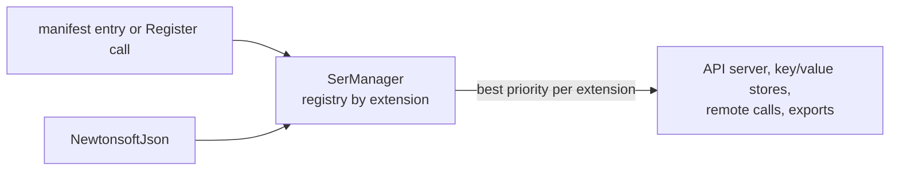

# SysWeaver.Serialization.NewtonsoftJson

[⬆ SysWeaver overview](../../README.md)

> Serializer plug-in: **json** (text) backed by Newtonsoft.Json.

| | |
|---|---|
| **Layer** | Serialization |
| **Kind** | Serializer plug-in (`ISerializerType`) |
| **Selection priority** | above default among serializers for `json` |

## Purpose

Wraps the widely used Newtonsoft.Json library, including a custom member resolver and a formatted-output helper. It is the *reading* half of [SysWeaver.Serialization.SafeJson](../../SysWeaver.Serialization.SafeJson/README.md) and is used by projects that need Newtonsoft features (e.g. Chart.js configuration objects).

## How it fits into SysWeaver



All data that SysWeaver moves — web API payloads, stored values, remote API calls, table exports — goes through the serializer registry in [SysWeaver.Serialization](../../SysWeaver.Serialization/README.md). Adding a plug-in makes its format available everywhere at once; clients choose it through HTTP `Accept` / `Content-Type` headers.

## Key features

- Tolerant, feature-rich JSON parsing.
- Pretty-printed output helper.
- Registered through the manifest like any service, or with one static call in code.

## Limitations and considerations

- Slower and more allocation-heavy than the span-based serializers.
- Selection between serializers of the same extension is by priority, so the effective JSON implementation depends on which plug-ins are registered.

## Using it

The service manager recognises serializer types and registers them instead of creating an instance:

```json
{ "Type": "SysWeaver.Serialization.NewtonsoftJsonSerializer, SysWeaver.Serialization.NewtonsoftJson" }
```

Or register it from code at startup: `SysWeaver.Serialization.NewtonsoftJsonSerializer.Register();`

## Relationships

- **Project:** [`SysWeaver.Serialization.NewtonsoftJson.csproj`](SysWeaver.Serialization.NewtonsoftJson.csproj)
- **Builds on:** [SysWeaver.Serialization](../../SysWeaver.Serialization/README.md)
- **Used by:** [SysWeaver.MicroService.ChartJs](../../SysWeaver.MicroService.ChartJs/README.md), [SysWeaver.Serialization.SafeJson](../../SysWeaver.Serialization.SafeJson/README.md)
