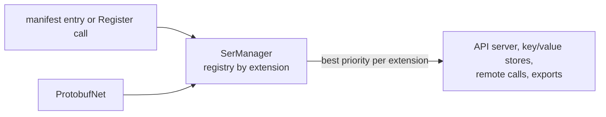

# SysWeaver.Serialization.ProtobufNet

[⬆ SysWeaver overview](../../README.md)

> Serializer plug-in: **proto** (binary) backed by protobuf-net.

| | |
|---|---|
| **Layer** | Serialization |
| **Kind** | Serializer plug-in (`ISerializerType`) |
| **Selection priority** | default among serializers for `proto` |

## Purpose

Adds Protocol Buffers via protobuf-net. The API server lists `proto` among its default formats; registering this plug-in makes it available to clients.

## How it fits into SysWeaver



All data that SysWeaver moves — web API payloads, stored values, remote API calls, table exports — goes through the serializer registry in [SysWeaver.Serialization](../../SysWeaver.Serialization/README.md). Adding a plug-in makes its format available everywhere at once; clients choose it through HTTP `Accept` / `Content-Type` headers.

## Key features

- Compact, fast binary format with broad language support.
- Registered through the manifest like any service, or with one static call in code.

## Limitations and considerations

- Types usually need protobuf contract annotations (member order) to serialize meaningfully.
- Selection between serializers of the same extension is by priority, so the effective JSON implementation depends on which plug-ins are registered.

## Using it

The service manager recognises serializer types and registers them instead of creating an instance:

```json
{ "Type": "SysWeaver.Serialization.ProtobufNetSerializer, SysWeaver.Serialization.ProtobufNet" }
```

Or register it from code at startup: `SysWeaver.Serialization.ProtobufNetSerializer.Register();`

## Relationships

- **Project:** [`SysWeaver.Serialization.ProtobufNet.csproj`](SysWeaver.Serialization.ProtobufNet.csproj)
- **Builds on:** [SysWeaver.Serialization](../../SysWeaver.Serialization/README.md)
