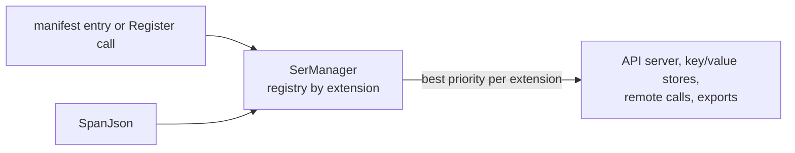

# SysWeaver.Serialization.SpanJson

[⬆ SysWeaver overview](../../README.md)

> Serializer plug-in: **json** (text) backed by SpanJson.

| | |
|---|---|
| **Layer** | Serialization |
| **Kind** | Serializer plug-in (`ITextSerializerType`) |
| **Selection priority** | -5 (lowest among the bundled serializers for `json`) |

## Purpose

An alternative span-based JSON implementation registered with a low priority, mainly useful for comparison and compatibility scenarios.

## How it fits into SysWeaver



All data that SysWeaver moves — web API payloads, stored values, remote API calls, table exports — goes through the serializer registry in [SysWeaver.Serialization](../../SysWeaver.Serialization/README.md). Adding a plug-in makes its format available everywhere at once; clients choose it through HTTP `Accept` / `Content-Type` headers.

## Key features

- `SpanJsonSerializer` (singleton `Instance`) implements both the binary (UTF-8) and the string APIs.
- Writes and reads with the same custom resolver: nulls included, byte arrays as number arrays, enums as integers, original member casing.
- Registered through the manifest like any service, or with one static call in code.

## Limitations and considerations

- Selection between serializers of the same extension is by priority, so the effective JSON implementation depends on which plug-ins are registered (bundled priorities: SafeJson 10, SysWeaver.Json 2, Newtonsoft 1, System.Text.Json 0, CompactJson / SpanJson / Utf8Json -5).
- `SerializerOptions` are ignored; output is always compact.

## Using it

The service manager recognises serializer types and registers them instead of creating an instance:

```json
{ "Type": "SysWeaver.Serialization.SpanJsonSerializer, SysWeaver.Serialization.SpanJson" }
```

Or register it from code at startup: `SysWeaver.Serialization.SpanJsonSerializer.Register();`

## Relationships

- **Project:** [`SysWeaver.Serialization.SpanJson.csproj`](SysWeaver.Serialization.SpanJson.csproj)
- **Builds on:** [SysWeaver.Serialization](../../SysWeaver.Serialization/README.md)
