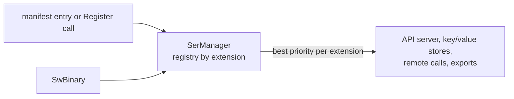

# SysWeaver.Serialization.SwBinary

[⬆ SysWeaver overview](../../README.md)

> Serializer plug-in: **swbin** (binary) backed by SysWeaver binary inspectors.

| | |
|---|---|
| **Layer** | Serialization |
| **Kind** | Serializer plug-in (`ISerializerType`) |
| **Selection priority** | 0 (the only serializer for `swbin`) |

## Purpose

Exposes the SysWeaver-specific binary format from [SysWeaver.Inspection.Binary](../../SysWeaver.Inspection.Binary/README.md) as a regular serializer.

## How it fits into SysWeaver



All data that SysWeaver moves — web API payloads, stored values, remote API calls, table exports — goes through the serializer registry in [SysWeaver.Serialization](../../SysWeaver.Serialization/README.md). Adding a plug-in makes its format available everywhere at once; clients choose it through HTTP `Accept` / `Content-Type` headers.

## Key features

- `SysWeaverBinarySerializer` (singleton `Instance`, binary only) writes with `BinaryWriterInspector` and reads with `BinaryReaderInspector`.
- No external dependency.
- Versioned, inspection-based encoding.
- Registered through the manifest like any service, or with one static call in code.

## Limitations and considerations

- Only SysWeaver can read the format.
- The root value is written as its static type (no root type information), so it must be read back as the same type.
- `SerializerOptions` are ignored.
- Selection between serializers of the same extension is by priority; this is currently the only bundled `swbin` implementation.

## Using it

The service manager recognises serializer types and registers them instead of creating an instance:

```json
{ "Type": "SysWeaver.Serialization.SysWeaverBinarySerializer, SysWeaver.Serialization.SwBinary" }
```

Or register it from code at startup: `SysWeaver.Serialization.SysWeaverBinarySerializer.Register();`

## Relationships

- **Project:** [`SysWeaver.Serialization.SwBinary.csproj`](SysWeaver.Serialization.SwBinary.csproj)
- **Builds on:** [SysWeaver.Inspection.Binary](../../SysWeaver.Inspection.Binary/README.md), [SysWeaver.Serialization](../../SysWeaver.Serialization/README.md)
