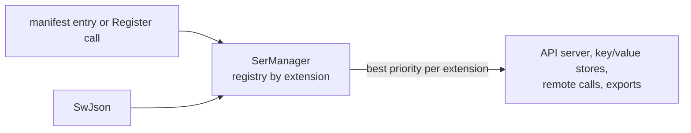

# SysWeaver.Serialization.SwJson

[⬆ SysWeaver overview](../../README.md)

> Serializer plug-in: **json** (text) backed by SysWeaver's own JSON reader/writer.

| | |
|---|---|
| **Layer** | Serialization |
| **Kind** | Serializer plug-in (`ISerializerType`) |
| **Selection priority** | high among serializers for `json` |

## Purpose

The framework's own, dependency-free JSON implementation. It has the highest priority of the plain JSON serializers, so registering it makes it the default JSON implementation (for example for web API responses). It is also the *writing* half of [SysWeaver.Serialization.SafeJson](../../SysWeaver.Serialization.SafeJson/README.md).

## How it fits into SysWeaver



All data that SysWeaver moves — web API payloads, stored values, remote API calls, table exports — goes through the serializer registry in [SysWeaver.Serialization](../../SysWeaver.Serialization/README.md). Adding a plug-in makes its format available everywhere at once; clients choose it through HTTP `Accept` / `Content-Type` headers.

## Key features

- No external dependency.
- Preferred over the other plain JSON serializers when registered.
- Registered through the manifest like any service, or with one static call in code.

## Limitations and considerations

- As a custom implementation, edge cases of exotic types may behave differently from System.Text.Json or Newtonsoft; test your payload types.
- Selection between serializers of the same extension is by priority, so the effective JSON implementation depends on which plug-ins are registered.

## Using it

The service manager recognises serializer types and registers them instead of creating an instance:

```json
{ "Type": "SysWeaver.Serialization.SysWeaverJsonSerializer, SysWeaver.Serialization.SwJson" }
```

Or register it from code at startup: `SysWeaver.Serialization.SysWeaverJsonSerializer.Register();`

## Relationships

- **Project:** [`SysWeaver.Serialization.SwJson.csproj`](SysWeaver.Serialization.SwJson.csproj)
- **Builds on:** [SysWeaver.Serialization](../../SysWeaver.Serialization/README.md)
- **Used by:** [SysWeaver.Serialization.SafeJson](../../SysWeaver.Serialization.SafeJson/README.md)
