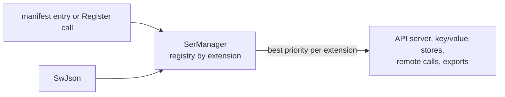

# SysWeaver.Serialization.SwJson

[⬆ SysWeaver overview](../../README.md)

> Serializer plug-in: **json** (text) backed by SysWeaver's own JSON reader/writer.

| | |
|---|---|
| **Layer** | Serialization |
| **Kind** | Serializer plug-in (`ITextSerializerType`) |
| **Selection priority** | 2 (above Newtonsoft 1 and System.Text.Json 0; below SafeJson 10) |

## Purpose

The framework's own, dependency-free JSON implementation. It has the highest priority of the plain JSON serializers, so registering it makes it the default JSON implementation (for example for web API responses). It is also the *writing* half of [SysWeaver.Serialization.SafeJson](../../SysWeaver.Serialization.SafeJson/README.md).

## How it fits into SysWeaver



All data that SysWeaver moves — web API payloads, stored values, remote API calls, table exports — goes through the serializer registry in [SysWeaver.Serialization](../../SysWeaver.Serialization/README.md). Adding a plug-in makes its format available everywhere at once; clients choose it through HTTP `Accept` / `Content-Type` headers.

## Key features

- No external dependency.
- Preferred over the other plain JSON serializers when registered.
- `SysWeaverJsonSerializer` (singleton `Instance`) wraps the two engines:
  - `JsonWriter.ToJsonString<T>`, `JsonWriter.ToJsonBytes<T>` (optionally into a caller supplied buffer) write UTF-8 through pooled buffers (`BufferWriter`), so the only allocation is the result.
  - `JsonReader.Create<T>` / `JsonReader.Create(Type, ...)` parse UTF-8 bytes (or a string) directly.
- Per-type readers and writers are generated with compiled expression trees and cached for the life of the process: the first use of a type is slow, later calls are fast.
- Supported types: primitives, `decimal`, `string`, `char`, enums (written as numbers, read as names, numbers or flag lists), `DateTime`, `DateTimeOffset`, `DateOnly`, `TimeOnly`, `TimeSpan`, `Guid`, `byte[]` (base64), `Nullable<T>`, arrays, `ICollection<T>`, other `IEnumerable<T>` classes without serialized members (`Queue<T>`, `Stack<T>`, `ConcurrentQueue<T>`, `ConcurrentBag<T>`; written as arrays, a json array read as `IEnumerable<T>` / `IReadOnlyList<T>` creates a `List<T>`), `IDictionary<K,V>` with string / number / bool / char / enum / date / time / `Guid` keys (other key types are written with the key's `ToString()` as the property name and can't be read back), and classes / structs (public read/write properties and non-readonly public fields).
- Polymorphism: when the runtime type differs from the declared type, values are written Newtonsoft-style as `{"$type":"Name,Assembly",...}` (with `$value` / `$values` for boxed primitives and collections, the `$type` of a boxed `byte` / `short` / enum is its own type) and the reader re-creates that type (classes with a public parameterless constructor, and structs).
  Collections declared as an interface are written without a `$type` when they are of the type the reader creates for the interface anyway: a `List<T>` (for `IList<T>`, `ICollection<T>`, `IEnumerable<T>`, `IReadOnlyList<T>`, `IReadOnlyCollection<T>`), a `HashSet<T>` (for `ISet<T>`) or a `Dictionary<K,V>` (for `IDictionary<K,V>` and `IReadOnlyDictionary<K,V>`); other implementations get a `$type`. Type names can be customised with `JsonWriter.ToTypename`, `AssemblyMap` and `NamespaceMap` (set before first use).
- Culture-invariant number and date handling: shortest round-trip floats, ISO-8601 (`"o"`) dates, `"c"` time spans; only control characters, `"` and `\` are escaped.
- Lenient reader: unquoted keys, quoted numbers/booleans, `//` and `/* */` comments and trailing commas are accepted; unknown members are skipped.
- Registered through the manifest like any service, or with one static call in code.

## Limitations and considerations

- As a custom implementation, edge cases of exotic types may behave differently from System.Text.Json or Newtonsoft; test your payload types.
- `SerializerOptions` are ignored: output is always compact (no indentation).
- Member names are matched case-sensitively.
- JSON has no `NaN` / `Infinity`: a `float` / `double` NaN or infinity is written as `null` (dictionary keys are strings and keep `"NaN"`, `"Infinity"`, `"-Infinity"`). Reading `null` into a `float` / `double` gives NaN, so infinities don't round-trip (they come back as NaN) and a NaN / infinity in a `float?` / `double?` comes back as `null`. The bare `NaN`, `Infinity` and `-Infinity` tokens written by older versions are still read. Negative zero is written as `-0.0` (and read back as -0.0, `-0` is read as -0.0 too).
- Integer values must be plain integers in the range of the target type when reading (a fraction, an exponent or an out-of-range value is an error).
- `$type` in the input can only name types allowed by the `DataTypePolicy` (see `TypeFinder.GetForData`), and the type must be assignable to the declared type.
- Selection between serializers of the same extension is by priority, so the effective JSON implementation depends on which plug-ins are registered.

## Using it

The service manager recognises serializer types and registers them instead of creating an instance:

```json
{ "Type": "SysWeaver.Serialization.SysWeaverJsonSerializer, SysWeaver.Serialization.SwJson" }
```

Or register it from code at startup: `SysWeaver.Serialization.SysWeaverJsonSerializer.Register();`

## Relationships

- **Project:** [`SysWeaver.Serialization.SwJson.csproj`](SysWeaver.Serialization.SwJson.csproj)
- **Builds on:** [SysWeaver.Serialization](../../SysWeaver.Serialization/README.md)
- **Used by:** [SysWeaver.Serialization.SafeJson](../../SysWeaver.Serialization.SafeJson/README.md)
