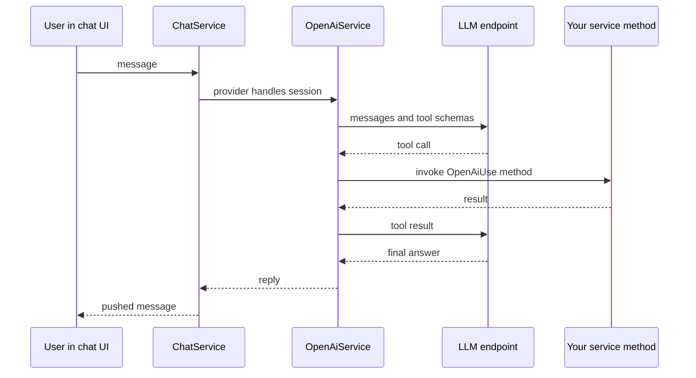
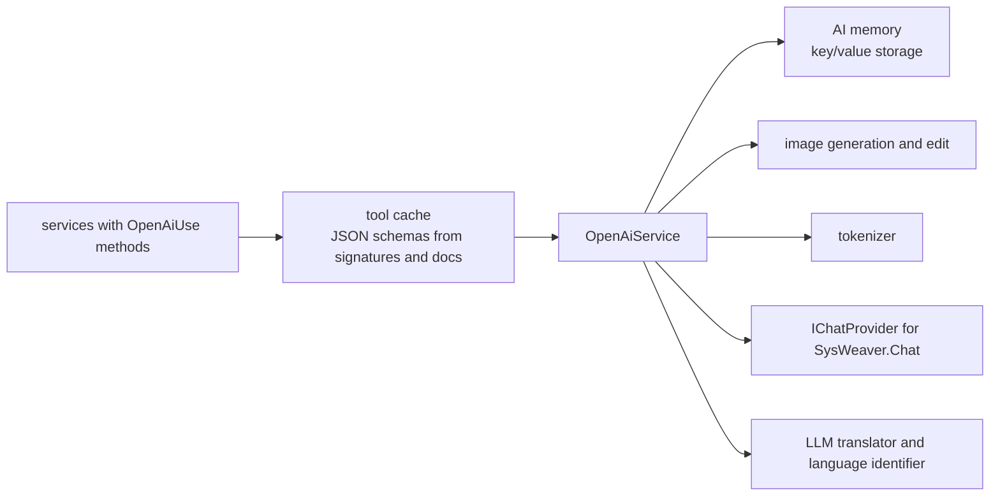

# SysWeaver.AI.OpenAI

[⬆ SysWeaver overview](../README.md)

> LLM integration for SysWeaver: an OpenAI-API chat provider that can call methods of your services as tools, generate images, tokenize text and keep an AI memory — usable with OpenAI or any compatible endpoint.

| | |
|---|---|
| **Layer** | AI |
| **Kind** | Micro service (chat provider, tool host) |

## Purpose

Make every SysWeaver service potentially "AI-callable". Methods marked `[OpenAiUse]` on registered services are described to the model as tools (with JSON schemas generated from their signatures and XML documentation); when the model calls a tool, SysWeaver invokes the method and returns the result.

## How it fits into SysWeaver





## Key features

- Chat sessions with model, reasoning effort and service tier selectable per session.
- Automatic tool calling of annotated service methods, including table results rendered in the chat UI.
- Persistent AI memory with limits, viewable as a table.
- Image generation and editing.
- Token encoding/decoding for cost and context management.
- Configurable endpoint, so OpenAI-compatible APIs of other vendors can be used.
- Concurrency limits for chats and image generation.

## Limitations and considerations

- Requires an API key and incurs usage costs; tool calls can multiply requests.
- Exposing methods as tools gives the model the ability to call them — only mark methods that are safe for the requesting user.
- Behaviour depends on the chosen model's tool-calling capabilities.

## Using it

```csharp
public sealed class WeatherService : IHaveOpenAiTools
{
    /// <summary>Current temperature in a city, in degrees Celsius</summary>
    [OpenAiUse]
    public double GetTemperature(string city) => 21.5;
}
```
```json
{ "Type": "SysWeaver.AI.OpenAiService, SysWeaver.AI.OpenAI", "Params": { } }
```
Provide the API key through the service's key parameters (it derives from the framework's API key parameter type).

## Relationships

- **Project:** [`SysWeaver.AI.OpenAI.csproj`](SysWeaver.AI.OpenAI.csproj)
- **Builds on:** [SysWeaver.Chat](../SysWeaver.Chat/README.md), [SysWeaver.HttpServer](../SysWeaver.HttpServer/README.md), [SysWeaver.IsoData](../SysWeaver.IsoData/README.md), [SysWeaver.Media.Png](../SysWeaver.Media.Png/README.md), [SysWeaver.MicroServices.ServiceManager](../SysWeaver.MicroServices.ServiceManager/README.md)
- **Used by:** [SysWeaver.AI.LlmTranslator](../SysWeaver.AI.LlmTranslator/README.md), [SysWeaver.LanguageIdentifier.Llm](../SysWeaver.LanguageIdentifier.Llm/README.md)
