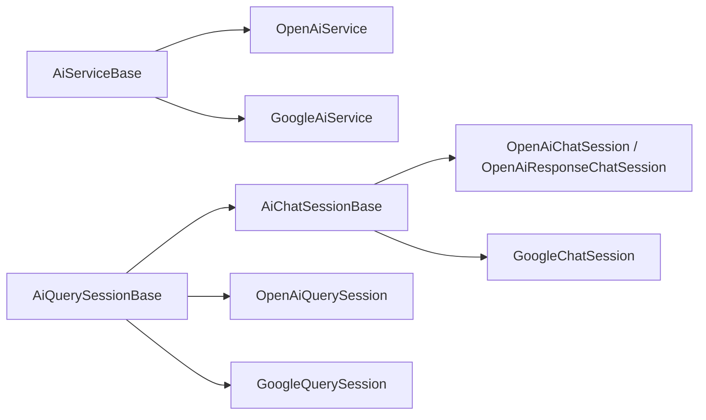

# SysWeaver.AI

[⬆ SysWeaver overview](../README.md)

> API agnostic AI (LLM) functionality for SysWeaver: the chat provider, tool calling of service methods, AI memory, default tools and the session/service abstractions that the API specific projects build on.

| | |
|---|---|
| **Layer** | AI |
| **Kind** | Library (base classes and interfaces) |

## Purpose

Hold everything that is common to all AI providers, so that a provider project (OpenAI, Google, ...) only implements the actual API calls.

## Key types

| Type | Description |
|---|---|
| `IAiService` | An AI service: chat provider (`IChatProvider`), tool cache, session factory, commands, usage events. |
| `AiServiceParams` | Abstract base for service parameters (endpoint, timeouts, default models, reasoning, concurrency). |
| `AiSessionParams` | Base for session parameters (model, reasoning). |
| `IAiQuerySession` / `IAiChatSession` | A stateless query session / a chat (conversation) session. |
| `AiServiceBase` | Base class for services, implements the chat provider, the tool cache, commands and default tools. |
| `AiQuerySessionBase` / `AiChatSessionBase` | Base classes for sessions: tool registration and invocation, memory tools, menus, commands, system prompt building. |
| `AiTool` / `AiToolFunction` | A tool (service method) and its API agnostic function description (name, description, JSON schema). |
| `AiContentPart` | An API agnostic message attachment (text, image or file). |
| `IAiMemory` / `KeyValueStorageAiMemory` | Per user AI memory. |
| `JsonSchema` | JSON schema generation from types and XML documentation. |

## How a provider is built

A provider derives from `AiServiceBase` and implements `CreateAiChatSession` and `CreateAiQuerySession` (and optionally overrides `AddDefaultTools`).
WebApi methods must be declared in the derived service (the url is based on the declaring type), the base supplies protected implementations (`InternalChatSession`, `InternalMessageTable`).
Sessions derive from `AiChatSessionBase` / `AiQuerySessionBase` and implement `Query`, `Complete`, `CompleteUpdate`, `ClearApiMessages`, `WriteConversation` and `SystemPrompt`, using `AiCalls` to execute tool calls.

## Relationships

- **Project:** [`SysWeaver.AI.csproj`](SysWeaver.AI.csproj)
- **Builds on:** [SysWeaver.Chat](../SysWeaver.Chat/README.md), [SysWeaver.HttpServer](../SysWeaver.HttpServer/README.md), [SysWeaver.IsoData](../SysWeaver.IsoData/README.md), [SysWeaver.Media.Png](../SysWeaver.Media.Png/README.md), [SysWeaver.MicroServices.ServiceManager](../SysWeaver.MicroServices.ServiceManager/README.md)
- **Used by:** [SysWeaver.AI.OpenAI](../SysWeaver.AI.OpenAI/README.md), [SysWeaver.AI.Google](../SysWeaver.AI.Google/README.md)
