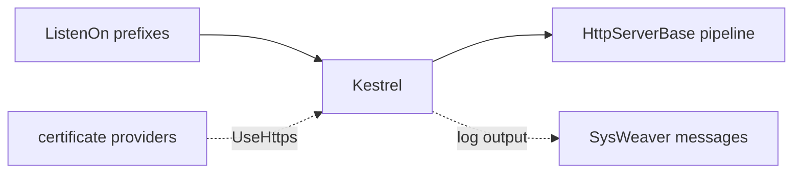

# SysWeaver.AspHttpServer

[⬆ SysWeaver overview](../README.md)

> HTTP listener adapter for the SysWeaver pipeline based on ASP.NET Core Kestrel, with optional HTTP/3.

| | |
|---|---|
| **Layer** | HTTP |
| **Kind** | Library (concrete server) |

## Purpose

Host the SysWeaver pipeline on Kestrel for a modern, cross-platform, high-performance server — without adopting the ASP.NET Core application model. Kestrel is used purely as the transport; routing, auth and everything else remain SysWeaver's.

## How it fits into SysWeaver

## Key features

- Cross-platform HTTPS with certificates from SysWeaver certificate providers.
- Optional HTTP/3.
- Kestrel logging routed into the SysWeaver message system.

## Limitations and considerations

- Kestrel does not accept a path in a listen prefix (host and port only).
- HTTP/3 requires OS support (a recent Windows or libmsquic on Linux).
- Some Kestrel internals are accessed via reflection, which can be sensitive to ASP.NET Core version changes.

## Using it

Through [SysWeaver.MicroService.AspHttpServer](../SysWeaver.MicroService.AspHttpServer/README.md).

## Relationships

- **Project:** [`SysWeaver.AspHttpServer.csproj`](SysWeaver.AspHttpServer.csproj)
- **Builds on:** [SysWeaver.HttpServer](../SysWeaver.HttpServer/README.md)
- **Used by:** [SysWeaver.MicroService.AspHttpServer](../SysWeaver.MicroService.AspHttpServer/README.md)
