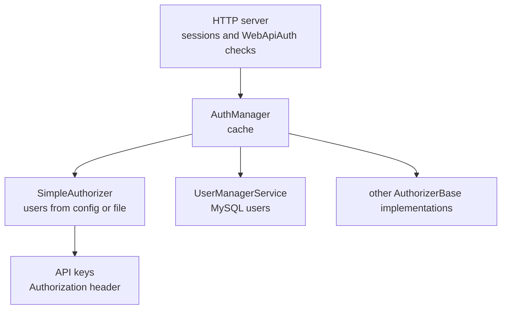

# SysWeaver.Auth.Core

[⬆ SysWeaver overview](../README.md)

> Authentication core: the `AuthManager` that validates users across any number of pluggable authorizers with caching, the authorizer contract, a configuration-based `SimpleAuthorizer` with API keys, password policies and localizable message templates.

| | |
|---|---|
| **Layer** | Security |
| **Kind** | Library |

## Purpose

Separate *who can log in and with which tokens* from the web server. The server only asks the `AuthManager`; the manager consults its authorizers (a static user list, a database-backed user manager, …) and caches the results.

## How it fits into SysWeaver



## Key concepts

| Concept | Description |
|---|---|
| **Authorization** | The result of a successful login: user identity plus the set of *tokens* (roles) that `[WebApiAuth]` checks against. |
| **Authorizer** | A source of users. Several can be active; the manager asks them in turn. |
| **Realm** | A per-system value mixed into password hashes so identical credentials hash differently on different systems. |
| **Simple authorizer** | Users defined as `user:password:tokens` strings (clear text or pre-computed hash) in parameters or a watched file; optional basic auth; API key management with runtime-configurable permissions. |
| **Password policy** | Length and character class requirements, reported to clients so the UI can validate early. |
| **Managed texts** | Localizable text/mail templates with variables, loaded from disc or web, used by account flows. |

## Key features

- Multiple authorizers behind one manager.
- Result caching to keep per-request auth checks cheap.
- Client-side salted hashing support.
- API keys for machine-to-machine access.

## Limitations and considerations

- `SimpleAuthorizer` is meant for small, static user sets (operators, services); use [SysWeaver.MicroService.UserManager](../SysWeaver.MicroService.UserManager/README.md) for self-service accounts.
- Clear-text passwords in configuration are supported but should be replaced with hashes (`<exe> hash user password`).

## Using it

```json
[
  { "Type": "SysWeaver.Auth.SimpleAuthorizer, SysWeaver.Auth.Core",
    "Params": { "Users": [ "admin:<hash-or-password>:Admin, Ops" ] } },
  { "Type": "SysWeaver.MicroService.AuthManagerService, SysWeaver.MicroService.Auth" }
]
```

## Relationships

- **Project:** [`SysWeaver.Auth.Core.csproj`](SysWeaver.Auth.Core.csproj)
- **Builds on:** [SysWeaver.Common](../SysWeaver.Common/README.md), [SysWeaver.Compression](../SysWeaver.Compression/README.md), [SysWeaver.MicroServices](../SysWeaver.MicroServices/README.md), [SysWeaver.Storage](../SysWeaver.Storage/README.md), [SysWeaver.TableData](../SysWeaver.TableData/README.md)
- **Used by:** [SysWeaver.HttpServer](../SysWeaver.HttpServer/README.md), [SysWeaver.MicroService.AspHttpServer](../SysWeaver.MicroService.AspHttpServer/README.md), [SysWeaver.MicroService.Auth](../SysWeaver.MicroService.Auth/README.md), [SysWeaver.MicroService.HttpServer](../SysWeaver.MicroService.HttpServer/README.md), [SysWeaver.MicroService.NetHttpServer](../SysWeaver.MicroService.NetHttpServer/README.md), [SysWeaver.MicroService.UserStorage](../SysWeaver.MicroService.UserStorage/README.md)
