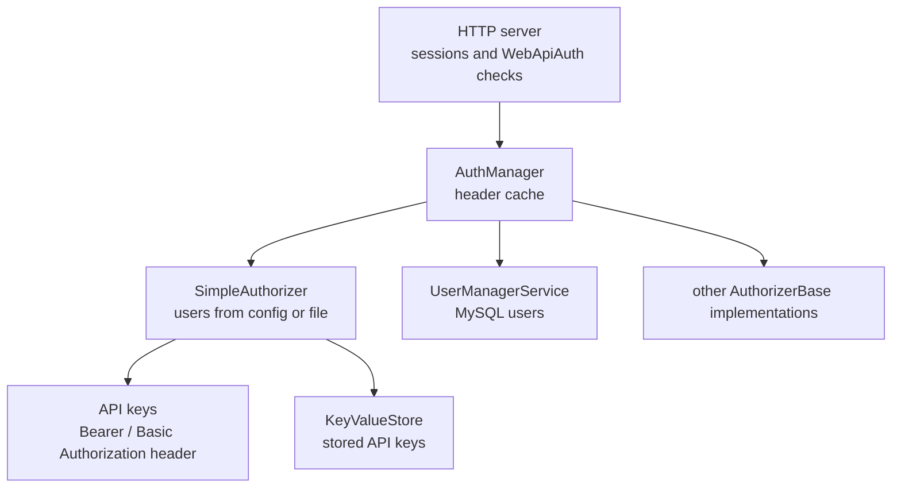

# SysWeaver.Auth.Core

[⬆ SysWeaver overview](../README.md)

> Authentication core: the `AuthManager` that validates users across any number of pluggable authorizers and caches Authorization header results, the authorizer contract, a configuration-based `SimpleAuthorizer` with API keys, password policies and localizable message templates.

| | |
|---|---|
| **Layer** | Security |
| **Kind** | Library |

## Purpose

Separate *who can log in and with which tokens* from the web server. The server only asks the `AuthManager`; the manager consults its authorizers (a static user list, a database-backed user manager, …) in order, and caches the results of HTTP `Authorization` headers.

## How it fits into SysWeaver



## Key concepts

| Concept | Description |
|---|---|
| **Authorization** | The result of a successful login (`Authorization`, extends `AuthorizationInfo`): user identity, guid, the set of lower case *tokens* (roles) that `[WebApiAuth]` checks against (`AuthExt.IsValid`), the authorizer and shared per-user data. `WeakMethod` tells if basic auth / a bearer token was used. |
| **Authorizer** | A source of users (`AuthorizerBase`). Several can be active; the manager asks them in turn. Supported methods: basic auth, bearer token, one-time-pad secure login, one-time tokens. Each has a unique guid prefix and a `ChangeCounter` used to invalidate cached results. |
| **Password hashing** | Clients compute `SHA256(password + "|" + salt)` with a salt from the authorizer (`AuthManager.GetSalt`); the secure login sends `SHA256(base64(hash) + "|" + oneTimePad)` so the password hash is never replayable (`AuthTools`). |
| **Realm** | The name sent in the `WWW-Authenticate` header for basic auth (defaults to the entry assembly name). |
| **Simple authorizer** | Users defined as `user:password[:tokens[:domain]]` strings (clear text or pre-computed hash) in parameters or a watched file; optional basic auth; API key management (stored in `KeyValueStore.AllApp`, usable as bearer tokens) with runtime-configurable permissions, plus a web page to generate password hashes. |
| **Password policy** | Length and character class requirements (`PasswordPolicy`, checked with `PasswordPolicyExt.Check`), reported to clients so the UI can validate early. |
| **Managed texts** | Localizable text/mail templates with variables (`ManagedMessages`, `ManagedTexts`, `ManagedTextTemplate`, …), loaded from per-language folders, embedded resources or literal text and reloaded when files change; used by account flows. |
| **Name generator** | `NameGen` creates random human friendly nick names (deterministic per user guid). |

## Key features

- Multiple authorizers behind one manager.
- Result caching to keep per-request Authorization header checks cheap.
- Client-side salted hashing support, constant time hash comparisons in `SimpleAuthorizer`.
- API keys for machine-to-machine access.

## Limitations and considerations

- `SimpleAuthorizer` is meant for small, static user sets (operators, services); use [SysWeaver.MicroService.UserManager](../SysWeaver.MicroService.UserManager/README.md) for self-service accounts.
- Clear-text passwords in configuration are supported but should be replaced with hashes, generated on the *Debug/SimpleAuth/Generate password hash* page (requires the debug or ops token).
- Password hashes are a single SHA256 (fast to brute force if leaked); keep user files and configuration private.
- API keys are stored in clear text in the application key/value store.
- Only successful Authorization header results are cached, for `CacheDuration` seconds (default 30) and at most `MaxCachedHeaders` (default 10 000) entries, keyed by a SHA256 hash of the header.
  `SimpleAuthorizer.ChangeCounter` is always 0, so a removed API key or a changed password can still be used with a cached header until the entry expires (at most `CacheDuration` seconds).

## Using it

```json
[
  { "Type": "SysWeaver.Auth.SimpleAuthorizer, SysWeaver.Auth.Core",
    "Params": { "Users": [ "admin:<hash-or-password>:Admin, Ops" ] } },
  { "Type": "SysWeaver.MicroService.AuthManagerService, SysWeaver.MicroService.Auth" }
]
```

## Relationships

- **Project:** [`SysWeaver.Auth.Core.csproj`](SysWeaver.Auth.Core.csproj)
- **Builds on:** [SysWeaver.Common](../SysWeaver.Common/README.md), [SysWeaver.Compression](../SysWeaver.Compression/README.md), [SysWeaver.MicroServices](../SysWeaver.MicroServices/README.md), [SysWeaver.Storage](../SysWeaver.Storage/README.md), [SysWeaver.TableData](../SysWeaver.TableData/README.md)
- **Used by:** [SysWeaver.HttpServer](../SysWeaver.HttpServer/README.md), [SysWeaver.MicroService.AspHttpServer](../SysWeaver.MicroService.AspHttpServer/README.md), [SysWeaver.MicroService.Auth](../SysWeaver.MicroService.Auth/README.md), [SysWeaver.MicroService.HttpServer](../SysWeaver.MicroService.HttpServer/README.md), [SysWeaver.MicroService.NetHttpServer](../SysWeaver.MicroService.NetHttpServer/README.md), [SysWeaver.MicroService.UserStorage](../SysWeaver.MicroService.UserStorage/README.md)
