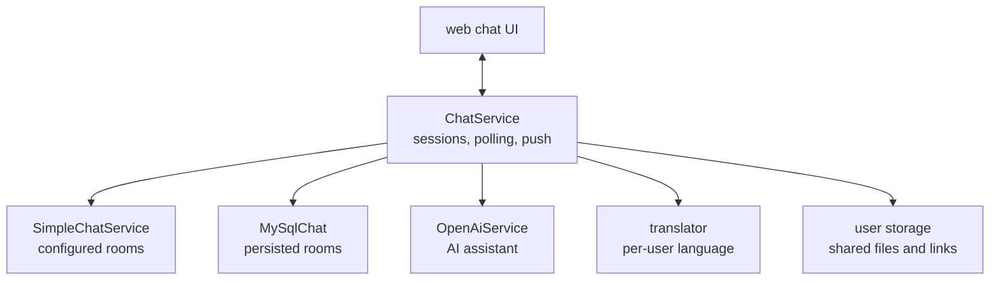

# SysWeaver.Chat

[⬆ SysWeaver overview](../README.md)

> A chat framework: rooms/sessions with pluggable providers (simple in-memory rooms, MySQL-persisted rooms, AI assistants), real-time delivery, translation, file and link sharing and a web chat UI.

| | |
|---|---|
| **Layer** | Collaboration |
| **Kind** | Micro service + provider contract |

## Purpose

One chat UI and API for very different conversation partners: people in a room, or an AI. Providers decide *what* a chat is; the chat service handles sessions, delivery and the user experience.

## How it fits into SysWeaver



## Key concepts

| Concept | Description |
|---|---|
| **Provider** | Implements the chat provider contract; supplies sessions, messages and optionally user-created chats. |
| **Session / room** | Has its own auth rules: who may join, post, clear and remove messages. |
| **Message** | Text, markdown or HTML bodies with flags; delivered by polling/push. |
| **Store handlers** | Services that can persist or render chat content (e.g. charts, explorer links) as shareable links. |

## Key features

- Per-room permissions, including anonymous rooms.
- On-demand translation of messages into each user's language.
- Optional speech input with a wake word.
- File and link sharing via user storage, with optional public sharing.
- AI tool integration: chat features are available to AI providers.

## Limitations and considerations

- The simple provider keeps rooms in memory; use the MySQL provider for persistence.
- Sharing features require a user storage service.

## Using it

```json
[
  { "Type": "SysWeaver.Chat.SimpleChatService, SysWeaver.Chat", "Params": { "Rooms": [ "Lobby|*" ] } },
  { "Type": "SysWeaver.Chat.ChatService, SysWeaver.Chat" }
]
```
The room definition syntax (name, join tokens, clear/remove permissions) is documented on the simple chat parameters.

## Relationships

- **Project:** [`SysWeaver.Chat.csproj`](SysWeaver.Chat.csproj)
- **Builds on:** [SysWeaver.HttpServer](../SysWeaver.HttpServer/README.md), [SysWeaver.MicroServices.ServiceManager](../SysWeaver.MicroServices.ServiceManager/README.md)
- **Used by:** [SysWeaver.AI.OpenAI](../SysWeaver.AI.OpenAI/README.md), [SysWeaver.Chat.MySql](../SysWeaver.Chat.MySql/README.md)
