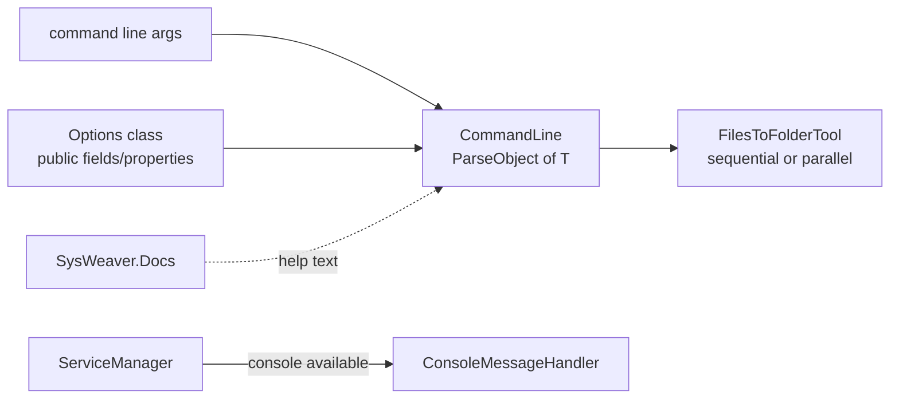

# SysWeaver.CommandLine

[⬆ SysWeaver overview](../README.md)

> Command line parsing into typed option objects, auto-generated help from XML docs, a console log handler, and a ready-made shell for "files in → folder out" tools.

| | |
|---|---|
| **Layer** | Foundation |
| **Kind** | Library |

## Purpose

Provides everything needed to build small, consistent command line tools on top of SysWeaver — the framework's own build tools (compression, SVG optimisation, folder sync) are built this way — and supplies the console output used when a service runs interactively.

## How it fits into SysWeaver



The service manager registers the console message handler automatically when a console is attached, which is how `debug`/`execute` mode prints log messages.

## Key features

- Map command line options onto the public members of any class; values are parsed for all common types and parsers are extensible.
- Help/syntax text generated from the options class and its XML documentation.
- Wildcards, file sequences and an input-files/output-folder tool shell with synchronous, asynchronous and parallel processing variants.
- Console message handler with levels and colouring.

## Limitations and considerations

- Designed for the SysWeaver conventions (option prefix, option naming); not a general replacement for full-featured CLI frameworks with sub-command trees.
- Help quality depends on XML comments being present and deployed.

## Using it

```csharp
public sealed class Options
{
    /// <summary>Overwrite existing files</summary>
    public bool Force;
}

static int Main(string[] args) =>
    FilesToFolderTool.OnFiles<Options>(args, (log, options, a, b, c) =>
    {
        // process one input file; return an exit code
        return 0;
    });
```

## Relationships

- **Project:** [`SysWeaver.CommandLine.csproj`](SysWeaver.CommandLine.csproj)
- **Builds on:** [SysWeaver.Common](../SysWeaver.Common/README.md), [SysWeaver.Docs](../SysWeaver.Docs/README.md), [SysWeaver.ExpressionEvaluator](../SysWeaver.ExpressionEvaluator/README.md)
- **Used by:** [SysWeaver.Media](../SysWeaver.Media/README.md), [SysWeaver.MicroService.HttpServer](../SysWeaver.MicroService.HttpServer/README.md), [SysWeaver.MicroServices.ServiceManager](../SysWeaver.MicroServices.ServiceManager/README.md)
