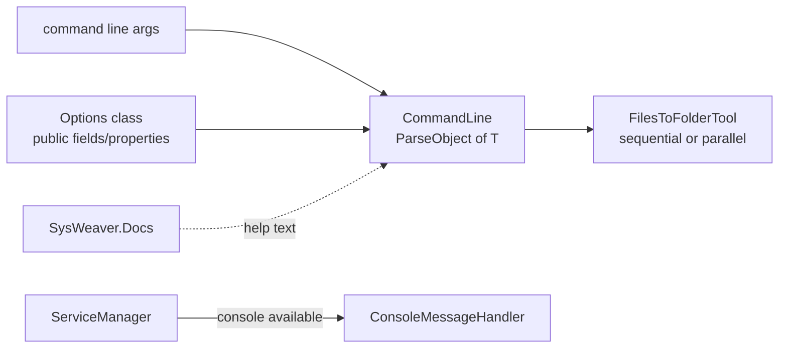

# SysWeaver.CommandLine

[⬆ SysWeaver overview](../README.md)

> Command line parsing into typed option objects, auto-generated help from XML docs, a console log handler, and a ready-made shell for "files in → folder out" tools.

| | |
|---|---|
| **Layer** | Foundation |
| **Kind** | Library |

## Purpose

Provides everything needed to build small, consistent command line tools on top of SysWeaver — the framework's own build tools (compression, SVG optimisation, folder sync) are built this way — and supplies the console output used when a service runs interactively.

## How it fits into SysWeaver



The service manager registers the console message handler automatically when a console is available (synchronous with full details in DEBUG builds, asynchronous otherwise), which is how `debug`/`execute` mode prints log messages.

## Key features

- `CommandLine.ParseObject<T>` maps options onto the public fields/properties of any class (nested objects become `Parent.Child` options, a `false` boolean becomes a flag); `CommandLine.ParseOptions` parses against explicitly declared `CommandLineOption`s.
- Positional arguments (`CommandLineArgument`) with required/optional handling, optional "any number of arguments", and per-argument tags (default, valid values, limits, type).
- Values parsed for all primitive types, `String`, `Char`, `DateTime`, `TimeSpan`, `Guid`, enums, arrays and lists (`;` separated); numbers accept expressions via SysWeaver.ExpressionEvaluator; extra parsers via `CommandLine.AddParser`.
- Help/syntax text (`CommandLine.SyntaxObject<T>` / `SyntaxOptions`) generated from the options class and its XML documentation; `-?` and `-help` are built in.
- `FileCommandLineArgument` / `FileCommandLineOptionArgument`: existing files with wildcards, `;` separated masks, a trailing `+` for recursive search and optional numbered file sequences.
- `FilesToFolderTool` / `FilesToFolderTool<T>`: an input-files/output-folder tool shell with synchronous, asynchronous and parallel processing variants and consistent exit codes (0 ok, 1 help, -1 bad command line, -2 exception).
- `Wildcard.Match`: Windows or Unix style file name wildcard matching.
- `ConsoleMessageHandler`: console message handler with three detail styles, level colouring and sync/async output.

## Limitations and considerations

- Designed for the SysWeaver conventions (option prefix, option naming); not a general replacement for full-featured CLI frameworks with sub-command trees.
- Options are recognised by the prefixes `-`, `--` and `/` (the longest matching prefix is removed, so `--name` is looked up as `name`); positional values starting with `-` or `/` (negative numbers, absolute Unix paths) are taken as options.
- Known issue: min/max limits are only enforced for option arguments, not positional arguments.
- Help quality depends on XML comments being present and deployed; only the plain text of `<summary>` is used.
- Configuration (prefixes, tags, parsers) is global static state; set it up once at startup.

## Using it

```csharp
public sealed class Options
{
    /// <summary>Overwrite existing files</summary>
    public bool Force;
}

static int Main(string[] args) =>
    FilesToFolderTool.OnFiles<Options>(args, (log, options, sourceFile, relativeName, destFolder) =>
    {
        // process one input file; return 0 to continue, anything else aborts with that exit code
        return 0;
    });
// Usage: MyTool [-Force] *.png+ OutFolder
```

## Relationships

- **Project:** [`SysWeaver.CommandLine.csproj`](SysWeaver.CommandLine.csproj)
- **Builds on:** [SysWeaver.Common](../SysWeaver.Common/README.md), [SysWeaver.Docs](../SysWeaver.Docs/README.md), [SysWeaver.ExpressionEvaluator](../SysWeaver.ExpressionEvaluator/README.md)
- **Used by:** [SysWeaver.Media](../SysWeaver.Media/README.md), [SysWeaver.MicroService.HttpServer](../SysWeaver.MicroService.HttpServer/README.md), [SysWeaver.MicroServices.ServiceManager](../SysWeaver.MicroServices.ServiceManager/README.md)
