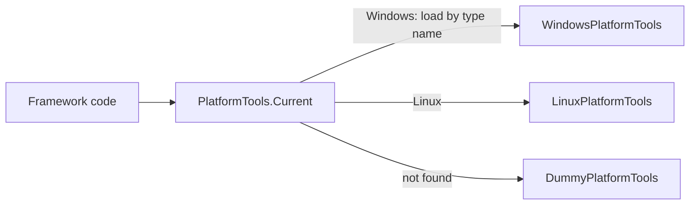

# SysWeaver.Common.Windows

[⬆ SysWeaver overview](../README.md)

> Windows implementation of the platform abstraction (`IPlatformTools`): system metrics, reboot, disk flush and directory permissions.

| | |
|---|---|
| **Layer** | Foundation (platform adapter) |
| **Kind** | Library, loaded by name at runtime |
| **Platform** | Windows |

## Purpose

Keeps Windows-only APIs (performance counters, WMI, Win32 shutdown/ACL calls) out of the portable core. The core asks `PlatformTools.Current` for an implementation and gets this one when running on Windows.

## How it fits into SysWeaver

No project calls this assembly directly; it only needs to be deployed with the application (the storage layer references both platform assemblies so they are copied to the output automatically).

## Key features

- CPU and memory usage, system statistics surfaced in the service manager's statistics tables.
- Machine reboot (used by administrative services).
- Flushing file handles to disk and granting directory access to everyone.
- Default key folder location for the platform.

## Limitations and considerations

- Only meaningful on Windows; relies on Windows management and performance-counter APIs.
- If the assembly is missing, the framework silently falls back to a dummy implementation (metrics become unavailable rather than failing).

## Using it

Nothing to configure — deploy the DLL with the application and use `PlatformTools.Current`.

## Relationships

- **Project:** [`SysWeaver.Common.Windows.csproj`](SysWeaver.Common.Windows.csproj)
- **Builds on:** [SysWeaver.Common](../SysWeaver.Common/README.md)
- **Used by:** [SysWeaver.Storage](../SysWeaver.Storage/README.md)
