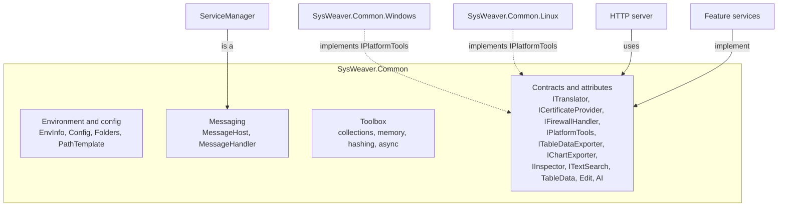

# SysWeaver.Common

[⬆ SysWeaver overview](../README.md)

> The foundation every other SysWeaver project stands on: environment and configuration, folders, messaging/logging, async and collection primitives, and — importantly — the shared *vocabulary* of contracts and attributes that the rest of the framework implements.

| | |
|---|---|
| **Layer** | Foundation |
| **Kind** | Library (no external dependencies) |
| **Platform** | Any; platform-specific parts are delegated to `IPlatformTools` implementations |

## Purpose

`SysWeaver.Common` exists so that higher layers never have to agree on anything except this assembly. It serves three roles:

1. **Runtime environment** – where am I running, which files and folders belong to this application, how is it configured, where do log messages go.
2. **General purpose toolbox** – high performance collections, string and memory helpers, hashing, scheduling and async coordination primitives that are reused throughout the framework.
3. **Contract hub** – interfaces and attributes that let independent projects cooperate without referencing each other (translation, language identification, certificates, firewalls, table data and chart export, inspection, text search, object editing, AI tools, platform tools, …).

## How it fits into SysWeaver



The `ServiceManager` *is* a `MessageHost`, so every service logs through the same pipeline. Feature projects implement the contracts defined here (e.g. a translator implements `ITranslator`, a certificate provider implements `ICertificateProvider`), and consumers discover them at runtime through the service manager — neither side references the other.

## Key concepts

| Concept | What it gives you |
|---|---|
| **Environment info** (`EnvInfo`) | Executable location and base name, OS platform name, application identity and two native library folder conventions: `NativePath` (`runtimes/<os>_<arch>`, e.g. `windows_x64`) and `RuntimeFolder*` (.NET RID style `runtimes/<rid>/native\|lib`, e.g. `win-x64`). The executable base name drives the names of the config, manifest and log files. |
| **Layered configuration** (`Config`) | Settings are merged from `[CommonApplicationData]/SysWeaver/DefaultSystemConfig.json`, the application's own `<ExecutableBase>.Config.json` and `[CommonApplicationData]/SysWeaver/ForcedSystemConfig.json`, whose values applications cannot override (both machine-wide files are created with a commented template if missing, but only by admin / root processes; they are readable by everyone and only writable by admins / root). Keys are case insensitive; only top-level scalar and array values are supported. `Config.ApplyConfig` maps a JSON file onto a parameter object, honouring `[ConfigIgnore]`. |
| **Folders & path templates** (`Folders`, `PathTemplate`) | Standard data locations (all users / per user, shared / per application, `KeyFolder`) and `$(Variable)` path expansion used in almost every configurable path in the framework. Lists of folders are separated by `Path.PathSeparator` (`;` on Windows, `:` on Unix). `$(AppGuid)` is a GUID derived from the entry assembly name, stable between runs. |
| **Messaging** (`MessageHost`, `MessageHandler`, `Message`, message levels) | A hub that distributes log/status messages to any number of handlers (console, `DebugMessageHandler`, `FileLogMessageHandler` which trims the oldest lines when the file exceeds its max size, …). Handlers run in `NativeSync`, `Async` or `ForceSync` mode; Debug-level messages are dropped by default in Release builds. |
| **Templates** (`TextTemplate`, `LanguageTemplate`) | `$(Variable)` text templates with transform prefixes (`_ ^ ~ @ # % $ £ ¤ *`) used framework-wide, and a per-extension handler registry the HTTP server uses for localized files. |
| **Plug-in loading** (`TypeFinder`, `PlatformTools`) | Resolve types by name — from the loaded assemblies and by loading `<Assembly>.dll` from the executable folder (nowhere else) — which is what makes manifest-driven composition and OS-specific implementations possible. |
| **Data type policy** (`DataTypePolicy`, `TypeFinder.GetForData`) | Decides which types serialized data may name (`$type`): any type in a loaded assembly (or an assembly in the executable folder), except a frozen deny list of known deserialization gadgets (also as array element / generic argument), delegates and reflection types. Used by the Newtonsoft, SafeJson and SwJson readers. |
| **Roles** (`Roles`) | Standard auth token names (Admin, Ops, Dev, Debug, Service and combinations) used by `[WebApiAuth]` across the framework. |
| **Attribute vocabularies** | Table-data rendering hints, object-editor hints, auto-translation markers and AI tool markers. They only *describe*; the processing lives in the projects that consume them (see below). |

### Contracts and vocabularies

| Area | Types | Consumed / implemented by |
|---|---|---|
| **Translation** (`SysWeaver.Translation`) | `ITranslator`, `TranslateRequest`, `AutoTranslate*` attributes, `TranslationTools.NoTranslatePrefix` (`"_ä_"` marks text that must not be translated) | Translation services and caches, the TableData type translator |
| **Language identification** (`SysWeaver.LanguageIdentifier`) | `ILanguageIdentifier`, `IdentifiedLanguage` | SysWeaver.LanguageIdentifier.FastText |
| **Security** (`SysWeaver.Security`) | `ICertificateProvider`, `IFirewallHandler`, `CertificateTools` (load PFX with a password or password file, install to LocalMachine\My, read SAN and expiry, PEM to DER) | HttpServer, AspHttpServer |
| **Table data** (`SysWeaver.Data`) | Wire DTOs (`TableData`, `TypedTableData<T>`, `TableDataRequest`, `TableDataFilter`, `TableDataColumn`), `TableData*` attributes (formats, keys, search weighting, actions, …) and the `TableDataFormats` `Name;arg;arg` format mini-language rendered by the JS `ValueFormat` in the HTTP server | SysWeaver.TableData, the explore service |
| **Table export** | `ITableDataExporter`, `IHaveTableDataExporters`, `TableDataExportOptions` | Explore service; implemented by TableData (Csv/Html/Markdown), Excel, Json, UserData |
| **Chart export** (`SysWeaver.Chart`) | `IChartExporter`, `IHaveChartExporters`, `ChartExportOptions`, `ChartExportInputTypes` | ChartJs service; implemented by ChartJs.Excel (xlsx, pdf) |
| **Inspection** (`SysWeaver.Inspection`) | `IInspector`, `IReadInspector`, `IWriteInspector`, `IDescribable`, `DescVersionAttribute` | SysWeaver.Inspection and its binary serializer |
| **Text search** (`SysWeaver.Search`) | `ITextSearch`, `ITextSearcher<T>`, `ITextRanker`, `SimpleTextSearch` (linear scan, no index) | Default free-text ranking of TableData, Media.Svg font matching |
| **Object editing** | `Edit*` attributes (display name, order, range, password, multiline, hide-if, …) | SysWeaver.MicroService.Edit (`TypeService`) |
| **AI tools** (`SysWeaver.AI`) | Provider-agnostic: `AiToolAttribute` / `OpenAiUseAttribute` mark a method as a tool, `AiToolPrefixAttribute` / `AiToolNameAttribute` name it, `AiIgnore` / `AiOptional` shape the JSON schema, `AiHideMcpAttribute` hides it from MCP, `IHaveOpenAiTools` marks services for the AI chat, `IAiToolContext` lets tools attach links and files | SysWeaver.AI chat services and the MCP service |
| **HTTP** (`SysWeaver.Net`) | `HttpResponseException` – throw it to return a specific HTTP status | HTTP server |
| **Platform** | `IPlatformTools`, `PlatformTools.Current`, `DummyPlatformTools` | SysWeaver.Common.Windows / .Linux |
| **Monitoring** | `IPerfMonitored` / `PerfMonitor`, `IHaveStats` / `Stats` | ServiceManager |

## Key features

- Configuration and folder conventions shared by every SysWeaver application, with machine-wide defaults and enforced overrides.
- **Strings:** culture-invariant, ASCII-vectorized case conversion and ordinal helpers (`StringExt.FastToLower`, `FastStartsWith`, …, returning the same instance when nothing changes), `StringTools` (quoting, sanitizing, fuzzy matching, hex, masking, line splitting), simplified (not RFC-complete) validators in `StringValidate`, and `CompactAsciiString` base-N integer encoding (used for ETags).
- **Prefix lookups** – "longest contained string that a text starts with": mutable `StringTree` / `StringTreeList<T>`, immutable thread-safe `FrozenStringTree` / `FrozenStringTreeList<T>`, and hash based, case-sensitive `StringPrefixLookup` (used by the HTTP server for module prefixes and redirects). `IStringTreeExt` adds in-text searching. Empty strings are not supported (adding one throws an `ArgumentException`).
- **Read-optimised collections:** `SetExt.Freeze`, `DictionaryExt.Freeze` and `ReadOnlyData` pick an immutable implementation by content (shared empty, single item, SIMD compare for small integer/enum key sets, ordinal string fingerprinting, else `FrozenSet`/`FrozenDictionary`); `SemiFrozenDictionary` (lock-free reads against a frozen copy rebuilt after a run of unmodified reads); `LowAllocConcurrentDictionary` (segmented, open addressing, no per-item allocation, span-based string lookups); `DictionaryList` multi-map, `ObjectMerger` interning, `OrderedMerge`, `BinarySearch`, and async `Convert`/`Process` helpers with `maxConcurrency`.
- **Caches:** `FastMemCache<K,V>` (TTL cache; per-key lock so a factory runs once per key at a time, expiry set on write and not extended on read, optional background build, stats) and `CachedValue<T>`.
- **Memory, streams and files:** `ArrayPoolStream` (pooled `MemoryStream` replacement with zero-copy leases), `ChunkedStream`, memory-mapped `FileReadOnlyMemory`, `UnmanagedMemory` / `Mem` pointer and span wrappers, `PathExt` / `FileExt` operations with retries (`retryCount` is the total number of attempts), file watching (`OnFileChange`, `ManagedFileString`, `ManagedString`), `ManagedFile` (local or http(s) file with change callback and pluggable schemas), and `SysWeaver.IO` (`EndianAwareBinaryReader`, `LengthLimitedStream`).
- **Hashing, random and codes:** `GxHash` (AES intrinsics), `QuickHash` (MurmurHash2), `ObjectHash`, `HashTools` (compact file-name-safe hash strings), `FileHash` (cached MD5 content hashes, not for security), array/memory equality comparers, pooled CSPRNG `SecureRng` (`using var rng = SecureRng.Get()`), and `AlphaNumericCodeGenerator` / `NumericCodeGenerator` human-friendly codes.
- **Async coordination:** `AsyncLock` (N slots, not re-entrant), `AsyncObjectLock<T>` (per key), `AsyncSignal`, `BlockUntilChange` / `BlockUntilValueChange` (long-poll change notification), `ConcurrencyLimiter`, `RateLimiter` (sliding window) and `HttpRateLimiter` (delay, then 429), `ObjectPool` / `AsyncObjectPool` / `LimitedObjectPool<T>`, `SingleTaskRunner`, `PeriodicTask` (can be restarted after a stop, not after dispose), `PeriodicCancellationTokenSource`, a low-precision UTC `Scheduler`, `Retry`, `InterlockedEx`, `ConcurrentCount<TKey>` and `TaskExt`.
- **Web and net helpers:** `WebTools` (shared `HttpClient`s, optional Tor via `TorService` when SysWeaver.Tor is deployed), `WebPath`, `NetworkTools` (LAN IPs, connectivity probing), `MimeTypeMap` / `Mimes`, `PushMessage` payloads used by HTTP sessions.
- **Misc:** `ValueFormat`, `NiceRound`, `ColorTools` / `HtmlColors`, `ExternalProcess` / `SystemHelper`, console helpers.
- **Exceptions:** `ExceptionExt.SafeMessage()` / `SafeText()` return an exception's message / full text with sensitive information removed (file system paths reduced to the file name, connection string and key=value secrets, url user info, bearer / basic tokens, JWT's and well known api keys, private IP addresses, internal host names and SQL values masked with "***"), used for every exception text the HTTP server, proxies, MCP / AI host services and AI chat send to clients. It's a best effort heuristic filter, normal messages are returned unchanged.
- Performance and statistics (`IPerfMonitored` / `PerfMonitor.Track()`, `IHaveStats`, `MovingAverage`, `ExceptionTracker`) that the service manager collects and displays automatically.
- Contracts that let the framework be assembled from interchangeable parts.

## Limitations and considerations

- It is a large, broad assembly; everything depends on it, so changes here ripple through the whole framework.
- Some functionality depends on optional assemblies being present at runtime (platform tools, Tor support in `TorService`, XML documentation comments in generated config templates). When they are missing the code falls back silently (e.g. `DummyPlatformTools`), which can hide deployment mistakes.
- Several helpers use unsafe code and raw memory for performance; they assume correct usage by callers. `GxHash` (and the memory comparers that use it for primitive element types) requires AES-NI or ARM AES and throws `PlatformNotSupportedException` otherwise.
- `PathExt.CreateDataFolder` (`PathExt.AllowAllAccess`) grants **Everyone** full control on Windows, inherited by all nested files and sub folders (so data written by a service running as SYSTEM stays modifiable by users and vice versa; existing children are updated when the rule is applied); on Linux it uses the platform tools instead (`a+rwX` on the folder and its content plus a POSIX default ACL through `setfacl`, so content created later by root or any user stays writable by everyone), and the all-user `Folders` are created and made accessible to everyone (through the platform tools) when first used.
- `$(CommonApplicationData)` (`PathTemplate.CommonApplicationData`) is `C:\ProgramData` on Windows and `/var/lib` on Linux (.NET's `/usr/share` is meant for read only data). Only root can create folders in `/var/lib`: when root runs first, `/var/lib/SysWeaver` is created with rwx for everyone and the sticky bit, so any user can then create application folders in it. If an all-user folder can't be created (a normal user runs before root), `Folders.AllSharedFolders` / `AllAppFolders` fall back to the user folders (data isn't shared) and a console warning shows the one-time fix (`sudo mkdir -p /var/lib/SysWeaver && sudo chmod 1777 /var/lib/SysWeaver`).
- Hashes from `QuickHash`, `ObjectHash` and `FileHash` are for in-process or caching use, not security; `QuickHash` is endian specific.
- Not everything is thread safe: `DictionaryList`, `StringTree` / `StringTreeList<T>` (use the frozen variants for concurrent reads) and `CompactAsciiStringSet` before `Fix()` are not.
- The attribute vocabularies have no effect on their own — they require the corresponding processing project (table data, editor, translation, AI) to be present.
- The `Inspection` contracts live in a folder spelled `Inpsection`; the namespace is `SysWeaver.Inspection`. The public `SysWeaver.ReadOnlyDictionary<K,V>` clashes with `System.Collections.ObjectModel.ReadOnlyDictionary` when both namespaces are imported.

## Using it

You rarely reference it explicitly; it arrives transitively. Typical direct uses:

```csharp
using SysWeaver;

// Read an application setting (merged from default, app and forced config files)
if (Config.TryGetString("KeyFolder", out var keys)) { /* … */ }

// Expand a path template used in service parameters
var dataFile = PathTemplate.Resolve("$(CommonApplicationData)/MyApp/data.bin");

// OS specific helpers, implementation chosen at runtime
if (PlatformTools.Current.GetCpuUsage(out var cpu)) { /* … */ }
```

Deploy `SysWeaver.Common.Windows` and/or `SysWeaver.Common.Linux` next to the executable so the platform tools can be resolved.

## Relationships

- **Project:** [`SysWeaver.Common.csproj`](SysWeaver.Common.csproj)
- **Used by:** [SysWeaver.Auth.Core](../SysWeaver.Auth.Core/README.md), [SysWeaver.CommandLine](../SysWeaver.CommandLine/README.md), [SysWeaver.Common.Linux](../SysWeaver.Common.Linux/README.md), [SysWeaver.Common.Windows](../SysWeaver.Common.Windows/README.md), [SysWeaver.Compression](../SysWeaver.Compression/README.md), [SysWeaver.DbSimpleStack](../SysWeaver.DbSimpleStack/README.md), [SysWeaver.Excel](../SysWeaver.Excel/README.md), [SysWeaver.ExpressionEvaluator](../SysWeaver.ExpressionEvaluator/README.md), [SysWeaver.FileTranslation](../SysWeaver.FileTranslation/README.md), [SysWeaver.FolderSync](../SysWeaver.FolderSync/README.md), [SysWeaver.HttpServer](../SysWeaver.HttpServer/README.md), [SysWeaver.HttpServer.ExploreModule](../SysWeaver.HttpServer.ExploreModule/README.md), [SysWeaver.Inspection](../SysWeaver.Inspection/README.md), [SysWeaver.IsoData](../SysWeaver.IsoData/README.md), [SysWeaver.Knowledge](../SysWeaver.Knowledge/README.md), [SysWeaver.LanguageIdentifier.FastText](../SysWeaver.LanguageIdentifier.FastText/README.md), [SysWeaver.Map](../SysWeaver.Map/README.md), [SysWeaver.Math](../SysWeaver.Math/README.md), [SysWeaver.Media.Png](../SysWeaver.Media.Png/README.md), [SysWeaver.Media.Psd](../SysWeaver.Media.Psd/README.md), [SysWeaver.Media.Svg](../SysWeaver.Media.Svg/README.md), [SysWeaver.MicroService.FileUploader](../SysWeaver.MicroService.FileUploader/README.md), [SysWeaver.MicroService.Map](../SysWeaver.MicroService.Map/README.md), [SysWeaver.MicroService.Media](../SysWeaver.MicroService.Media/README.md), [SysWeaver.MicroService.Net](../SysWeaver.MicroService.Net/README.md), [SysWeaver.MicroService.Translation](../SysWeaver.MicroService.Translation/README.md), [SysWeaver.MicroService.TranslationDbCache](../SysWeaver.MicroService.TranslationDbCache/README.md), [SysWeaver.MicroService.UserManager](../SysWeaver.MicroService.UserManager/README.md), [SysWeaver.MicroService.UserStorage](../SysWeaver.MicroService.UserStorage/README.md), [SysWeaver.MicroServices](../SysWeaver.MicroServices/README.md), [SysWeaver.MicroServices.Log](../SysWeaver.MicroServices.Log/README.md), [SysWeaver.MicroServices.ServiceManager](../SysWeaver.MicroServices.ServiceManager/README.md), [SysWeaver.Minifier.Svg](../SysWeaver.Minifier.Svg/README.md), [SysWeaver.Remote.Connection](../SysWeaver.Remote.Connection/README.md), [SysWeaver.Remote.Services](../SysWeaver.Remote.Services/README.md), [SysWeaver.Security](../SysWeaver.Security/README.md), [SysWeaver.Serialization](../SysWeaver.Serialization/README.md), [SysWeaver.Storage](../SysWeaver.Storage/README.md), [SysWeaver.TableData](../SysWeaver.TableData/README.md), [SysWeaver.TextMessage.Fake](../SysWeaver.TextMessage.Fake/README.md), [SysWeaver.Tor](../SysWeaver.Tor/README.md), [SysWeaver.Translation.Google](../SysWeaver.Translation.Google/README.md), [SysWeaver.WebBrowser.Cef](../SysWeaver.WebBrowser.Cef/README.md), [SysWeaver.WebBrowser.WebView2](../SysWeaver.WebBrowser.WebView2/README.md)
