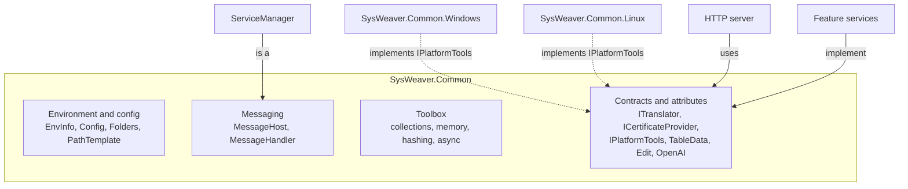

# SysWeaver.Common

[⬆ SysWeaver overview](../README.md)

> The foundation every other SysWeaver project stands on: environment and configuration, folders, messaging/logging, async and collection primitives, and — importantly — the shared *vocabulary* of contracts and attributes that the rest of the framework implements.

| | |
|---|---|
| **Layer** | Foundation |
| **Kind** | Library (no external dependencies) |
| **Platform** | Any; platform-specific parts are delegated to `IPlatformTools` implementations |

## Purpose

`SysWeaver.Common` exists so that higher layers never have to agree on anything except this assembly. It serves three roles:

1. **Runtime environment** – where am I running, which files and folders belong to this application, how is it configured, where do log messages go.
2. **General purpose toolbox** – high performance collections, string and memory helpers, hashing, scheduling and async coordination primitives that are reused throughout the framework.
3. **Contract hub** – interfaces and attributes that let independent projects cooperate without referencing each other (translation, certificates, firewalls, table rendering, object editing, AI tools, platform tools, …).

## How it fits into SysWeaver



The `ServiceManager` *is* a `MessageHost`, so every service logs through the same pipeline. Feature projects implement the contracts defined here (e.g. a translator implements `ITranslator`, a certificate provider implements `ICertificateProvider`), and consumers discover them at runtime through the service manager — neither side references the other.

## Key concepts

| Concept | What it gives you |
|---|---|
| **Environment info** (`EnvInfo`) | Executable location and base name, OS platform name, native library folder convention (`runtimes/<os>_<arch>`), application identity. The executable base name drives the names of the config, manifest and log files. |
| **Layered configuration** (`Config`) | Settings are merged from a machine-wide default file, the application's own `<Executable>.Config.json` and a machine-wide *forced* file whose values applications cannot override. |
| **Folders & path templates** (`Folders`, `PathTemplate`) | Standard data locations (all users / per user, shared / per application, key folder) and `$(Variable)` path expansion used in almost every configurable path in the framework. |
| **Messaging** (`MessageHost`, `MessageHandler`, message levels) | A hub that distributes log/status messages to any number of handlers (console, debugger, file, …). |
| **Plug-in loading** (`TypeFinder`, `PlatformTools`) | Resolve types by name — including loading `<Assembly>.dll` from the executable folder — which is what makes manifest-driven composition and OS-specific implementations possible. |
| **Roles** | Standard auth token names (Admin, Ops, Dev, Debug, Service and combinations) used by `[WebApiAuth]` across the framework. |
| **Attribute vocabularies** | Table-data rendering hints, object-editor hints, auto-translation markers and OpenAI tool markers. They only *describe*; the processing lives in the projects that consume them. |

## Key features

- Configuration and folder conventions shared by every SysWeaver application, with machine-wide defaults and enforced overrides.
- Rich, allocation-conscious building blocks: prefix/string trees, read-optimised dictionaries, pooled and chunked streams, memory-mapped file access, unmanaged memory helpers.
- Async coordination: locks, signals, concurrency and rate limiters, periodic tasks and a scheduler.
- Hashing and code generation (fast non-cryptographic hashes, secure random, human-friendly codes that tolerate look-alike characters).
- Performance and statistics interfaces (`IPerfMonitored`, `IHaveStats`) that the service manager collects and displays automatically.
- Contracts that let the framework be assembled from interchangeable parts.

## Limitations and considerations

- It is a large, broad assembly; everything depends on it, so changes here ripple through the whole framework.
- Some functionality depends on optional assemblies being present at runtime (platform tools, XML documentation reader). When they are missing the code falls back silently (e.g. dummy platform tools), which can hide deployment mistakes.
- Several helpers use unsafe code and raw memory for performance; they assume correct usage by callers.
- The attribute vocabularies have no effect on their own — they require the corresponding processing project (table data, editor, translation, AI) to be present.

## Using it

You rarely reference it explicitly; it arrives transitively. Typical direct uses:

```csharp
using SysWeaver;

// Read an application setting (merged from default, app and forced config files)
if (Config.TryGetString("KeyFolder", out var keys)) { /* … */ }

// Expand a path template used in service parameters
var dataFile = PathTemplate.Resolve("$(CommonApplicationData)/MyApp/data.bin");

// OS specific helpers, implementation chosen at runtime
if (PlatformTools.Current.GetCpuUsage(out var cpu)) { /* … */ }
```

Deploy `SysWeaver.Common.Windows` and/or `SysWeaver.Common.Linux` next to the executable so the platform tools can be resolved.

## Relationships

- **Project:** [`SysWeaver.Common.csproj`](SysWeaver.Common.csproj)
- **Used by:** [SysWeaver.Auth.Core](../SysWeaver.Auth.Core/README.md), [SysWeaver.CommandLine](../SysWeaver.CommandLine/README.md), [SysWeaver.Common.Linux](../SysWeaver.Common.Linux/README.md), [SysWeaver.Common.Windows](../SysWeaver.Common.Windows/README.md), [SysWeaver.Compression](../SysWeaver.Compression/README.md), [SysWeaver.DbSimpleStack](../SysWeaver.DbSimpleStack/README.md), [SysWeaver.Excel](../SysWeaver.Excel/README.md), [SysWeaver.ExpressionEvaluator](../SysWeaver.ExpressionEvaluator/README.md), [SysWeaver.FileTranslation](../SysWeaver.FileTranslation/README.md), [SysWeaver.FolderSync](../SysWeaver.FolderSync/README.md), [SysWeaver.HttpServer](../SysWeaver.HttpServer/README.md), [SysWeaver.HttpServer.ExploreModule](../SysWeaver.HttpServer.ExploreModule/README.md), [SysWeaver.Inspection](../SysWeaver.Inspection/README.md), [SysWeaver.IsoData](../SysWeaver.IsoData/README.md), [SysWeaver.Knowledge](../SysWeaver.Knowledge/README.md), [SysWeaver.LanguageIdentifier.FastText](../SysWeaver.LanguageIdentifier.FastText/README.md), [SysWeaver.Map](../SysWeaver.Map/README.md), [SysWeaver.Math](../SysWeaver.Math/README.md), [SysWeaver.Media.Png](../SysWeaver.Media.Png/README.md), [SysWeaver.Media.Psd](../SysWeaver.Media.Psd/README.md), [SysWeaver.Media.Svg](../SysWeaver.Media.Svg/README.md), [SysWeaver.MicroService.FileUploader](../SysWeaver.MicroService.FileUploader/README.md), [SysWeaver.MicroService.Map](../SysWeaver.MicroService.Map/README.md), [SysWeaver.MicroService.Media](../SysWeaver.MicroService.Media/README.md), [SysWeaver.MicroService.Net](../SysWeaver.MicroService.Net/README.md), [SysWeaver.MicroService.Translation](../SysWeaver.MicroService.Translation/README.md), [SysWeaver.MicroService.TranslationDbCache](../SysWeaver.MicroService.TranslationDbCache/README.md), [SysWeaver.MicroService.UserManager](../SysWeaver.MicroService.UserManager/README.md), [SysWeaver.MicroService.UserStorage](../SysWeaver.MicroService.UserStorage/README.md), [SysWeaver.MicroServices](../SysWeaver.MicroServices/README.md), [SysWeaver.MicroServices.Log](../SysWeaver.MicroServices.Log/README.md), [SysWeaver.MicroServices.ServiceManager](../SysWeaver.MicroServices.ServiceManager/README.md), [SysWeaver.Minifier.Svg](../SysWeaver.Minifier.Svg/README.md), [SysWeaver.Remote.Connection](../SysWeaver.Remote.Connection/README.md), [SysWeaver.Remote.Services](../SysWeaver.Remote.Services/README.md), [SysWeaver.Security](../SysWeaver.Security/README.md), [SysWeaver.Serialization](../SysWeaver.Serialization/README.md), [SysWeaver.Storage](../SysWeaver.Storage/README.md), [SysWeaver.TableData](../SysWeaver.TableData/README.md), [SysWeaver.TextMessage.Fake](../SysWeaver.TextMessage.Fake/README.md), [SysWeaver.Tor](../SysWeaver.Tor/README.md), [SysWeaver.Translation.Google](../SysWeaver.Translation.Google/README.md), [SysWeaver.WebBrowser.Cef](../SysWeaver.WebBrowser.Cef/README.md), [SysWeaver.WebBrowser.WebView2](../SysWeaver.WebBrowser.WebView2/README.md)
