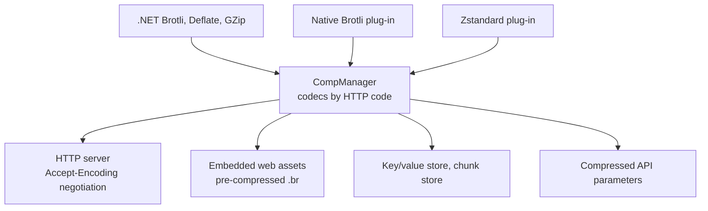

# SysWeaver.Compression

[⬆ SysWeaver overview](../README.md)

> The compression abstraction and registry: named, prioritised codecs (Brotli, Deflate, GZip built in; Zstandard and native Brotli as plug-ins) used for HTTP content encoding, pre-compressed web assets, storage and data transfer.

| | |
|---|---|
| **Layer** | Compression |
| **Kind** | Library (abstraction + registry + .NET codecs) |

## Purpose

Give the whole framework a single way to compress and decompress data by HTTP encoding name ("br", "gzip", "deflate", "zstd") with selectable effort levels, so that the web server, the build-time asset pipeline, key/value storage, chunk storage and remote calls all share codecs.

## How it fits into SysWeaver



## Key features

- Codec lookup by HTTP content-coding name; highest priority implementation wins.
- Effort levels (fast / balanced / best) expressed in compact preference strings such as `"br:Balanced, gzip:Fast"`.
- Stream and memory based APIs, helpers for embedded (pre-compressed) resources.
- Conversion of GZip data to Deflate without recompression.

## Limitations and considerations

- Codec availability is process-wide; clients can only negotiate codecs that have been registered.
- Build steps that pre-compress web assets use an external tool (see [SysWeaver overview](../README.md) build notes).

## Using it

Built-in codecs need no registration. Add plug-ins via the manifest (they are registered, not instantiated):

```json
{ "Type": "SysWeaver.Compression.CompZstdSharp, SysWeaver.Compression.ZstdSharp" }
```

## Relationships

- **Project:** [`SysWeaver.Compression.csproj`](SysWeaver.Compression.csproj)
- **Builds on:** [SysWeaver.Common](../SysWeaver.Common/README.md)
- **Used by:** [SysWeaver.Auth.Core](../SysWeaver.Auth.Core/README.md), [SysWeaver.Compression.BrotliNativeNET](../SysWeaver.Compression.BrotliNativeNET/README.md), [SysWeaver.Compression.ZstdSharp](../SysWeaver.Compression.ZstdSharp/README.md), [SysWeaver.DbSimpleStack](../SysWeaver.DbSimpleStack/README.md), [SysWeaver.FolderSync](../SysWeaver.FolderSync/README.md), [SysWeaver.HttpServer](../SysWeaver.HttpServer/README.md), [SysWeaver.Knowledge](../SysWeaver.Knowledge/README.md), [SysWeaver.LanguageIdentifier.FastText](../SysWeaver.LanguageIdentifier.FastText/README.md), [SysWeaver.Map](../SysWeaver.Map/README.md), [SysWeaver.Media.Svg](../SysWeaver.Media.Svg/README.md), [SysWeaver.MicroService.Media](../SysWeaver.MicroService.Media/README.md), [SysWeaver.MicroService.TranslationDbCache](../SysWeaver.MicroService.TranslationDbCache/README.md), [SysWeaver.Remote.Connection](../SysWeaver.Remote.Connection/README.md), [SysWeaver.Storage](../SysWeaver.Storage/README.md), [SysWeaver.TableData](../SysWeaver.TableData/README.md)
