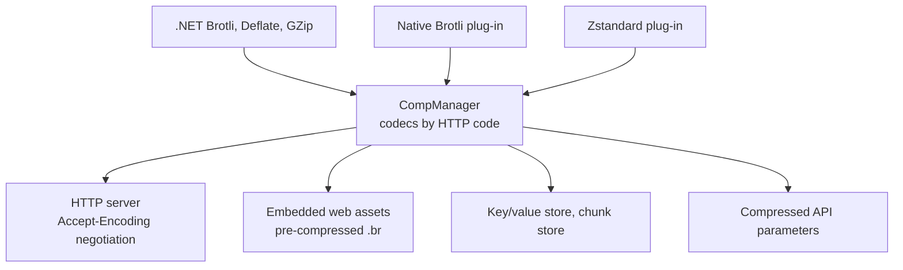

# SysWeaver.Compression

[⬆ SysWeaver overview](../README.md)

> The compression abstraction and registry: named, prioritised codecs (Brotli, Deflate, GZip built in; Zstandard and native Brotli as plug-ins) used for HTTP content encoding, pre-compressed web assets, storage and data transfer.

| | |
|---|---|
| **Layer** | Compression |
| **Kind** | Library (abstraction + registry + .NET codecs) |

## Purpose

Give the whole framework a single way to compress and decompress data by HTTP encoding name ("br", "gzip", "deflate", "zstd") with selectable effort levels, so that the web server, the build-time asset pipeline, key/value storage, chunk storage and remote calls all share codecs.

## How it fits into SysWeaver



## Key features

- Codec lookup by HTTP content-coding name or file extension (`CompManager.GetFromHttp`, `CompManager.GetFromExt`); the highest priority implementation wins (on a tie, the last registered).
- Three effort levels (`CompEncoderLevels.Fast` / `Balanced` / `Best`), mapped by each codec to its own quality setting (ex: Brotli quality 1 / 4 / 11). The HTTP server expresses its preferences as compact strings such as `"br:Balanced, gzip:Fast"`.
- Sync and async APIs for every combination of stream / memory input and output; extension methods (`CompExt`) that compress or decompress into an exact size array or pooled memory.
- Truncated or invalid compressed data throws (`InvalidDataException`) instead of silently returning partial data, also for the .NET `DeflateStream` / `GZipStream` based codecs.
- Helpers for embedded resources that may be stored pre-compressed (`AsmResExt`, ex: `index.html.br`) and for text files on disc that may be compressed (`CompFile`).
- Conversion of GZip data to raw Deflate without recompression (`TransformGZipToDeflateStream`).
- `CompStreamCodec<TEncoder, TDecoder>` implements the whole codec API on top of a struct encoder / decoder pair with pooled buffers, used by the Brotli, native Brotli and Zstandard codecs.

## Key types

| Type | Role |
|---|---|
| `ICompType` (`ICompEncoder`, `ICompDecoder`, `ICompInfo`) | A codec: name, HTTP code, priority, file extensions, compress / decompress. |
| `CompManager` | Process wide codec registry, lookup by HTTP code or file extension. |
| `CompEncoderLevels` | Fast / Balanced / Best effort. |
| `CompExt` | `GetCompressed`, `GetDecompressed`, `GetDecompressedArray`, `GetUnmanagedDecompressed` extension methods. |
| `CompBrotliNETNew`, `CompDeflateNET`, `CompGZipNET` | The built-in codecs registered by default (`br`, `deflate`, `gzip` / `gz`). |
| `CompBrotliNET` | Alternative `BrotliStream` based Brotli codec (priority -1, not registered). |
| `CompDeflateNETNew`, `CompGZipNETNew`, `CompZStdNETNew` | Codecs using the .NET 11+ encoder / decoder APIs, only compiled when targeting .NET 11 or later and not registered by default. |
| `CompStreamCodec<TEncoder, TDecoder>`, `ICompStreamEncoder<T>`, `ICompStreamDecoder<T>` | Building blocks for implementing a codec from a streaming encoder / decoder. |
| `CompInstancePool<T>` | Small lock-free pool used to reuse native encoder / decoder state. |
| `AsmResExt`, `CompFile` | Read (optionally compressed) embedded resources and files. |
| `TransformGZipToDeflateStream` | Present GZip data as raw Deflate data. |

## Limitations and considerations

- Codec availability is process-wide; clients can only negotiate codecs that have been registered.
- Concatenated streams are only decoded for GZip (members) and Zstandard (frames); for other formats data after the first compressed stream is ignored.
- When decompressing from a stream, the decoder may read past the end of the compressed data.
- Build steps that pre-compress web assets use an external tool (see [SysWeaver overview](../README.md) build notes).

## Using it

Built-in codecs need no registration. Add plug-ins via the manifest (they are registered, not instantiated), or call their static `Register()` method:

```json
{ "Type": "SysWeaver.Compression.CompZstdSharp, SysWeaver.Compression.ZstdSharp" }
```

## Relationships

- **Project:** [`SysWeaver.Compression.csproj`](SysWeaver.Compression.csproj)
- **Builds on:** [SysWeaver.Common](../SysWeaver.Common/README.md)
- **Used by:** [SysWeaver.Auth.Core](../SysWeaver.Auth.Core/README.md), [SysWeaver.Compression.BrotliNativeNET](../SysWeaver.Compression.BrotliNativeNET/README.md), [SysWeaver.Compression.ZstdSharp](../SysWeaver.Compression.ZstdSharp/README.md), [SysWeaver.DbSimpleStack](../SysWeaver.DbSimpleStack/README.md), [SysWeaver.FolderSync](../SysWeaver.FolderSync/README.md), [SysWeaver.HttpServer](../SysWeaver.HttpServer/README.md), [SysWeaver.Knowledge](../SysWeaver.Knowledge/README.md), [SysWeaver.LanguageIdentifier.FastText](../SysWeaver.LanguageIdentifier.FastText/README.md), [SysWeaver.Map](../SysWeaver.Map/README.md), [SysWeaver.Media.Svg](../SysWeaver.Media.Svg/README.md), [SysWeaver.MicroService.Media](../SysWeaver.MicroService.Media/README.md), [SysWeaver.MicroService.TranslationDbCache](../SysWeaver.MicroService.TranslationDbCache/README.md), [SysWeaver.Remote.Connection](../SysWeaver.Remote.Connection/README.md), [SysWeaver.Storage](../SysWeaver.Storage/README.md), [SysWeaver.TableData](../SysWeaver.TableData/README.md)
