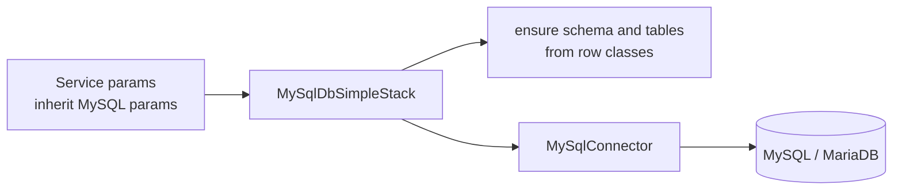

# SysWeaver.DbSimpleStack.MySql

[⬆ SysWeaver overview](../README.md)

> MySQL / MariaDB back-end for the SysWeaver database layer, including character set/collation control, table partition folders, and automatic creation and evolution of tables.

| | |
|---|---|
| **Layer** | Data |
| **Kind** | Library (database dialect) |

## Purpose

All SysWeaver services that persist relational data do so through this project. Their parameter classes typically *inherit* the MySQL parameters, so each service is configured with its own server/schema/credentials directly in its manifest entry.

## How it fits into SysWeaver



## Key features

- UTF-8 (utf8mb4) by default with case-sensitive and case-insensitive collations selectable per column.
- Table storage partitioning over configurable folders.
- Table maintenance (optimize) helpers.
- Automatic schema creation and column/index updates for new versions of row types.

## Limitations and considerations

- Schema evolution is additive: source comments mark removal of indices and composite indices as not yet implemented.
- The default connection string disables TLS; override the connection string for encrypted connections.

## Using it

```json
{ "Type": "SysWeaver.MicroService.MySqlApiAuditService, SysWeaver.MicroService.MySqlAudit",
  "Params": { "Server": "db.local", "Schema": "audit", "User": "svc", "Password": "…" } }
```
The same connection members apply to every service whose parameters derive from the MySQL parameters.

## Relationships

- **Project:** [`SysWeaver.DbSimpleStack.MySql.csproj`](SysWeaver.DbSimpleStack.MySql.csproj)
- **Builds on:** [SysWeaver.DbSimpleStack](../SysWeaver.DbSimpleStack/README.md)
- **Vendored libraries:** SimpleStack.Orm.MySQLConnector (see [_external](../_external/README.md))
- **Used by:** [SysWeaver.Chat.MySql](../SysWeaver.Chat.MySql/README.md), [SysWeaver.IpLocation.MySqlCache](../SysWeaver.IpLocation.MySqlCache/README.md), [SysWeaver.MicroService.MySqlAudit](../SysWeaver.MicroService.MySqlAudit/README.md), [SysWeaver.MicroService.TranslationDbCache](../SysWeaver.MicroService.TranslationDbCache/README.md), [SysWeaver.MicroService.UserManager](../SysWeaver.MicroService.UserManager/README.md)
