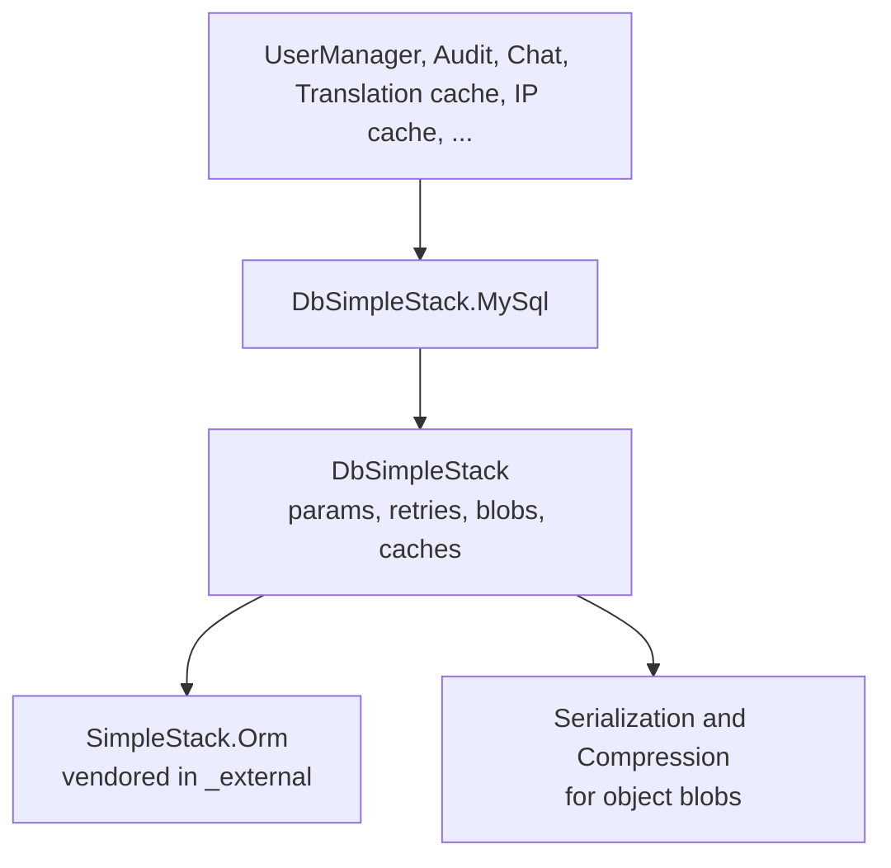

# SysWeaver.DbSimpleStack

[⬆ SysWeaver overview](../README.md)

> The relational database layer: a thin framework over the vendored SimpleStack.Orm that adds SysWeaver-style parameters, connection retry, automatic schema handling, object blobs, column attributes and in-memory table caches.

| | |
|---|---|
| **Layer** | Data |
| **Kind** | Library (database-agnostic core) |

## Purpose

Services that need a real database (users, audit logs, chat history, caches) describe their tables as C# classes and let this layer create and access them. The core is dialect-independent; [SysWeaver.DbSimpleStack.MySql](../SysWeaver.DbSimpleStack.MySql/README.md) supplies MySQL.

## How it fits into SysWeaver

## Key features

- Connection string templates filled from parameters (server, port, schema, credentials).
- Waits and retries while the database server starts.
- Objects stored as serialized, compressed blobs.
- Column attributes for case sensitivity, ASCII columns and full-text indices.
- Whole-table in-memory caches with optional background refresh.
- Optional read-only mode that blocks write operations.

## Limitations and considerations

- Relies on a vendored ORM fork rather than a NuGet package; updates must be done in the repository.
- Only the MySQL dialect is wired up by SysWeaver projects, although the vendored ORM contains others.

## Using it

Use it through a dialect project such as [SysWeaver.DbSimpleStack.MySql](../SysWeaver.DbSimpleStack.MySql/README.md).

## Relationships

- **Project:** [`SysWeaver.DbSimpleStack.csproj`](SysWeaver.DbSimpleStack.csproj)
- **Builds on:** [SysWeaver.Common](../SysWeaver.Common/README.md), [SysWeaver.Compression](../SysWeaver.Compression/README.md), [SysWeaver.Serialization](../SysWeaver.Serialization/README.md), [SysWeaver.TableData](../SysWeaver.TableData/README.md)
- **Vendored libraries:** SimpleStack.Orm (see [_external](../_external/README.md))
- **Used by:** [SysWeaver.DbSimpleStack.MySql](../SysWeaver.DbSimpleStack.MySql/README.md), [SysWeaver.FileDatabase](../SysWeaver.FileDatabase/README.md)
