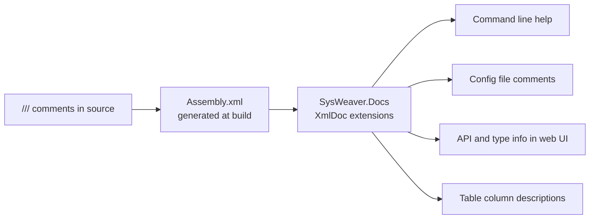

# SysWeaver.Docs

[⬆ SysWeaver overview](../README.md)

> Reads the compiler-generated XML documentation of assemblies at runtime, so that `///` comments become user-facing text: help screens, config file comments, API documentation and table column descriptions.

| | |
|---|---|
| **Layer** | Foundation |
| **Kind** | Library (no dependencies) |

## Purpose

SysWeaver follows a "document once" philosophy: the XML comment you write on a parameter field or a web API method is also what the operator sees in a generated config file, in command line help, or next to a column in the web UI. This project provides the lookup from reflection objects (types, members, methods, parameters, enum values) to that documentation.

## How it fits into SysWeaver



All SysWeaver projects enable XML documentation generation, which is what makes this work framework-wide. Some consumers (e.g. the config file writer in SysWeaver.Common) load `SysWeaver.Docs.XmlDocExt` by name at runtime instead of referencing it, so it is an optional enhancement rather than a hard requirement.

## Key features

- `XmlDocExt.XmlDoc()` extension methods on `Type`, `MemberInfo`, `FieldInfo`, `PropertyInfo`, `MethodInfo`, `ConstructorInfo`, `MethodBase` and `ParameterInfo`, returning `IXmlDocInfo` (summary, remarks), `IXmlDocMethodInfo` (plus returns and per-parameter docs) or `IXmlDocParameterInfo`.
- `XmlSummary()` shortcuts for fields and properties.
- Enum value documentation (`XmlDocEnum`).
- `ToTitle()` combines summary and remarks into one text for tool tips / UI titles.
- Members are also found when looked up through a derived type, and documentation of interfaces/base types in other assemblies is searched.
- Each documentation file is parsed once (lazily) and all lookups are cached; thread safe.

## Limitations and considerations

- Only as good as the comments: undocumented members produce `null`.
- Requires the `.xml` documentation files to be deployed next to the assemblies; publishing pipelines that drop them (or single-file publishing, where assemblies have no location) silently remove the documentation.
- Texts are the plain inner text: `<see cref="..."/>` and similar self-closing tags vanish from the sentence, and `<inheritdoc/>` is not resolved.
- Some signatures are not matched (e.g. types nested more than one level deep, constructors with nested-type parameters), these simply return `null`.

## Using it

Enable `GenerateDocumentationFile` in your own projects so your services get the same treatment, then:

```csharp
using SysWeaver.Docs;
string text = typeof(MyServiceParams).GetField("Greeting").XmlSummary();
```

## Relationships

- **Project:** [`SysWeaver.Docs.csproj`](SysWeaver.Docs.csproj)
- **Used by:** [SysWeaver.CommandLine](../SysWeaver.CommandLine/README.md), [SysWeaver.MicroService.Edit](../SysWeaver.MicroService.Edit/README.md), [SysWeaver.TableData](../SysWeaver.TableData/README.md)
