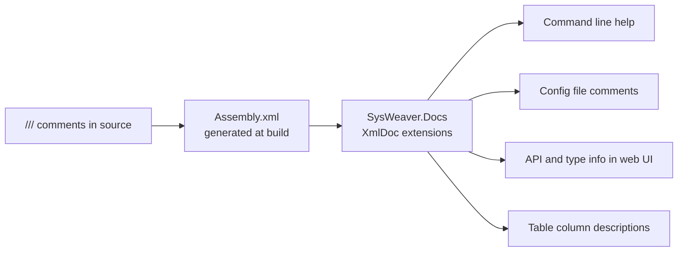

# SysWeaver.Docs

[⬆ SysWeaver overview](../README.md)

> Reads the compiler-generated XML documentation of assemblies at runtime, so that `///` comments become user-facing text: help screens, config file comments, API documentation and table column descriptions.

| | |
|---|---|
| **Layer** | Foundation |
| **Kind** | Library (no dependencies) |

## Purpose

SysWeaver follows a "document once" philosophy: the XML comment you write on a parameter field or a web API method is also what the operator sees in a generated config file, in command line help, or next to a column in the web UI. This project provides the lookup from reflection objects (types, members, methods, parameters, enum values) to that documentation.

## How it fits into SysWeaver



All SysWeaver projects enable XML documentation generation, which is what makes this work framework-wide. Some consumers load this assembly by name at runtime instead of referencing it, so it is an optional enhancement rather than a hard requirement.

## Key features

- Extension methods on `Type`, `MemberInfo`, `MethodInfo`, `ParameterInfo` etc. returning summaries, remarks, parameter and return documentation.
- Enum value documentation.
- Title extraction helpers for UI use.

## Limitations and considerations

- Only as good as the comments: undocumented members produce empty text.
- Requires the `.xml` documentation files to be deployed next to the assemblies; publishing pipelines that drop them silently remove the documentation.

## Using it

Enable `GenerateDocumentationFile` in your own projects so your services get the same treatment, then:

```csharp
using SysWeaver.Docs;
string text = typeof(MyServiceParams).GetField("Greeting").XmlSummary();
```

## Relationships

- **Project:** [`SysWeaver.Docs.csproj`](SysWeaver.Docs.csproj)
- **Used by:** [SysWeaver.CommandLine](../SysWeaver.CommandLine/README.md), [SysWeaver.MicroService.Edit](../SysWeaver.MicroService.Edit/README.md), [SysWeaver.TableData](../SysWeaver.TableData/README.md)
