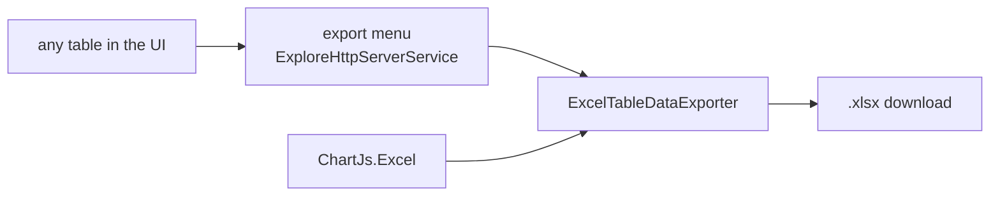

# SysWeaver.Excel

[⬆ SysWeaver overview](../README.md)

> Excel export of table data, using GemBox.Spreadsheet.

| | |
|---|---|
| **Layer** | Documents |
| **Kind** | Service (table exporter provider) |

## Purpose

Adds "export to Excel" to every table in the web UI by contributing a table exporter.

## How it fits into SysWeaver

## Limitations and considerations

- GemBox.Spreadsheet is commercial; without a license key it runs in the vendor's free, limited mode (the service reports which mode is active). The key is read from the key folder by default.

## Relationships

- **Project:** [`SysWeaver.Excel.csproj`](SysWeaver.Excel.csproj)
- **Builds on:** [SysWeaver.Common](../SysWeaver.Common/README.md)
- **Used by:** [SysWeaver.MicroService.ChartJs.Excel](../SysWeaver.MicroService.ChartJs.Excel/README.md)
