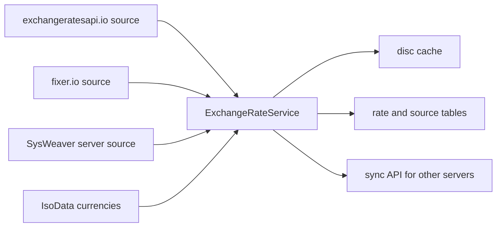

# SysWeaver.ExchangeRate

[⬆ SysWeaver overview](../README.md)

> Currency exchange rates as a service: aggregates rates from pluggable sources, caches them on disc and can serve other SysWeaver instances.

| | |
|---|---|
| **Layer** | Networking / Data |
| **Kind** | Micro service + sources |

## Purpose

Give applications current currency conversion rates without each service integrating a provider. One server can fetch from commercial APIs and act as the source for others.

## How it fits into SysWeaver

## Key features

- Multiple sources combined; per-source and combined rate tables.
- Disc caching so rates survive restarts and outages.
- Mapping of obsolete currency symbols to current ones.
- Server-to-server synchronisation protected by the service role.

## Limitations and considerations

- Needs at least one source; commercial sources require API keys and have update-frequency limits.
- Rates are only as fresh as the sources' update schedule.

## Using it

Register one or more rate sources, then the service (see the source classes in this folder for their parameters).

## Relationships

- **Project:** [`SysWeaver.ExchangeRate.csproj`](SysWeaver.ExchangeRate.csproj)
- **Builds on:** [SysWeaver.IsoData](../SysWeaver.IsoData/README.md), [SysWeaver.MicroServices.ServiceManager](../SysWeaver.MicroServices.ServiceManager/README.md), [SysWeaver.Remote.Connection](../SysWeaver.Remote.Connection/README.md), [SysWeaver.Serialization](../SysWeaver.Serialization/README.md)
