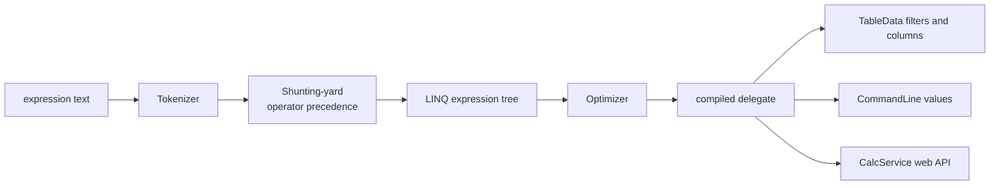

# SysWeaver.ExpressionEvaluator

[⬆ SysWeaver overview](../README.md)

> A compiling expression engine: text expressions are parsed and turned into LINQ expression trees for fast repeated evaluation in several numeric types. Also exposes a small calculator web API.

| | |
|---|---|
| **Layer** | Foundation |
| **Kind** | Library + optional web API object |

## Purpose

Lets users and configuration express formulas and filters as text ("x * 2 + y", "Size > 1000") while the framework executes them at compiled speed. It is the engine behind computed columns and filters in table data and behind value parsing in the command line tools.

## How it fits into SysWeaver



## Key features

- Evaluators for double, decimal, signed and unsigned 64-bit integers.
- Named parameters, so one expression compiles once and runs many times.
- Access to the raw expression tree for embedding into larger LINQ expressions.
- Tokenization output for validation or syntax highlighting.
- `CalcService`: a tiny service that publishes calculator endpoints over HTTP.

## Limitations and considerations

- Numeric expression language; it is not a general scripting language (use [SysWeaver.Script](../SysWeaver.Script/README.md) for C# code).
- `CalcService` declares no authentication of its own; if registered it follows the API server's default auth.

## Using it

```csharp
using SysWeaver.Parser;
var f = ExpressionEvaluator.Double.Evaluator("x * x + y", "x", "y");
double r = f(new[] { 3.0, 1.0 });
```
Publish the calculator (optional):
```json
{ "Type": "SysWeaver.MicroService.CalcService, SysWeaver.ExpressionEvaluator" }
```

## Relationships

- **Project:** [`SysWeaver.ExpressionEvaluator.csproj`](SysWeaver.ExpressionEvaluator.csproj)
- **Builds on:** [SysWeaver.Common](../SysWeaver.Common/README.md), [SysWeaver.MicroServices](../SysWeaver.MicroServices/README.md)
- **Used by:** [SysWeaver.CommandLine](../SysWeaver.CommandLine/README.md), [SysWeaver.TableData](../SysWeaver.TableData/README.md)
