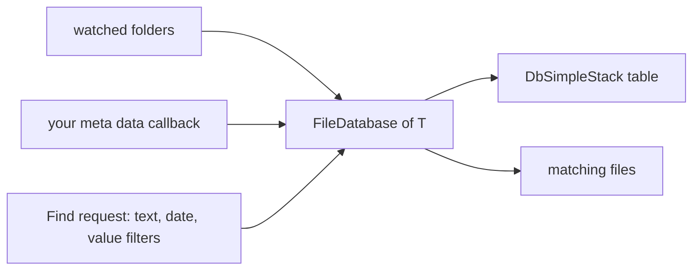

# SysWeaver.FileDatabase

[⬆ SysWeaver overview](../README.md)

> Indexes files and their meta data into a database table and searches them with text, date and value filters.

| | |
|---|---|
| **Layer** | Data |
| **Kind** | Library |

## Purpose

Make large file collections queryable: a service supplies a callback that extracts meta data from each file, and the file database keeps the table in sync with the file system and answers search requests.

## How it fits into SysWeaver

## Key features

- Keeps rows synchronised with files, ignoring overlapping or missing folders.
- Search with combinable text, date/time and numeric filters.
- Statistics and performance monitoring integrated with the service manager.

## Limitations and considerations

- Requires a database back-end through [SysWeaver.DbSimpleStack](../SysWeaver.DbSimpleStack/README.md).
- Meta data quality depends entirely on the supplied extraction callback.

## Relationships

- **Project:** [`SysWeaver.FileDatabase.csproj`](SysWeaver.FileDatabase.csproj)
- **Builds on:** [SysWeaver.DbSimpleStack](../SysWeaver.DbSimpleStack/README.md)
