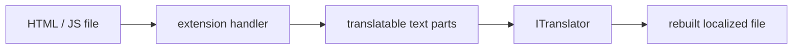

# SysWeaver.FileTranslation

[⬆ SysWeaver overview](../README.md)

> Translation of web files: extracts translatable text from HTML and JavaScript, translates it and rebuilds the file.

| | |
|---|---|
| **Layer** | Translation |
| **Kind** | Library |

## Purpose

Serve localized pages without maintaining a copy per language. Used by the translation file transformer and the translation services.

## How it fits into SysWeaver

## Limitations and considerations

- Handles HTML and JavaScript; CSS handling is marked as TODO in the source.
- Not included in the main solution file although solution projects reference it.

## Relationships

- **Project:** [`SysWeaver.FileTranslation.csproj`](SysWeaver.FileTranslation.csproj)
- **Builds on:** [SysWeaver.Common](../SysWeaver.Common/README.md)
- **Used by:** [SysWeaver.HttpTransformer.Translate](../SysWeaver.HttpTransformer.Translate/README.md), [SysWeaver.MicroService.Translation](../SysWeaver.MicroService.Translation/README.md)
