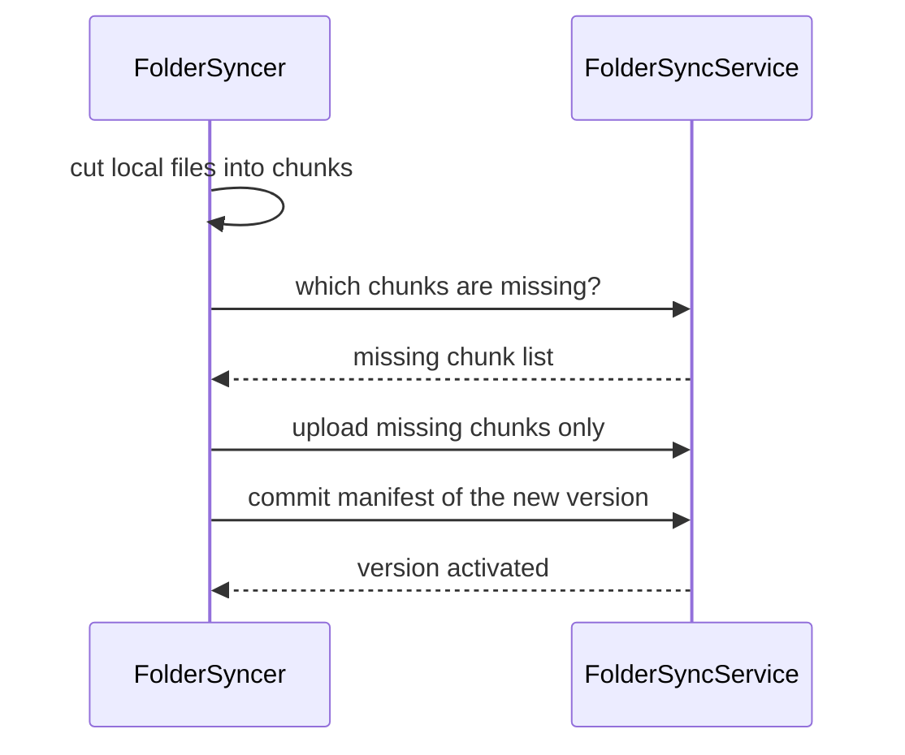

# SysWeaver.FolderSync

[⬆ SysWeaver overview](../README.md)

> Client side of SysWeaver folder synchronisation: push a local folder to a server, or pull a shared folder from it, transferring only changed content chunks.

| | |
|---|---|
| **Layer** | Files |
| **Kind** | Library (client) |

## Purpose

Deploy and distribute folders (applications, content, configuration) efficiently. Built on content-defined chunking, so updates only transfer what changed. The `SwSyncTool` binary in `_tools` wraps this client.

## How it fits into SysWeaver

## Limitations and considerations

- Accepting invalid server certificates is possible but explicitly discouraged.
- Needs a server running [SysWeaver.MicroService.FolderSync](../SysWeaver.MicroService.FolderSync/README.md).

## Relationships

- **Project:** [`SysWeaver.FolderSync.csproj`](SysWeaver.FolderSync.csproj)
- **Builds on:** [SysWeaver.Common](../SysWeaver.Common/README.md), [SysWeaver.Compression](../SysWeaver.Compression/README.md), [SysWeaver.Remote.Connection](../SysWeaver.Remote.Connection/README.md), [SysWeaver.Storage.Cdc](../SysWeaver.Storage.Cdc/README.md), [SysWeaver.Storage](../SysWeaver.Storage/README.md)
- **Used by:** [SysWeaver.MicroService.FolderSync](../SysWeaver.MicroService.FolderSync/README.md)
