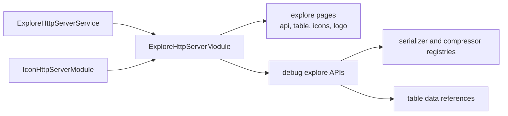

# SysWeaver.HttpServer.ExploreModule

[⬆ SysWeaver overview](../README.md)

> Developer-facing explorer pages for a running SysWeaver server: API browser, generic interactive table viewer, icon browser, serializer/compression inventories and data references.

| | |
|---|---|
| **Layer** | HTTP (module) |
| **Kind** | HTTP module with embedded web pages |

## Purpose

Make a running system self-describing. Developers and operators can browse the published APIs, open any table-data API in a generic grid, see which icons exist, and inspect which serializers and compressors are available — without extra tooling.

## How it fits into SysWeaver

## Key features

- API explorer page and generic table page for any table-data endpoint or data reference.
- Icon gallery of the shared icon set.
- Inventories of registered serializers and compression formats.
- Links that open a data reference as an interactive table.

## Limitations and considerations

- Most endpoints are restricted to debug/dev roles; the module is intended for development and operations, not end users.

## Using it

Added by `ExploreHttpServerService` from [SysWeaver.MicroService.HttpServer](../SysWeaver.MicroService.HttpServer/README.md) (after the static data and icon services).

## Relationships

- **Project:** [`SysWeaver.HttpServer.ExploreModule.csproj`](SysWeaver.HttpServer.ExploreModule.csproj)
- **Builds on:** [SysWeaver.Common](../SysWeaver.Common/README.md), [SysWeaver.HttpServer.IconModule](../SysWeaver.HttpServer.IconModule/README.md), [SysWeaver.HttpServer](../SysWeaver.HttpServer/README.md)
- **Used by:** [SysWeaver.MicroService.HttpServer](../SysWeaver.MicroService.HttpServer/README.md)
