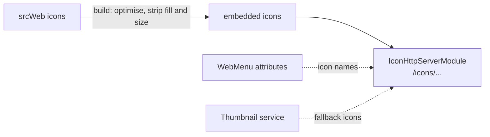

# SysWeaver.HttpServer.IconModule

[⬆ SysWeaver overview](../README.md)

> Serves SysWeaver's shared SVG icon library, plus icons for file extensions, MIME types and country flags.

| | |
|---|---|
| **Layer** | HTTP (module) |
| **Kind** | HTTP module with embedded assets |

## Purpose

A single, consistent icon set for every page and menu in the framework. Menu attributes and UI components reference icons by name; this module resolves and serves them.

## How it fits into SysWeaver

## Key features

- A large general-purpose icon set, optimised at build time so icons can be coloured with CSS.
- Lookup of icons by file extension and MIME type (used, for example, as thumbnail fallbacks).
- Country flag icons.

## Limitations and considerations

- The icon optimisation build step uses a Windows tool.
- Icons without fill information depend on page CSS for their colour.

## Using it

Added by `IconHttpServerService` in [SysWeaver.MicroService.HttpServer](../SysWeaver.MicroService.HttpServer/README.md).

## Relationships

- **Project:** [`SysWeaver.HttpServer.IconModule.csproj`](SysWeaver.HttpServer.IconModule.csproj)
- **Builds on:** [SysWeaver.HttpServer](../SysWeaver.HttpServer/README.md)
- **Used by:** [SysWeaver.HttpServer.ExploreModule](../SysWeaver.HttpServer.ExploreModule/README.md), [SysWeaver.MicroService.HttpServer](../SysWeaver.MicroService.HttpServer/README.md), [SysWeaver.MicroService.Thumbnail](../SysWeaver.MicroService.Thumbnail/README.md)
