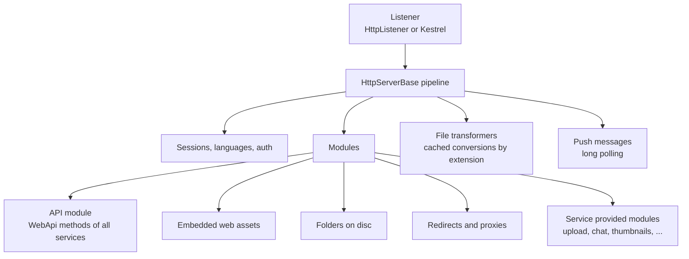
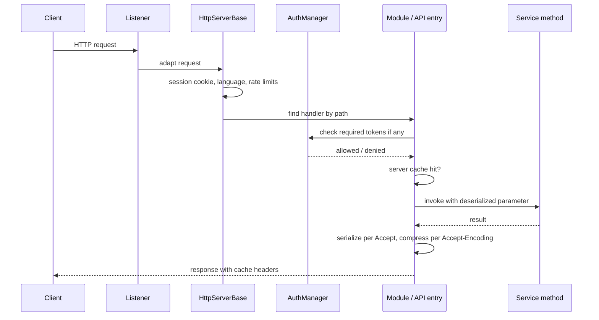

# SysWeaver.HttpServer

[⬆ SysWeaver overview](../README.md)

> The server-agnostic heart of SysWeaver's web layer: request pipeline, module routing, the Web API engine, static/embedded/disc file serving, sessions and authentication hooks, caching, compression, templates, push messages, translation and the built-in web application shell.

| | |
|---|---|
| **Layer** | HTTP |
| **Kind** | Library (abstract server + modules) |

## Purpose

Implement *everything* a SysWeaver web server does once, independent of the socket technology. Concrete listeners ([SysWeaver.NetHttpServer](../SysWeaver.NetHttpServer/README.md) on HttpListener, [SysWeaver.AspHttpServer](../SysWeaver.AspHttpServer/README.md) on Kestrel) only adapt requests into this pipeline; [SysWeaver.MicroService.HttpServer](../SysWeaver.MicroService.HttpServer/README.md) wires it into the service manager.

## How it fits into SysWeaver



### A request, end to end



## Key concepts

| Concept | Description |
|---|---|
| **Modules** | Units that claim URL paths and produce request handlers. Any registered service implementing the module interface is attached automatically. |
| **Web API engine** | Discovers `[WebApi]` methods on service instances and compiles fast invokers. URLs are composed from an API root, the class prefix and the method name/url. Parameters come from the query string (a single JSON value, XML, form data or compressed binary) or the request body; results are serialized according to the client's preferences. |
| **Sessions and auth** | Cookie based sessions and device ids; authentication delegated to an `AuthManager` when registered; login redirect for protected pages; API keys via the Authorization header. |
| **Caching** | Client cache headers, server-side response caches (global and per session), pre-compressed assets, ETags. |
| **Templates** | Text files can be served as templates with `${Variable}` substitution and encoding modifiers; templates using dynamic variables bypass caching. |
| **Transformers** | Services can register file-extension based transformers (e.g. minify, convert, translate) whose results are cached on disc. |
| **Push messages** | A long-poll channel through which the server pushes messages to a session, a user or everyone. |
| **Translation** | With a translator registered, responses and web assets can be translated to the session language automatically. |

## Key features

- Complete API hosting from annotated methods: serialization negotiation, compression negotiation, caching, rate limiting, auditing and runtime-configurable auth.
- Serving of embedded, on-disc and proxied content with redirects and pre-compressed variants.
- HTTPS certificate binding from certificate provider services; optional firewall rule management.
- A built-in single-page web application shell (home, welcome, menus, tables, themes) that other projects extend with their own pages.
- Extensive diagnostic tables (APIs, sessions, users, caches, MIME types, template variables).

## Limitations and considerations

- Certificate binding for the HttpListener based server uses Windows tooling; on other platforms use the Kestrel server for HTTPS.
- The server's default listen prefix is external HTTPS on port 443, which requires a certificate provider (and, on Windows with HttpListener, elevated rights) — always configure prefixes explicitly for development.
- HTTP range requests are not handled for cached content (marked as a TODO in the source), which matters for media streaming.
- Forwarded-for headers are not added by the built-in proxy components (TODO in source).
- The build embeds pre-compressed assets produced by a Windows tool, so the project builds as-is only on Windows.

## Using it

Normally used indirectly through a server micro service. Modules with parameter-only constructors can be declared directly in the manifest and are picked up by the server:

```json
[
  { "Type": "SysWeaver.MicroService.NetHttpServerService, SysWeaver.MicroService.NetHttpServer",
    "Params": { "ListenOn": [ { "Prefix": "http://localhost:8080" } ] } },
  { "Type": "SysWeaver.Net.FileHttpServerModule, SysWeaver.HttpServer",
    "Params": { "Folders": [ { "DiscFolder": "D:/Site", "WebFolder": "site" } ] } },
  { "Type": "SysWeaver.MicroService.ApiHttpServerService, SysWeaver.MicroService.HttpServer" }
]
```

Calling an API: `GET /Api/<class url>/<method>?"value"` or POST the value as the body.

## Relationships

- **Project:** [`SysWeaver.HttpServer.csproj`](SysWeaver.HttpServer.csproj)
- **Builds on:** [SysWeaver.Auth.Core](../SysWeaver.Auth.Core/README.md), [SysWeaver.Common](../SysWeaver.Common/README.md), [SysWeaver.Compression](../SysWeaver.Compression/README.md), [SysWeaver.IsoData](../SysWeaver.IsoData/README.md), [SysWeaver.Media.Svg](../SysWeaver.Media.Svg/README.md), [SysWeaver.MicroServices](../SysWeaver.MicroServices/README.md), [SysWeaver.Serialization](../SysWeaver.Serialization/README.md), [SysWeaver.TableData](../SysWeaver.TableData/README.md)
- **Used by:** [SysWeaver.AI.OpenAI](../SysWeaver.AI.OpenAI/README.md), [SysWeaver.AspHttpServer](../SysWeaver.AspHttpServer/README.md), [SysWeaver.Chat](../SysWeaver.Chat/README.md), [SysWeaver.HttpServer.ExploreModule](../SysWeaver.HttpServer.ExploreModule/README.md), [SysWeaver.HttpServer.IconModule](../SysWeaver.HttpServer.IconModule/README.md), [SysWeaver.HttpServer.IsoDataModule](../SysWeaver.HttpServer.IsoDataModule/README.md), [SysWeaver.HttpTransformer.Compress](../SysWeaver.HttpTransformer.Compress/README.md), [SysWeaver.HttpTransformer.Image](../SysWeaver.HttpTransformer.Image/README.md), [SysWeaver.HttpTransformer.Svg](../SysWeaver.HttpTransformer.Svg/README.md), [SysWeaver.HttpTransformer.Translate](../SysWeaver.HttpTransformer.Translate/README.md), [SysWeaver.MicroService.AspHttpServer](../SysWeaver.MicroService.AspHttpServer/README.md), [SysWeaver.MicroService.Auth](../SysWeaver.MicroService.Auth/README.md), [SysWeaver.MicroService.Avatar](../SysWeaver.MicroService.Avatar/README.md), [SysWeaver.MicroService.CustomUserImage](../SysWeaver.MicroService.CustomUserImage/README.md), [SysWeaver.MicroService.Edit](../SysWeaver.MicroService.Edit/README.md), [SysWeaver.MicroService.FileUploader](../SysWeaver.MicroService.FileUploader/README.md), [SysWeaver.MicroService.HttpServer](../SysWeaver.MicroService.HttpServer/README.md), [SysWeaver.MicroService.Map](../SysWeaver.MicroService.Map/README.md), [SysWeaver.MicroService.MediaThumbnail](../SysWeaver.MicroService.MediaThumbnail/README.md), [SysWeaver.MicroService.NetHttpServer](../SysWeaver.MicroService.NetHttpServer/README.md), [SysWeaver.MicroService.Thumbnail](../SysWeaver.MicroService.Thumbnail/README.md), [SysWeaver.MicroService.Thumbnail.Web](../SysWeaver.MicroService.Thumbnail.Web/README.md), [SysWeaver.MicroService.UserManager](../SysWeaver.MicroService.UserManager/README.md), [SysWeaver.MicroService.UserStorage](../SysWeaver.MicroService.UserStorage/README.md), [SysWeaver.MicroServices.ServiceManager](../SysWeaver.MicroServices.ServiceManager/README.md), [SysWeaver.NetHttpServer](../SysWeaver.NetHttpServer/README.md), [SysWeaver.ReverseProxy](../SysWeaver.ReverseProxy/README.md), [SysWeaver.Security](../SysWeaver.Security/README.md)
