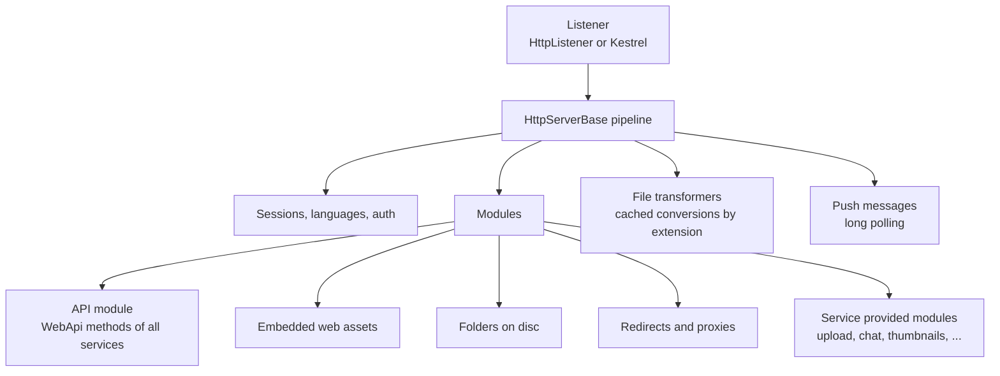
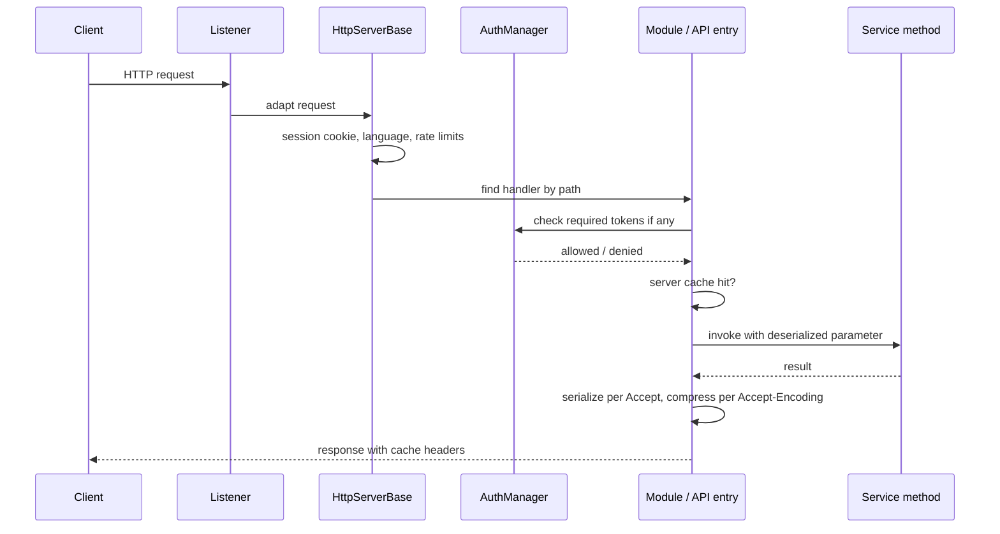

# SysWeaver.HttpServer

[⬆ SysWeaver overview](../README.md)

> The server-agnostic heart of SysWeaver's web layer: request pipeline, module routing, the Web API engine, static/embedded/disc file serving, sessions and authentication hooks, caching, compression, templates, push messages, translation and the built-in web application shell.

| | |
|---|---|
| **Layer** | HTTP |
| **Kind** | Library (abstract server + modules) |

## Purpose

Implement *everything* a SysWeaver web server does once, independent of the socket technology. Concrete listeners ([SysWeaver.NetHttpServer](../SysWeaver.NetHttpServer/README.md) on HttpListener, [SysWeaver.AspHttpServer](../SysWeaver.AspHttpServer/README.md) on Kestrel) only adapt requests into this pipeline; [SysWeaver.MicroService.HttpServer](../SysWeaver.MicroService.HttpServer/README.md) wires it into the service manager.

## How it fits into SysWeaver



### A request, end to end



## Key concepts

| Concept | Description |
|---|---|
| **Modules** | Units that claim URL paths and produce request handlers (`IHttpServerModule`, or `IHttpServerRawModule`, which bypasses the whole pipeline including auth). Any registered service implementing a module interface is attached automatically. |
| **Web API engine** | `ApiHttpServerModule` discovers `[WebApi]` methods on service instances and compiles fast invokers. URLs are composed from the API root (default `Api`), the class url (`[WebApiUrl]`, default the type name) and the method url/name, matched exactly and case sensitively. A method takes at most one input parameter (optionally followed by an `HttpServerRequest`). GET input is the whole query string (a single JSON value, XML, form data or compressed binary); POST input is the body, deserialized per `Content-Type`. Results are serialized according to the `Accept` header, falling back to the default serializer. |
| **Sessions and auth** | Cookie based sessions (`HttpSession`) and device ids; authentication delegated to an `AuthManager` when registered; login redirect (`AuthRedirect`, default `auth/Login.html?to={0}`) for protected pages; API keys via the `Authorization` header (Basic / Bearer) or the `x-api-key` / `x-goog-api-key` headers, with the resulting user stored in the cookie session. |
| **Auth tokens** | Per end point: `null` = open, `""` = any logged in user, `"-"` = explicitly open, otherwise comma separated tokens (any one suffices). For APIs: method `[WebApiAuth]` > type `[WebApiAuth]` > module default, with `IRunTimeWebApiAuth` overrides on top. |
| **Caching** | Client cache headers, server-side response caches (global, or per session), pre-compressed assets, ETags / 304. |
| **Templates** | Text files matching template patterns are served with `${Variable}` substitution and encoding modifiers; templates using dynamic variables bypass the global cache. |
| **Transformers** | Services can register file-extension based transformers (e.g. minify, convert, translate); `CachedTransformer` caches their results on disc. |
| **Push messages** | A long-poll channel through which the server pushes messages to a session, a user, all logged in users or all sessions. |
| **Translation** | With a translator registered, responses and web assets can be translated to the session language automatically. |

### Key types

| Type | Role |
|---|---|
| `HttpServerBase` / `HttpServerBaseParams` | The abstract pipeline (partial, split over `HttpServerBase*.cs`) and its configuration. |
| `HttpServerRequest` | The adapted request; `ManualHttpServerRequest` is an in-memory implementation. |
| `HttpSession` | Per client session state, with `MessageStreamRequest` / `MessageStreamResponse` for long polling. |
| `HttpServerPrefix`, `HttpServerHosts`, `HttpServerHostInfo` | Listen prefixes and host lookup. |
| `IHttpRequestHandler` | A resolved handler: auth, etag (304), cache key, then `Get` / `GetAsync`. |
| `ApiHttpServerModule`, `ApiHttpEntry`, `ApiIoParams` | The Web API engine, a compiled API method, and serializer negotiation. |
| `FileHttpServerModule`, `StaticDataHttpServerModule`, `RedirectHttpServerModule` | Disc folders, embedded / in-memory content, and redirects. |
| `FileProxy`, `ProxyTools`, `ProxyRequestCache` | Forwarding requests to other servers. |
| `CertificateBinder`, `IFirewallHandler` (`WindowsFirewallHandler`, `NoFirewallHandler`) | HTTPS certificate binding and firewall rules. |
| `NoUserLoggedInException` and related auth exceptions | Thrown by modules during handler resolution to start the login flow. |
| `IApiAuditService`, `IHttpTransformerService`, `IUserStorageService` | Contracts implemented by other services. |

### Built-in end points

| Kind | End points |
|---|---|
| Always handled by the server | `logout`, `auth/redirect`, `auth/logout_user`, `serverTime` |
| Used only when no module serves them | `login`, `basic_auth`, `icon.svg`, `icon_debug.svg`, `favicon.ico`, `apple-touch-icon.png`, `icon-180.png`, `icon-192.png`, `icon-512.png`, `logo.svg`, `logo_debug.svg`, `logo.png` (generated from the app name and colors), `app/app.css`, `app/app.js` (empty) |
| Default templates | `index.html`, `debug.html`, `app/manifest.json`, `app/Home.html`, `common/theme.css`, plus the patterns in `HttpServerBaseParams.Templates` |

### Template variables

- Only server defined variables are replaced; query string parameters are never used as template variables, and any other `${...}` text (e.g. JavaScript template literals) is kept as is.
- Dynamic (per request): `Server.UTC`, `Request.Prefix`, `Request.IP`, `Session.Lang` and, with a logged in user, `Session.User`, `Session.UserName`, `Session.Email`, `Session.Domain`, `Session.NickName`.
- Static: `Color.Background`, `Color.Color`, `Color.Acc1`, `Color.Acc2` and the `Key=Value` pairs of `HttpServerBaseParams.Variables`.
- Groups: `Env.*` (environment variables) and `EnvInfo.*` (e.g. `${EnvInfo.AppName}`); services can add their own groups.
- Values are inserted as is unless the template uses an encoding modifier; always use the one matching the context (`#` html text, `@` attributes, `$` inside JavaScript / JSON strings, `£` JavaScript values).

### Session lifetime

- Sessions with 3 or fewer requests and no strongly authenticated user expire 30 seconds after the last activity; other sessions expire after `SessionExtendLifetime` (default 15) minutes of inactivity.
- The session cookie is `HttpOnly`; `Secure` and `SameSite` are only added when `CorsCookies` is set.

## Key features

- Complete API hosting from annotated methods: serialization negotiation, compression negotiation, caching, rate limiting, auditing and runtime-configurable auth.
- Serving of embedded, on-disc and proxied content with redirects and pre-compressed variants.
- HTTPS certificate binding from certificate provider services; optional firewall rule management.
- A built-in single-page web application shell (home, welcome, menus, tables, themes) that other projects extend with their own pages.
- Extensive diagnostic tables (APIs, sessions, users, caches, MIME types, template variables, transformer caches).
- In-process API invocation (`IApiHttpServerEndPoint.InvokeAsync`) for AI tools and other services. It performs no auth, rate limit or cache checks, so callers must check `Auth` themselves.

## Limitations and considerations

- Certificate binding for the HttpListener based server uses Windows tooling; on other platforms use the Kestrel server for HTTPS.
- The listeners' default listen prefix is external HTTPS on port 443 (`HttpServerPrefix.DefaultExternalHttps`), which requires a certificate provider (and, on Windows with HttpListener, elevated rights). Always configure prefixes explicitly for development with an explicit host (e.g. `http://localhost:8080`) rather than relying on the `DefaultLocalHttp(s)` presets.
- HTTP range requests are not handled for cached content (marked as a TODO in the source), which matters for media streaming; suffix and multi-range requests are rejected.
- The client IP is always the direct peer address. `Forwarded` / `X-Forwarded-For` headers are neither read nor added by the built-in proxy components (TODO in source), and the proxies forward the client's headers, including cookies and authorization.
- Neither the server nor the API engine applies a request body size limit.
- Request path handling and template output have known open hardening issues; expose only folders meant to be public and don't rely on the server as the only protection for sensitive files.
- The build embeds pre-compressed assets produced by a Windows tool, so the project builds as-is only on Windows.

## Using it

Normally used indirectly through a server micro service. Modules with parameter-only constructors can be declared directly in the manifest and are picked up by the server:

```json
[
  { "Type": "SysWeaver.MicroService.NetHttpServerService, SysWeaver.MicroService.NetHttpServer",
    "Params": { "ListenOn": [ { "Prefix": "http://localhost:8080" } ] } },
  { "Type": "SysWeaver.Net.FileHttpServerModule, SysWeaver.HttpServer",
    "Params": { "Folders": [ { "DiscFolder": "D:/Site", "WebFolder": "site" } ] } },
  { "Type": "SysWeaver.MicroService.ApiHttpServerService, SysWeaver.MicroService.HttpServer" }
]
```

Calling an API: `GET /Api/<class url>/<method>?"value"` or POST the value as the body.

## Relationships

- **Project:** [`SysWeaver.HttpServer.csproj`](SysWeaver.HttpServer.csproj)
- **Builds on:** [SysWeaver.Auth.Core](../SysWeaver.Auth.Core/README.md), [SysWeaver.Common](../SysWeaver.Common/README.md), [SysWeaver.Compression](../SysWeaver.Compression/README.md), [SysWeaver.IsoData](../SysWeaver.IsoData/README.md), [SysWeaver.Media.Svg](../SysWeaver.Media.Svg/README.md), [SysWeaver.MicroServices](../SysWeaver.MicroServices/README.md), [SysWeaver.Serialization](../SysWeaver.Serialization/README.md), [SysWeaver.TableData](../SysWeaver.TableData/README.md)
- **Used by:** [SysWeaver.AI.OpenAI](../SysWeaver.AI.OpenAI/README.md), [SysWeaver.AspHttpServer](../SysWeaver.AspHttpServer/README.md), [SysWeaver.Chat](../SysWeaver.Chat/README.md), [SysWeaver.HttpServer.ExploreModule](../SysWeaver.HttpServer.ExploreModule/README.md), [SysWeaver.HttpServer.IconModule](../SysWeaver.HttpServer.IconModule/README.md), [SysWeaver.HttpServer.IsoDataModule](../SysWeaver.HttpServer.IsoDataModule/README.md), [SysWeaver.HttpTransformer.Compress](../SysWeaver.HttpTransformer.Compress/README.md), [SysWeaver.HttpTransformer.Image](../SysWeaver.HttpTransformer.Image/README.md), [SysWeaver.HttpTransformer.Svg](../SysWeaver.HttpTransformer.Svg/README.md), [SysWeaver.HttpTransformer.Translate](../SysWeaver.HttpTransformer.Translate/README.md), [SysWeaver.MicroService.AspHttpServer](../SysWeaver.MicroService.AspHttpServer/README.md), [SysWeaver.MicroService.Auth](../SysWeaver.MicroService.Auth/README.md), [SysWeaver.MicroService.Avatar](../SysWeaver.MicroService.Avatar/README.md), [SysWeaver.MicroService.CustomUserImage](../SysWeaver.MicroService.CustomUserImage/README.md), [SysWeaver.MicroService.Edit](../SysWeaver.MicroService.Edit/README.md), [SysWeaver.MicroService.FileUploader](../SysWeaver.MicroService.FileUploader/README.md), [SysWeaver.MicroService.HttpServer](../SysWeaver.MicroService.HttpServer/README.md), [SysWeaver.MicroService.Map](../SysWeaver.MicroService.Map/README.md), [SysWeaver.MicroService.MediaThumbnail](../SysWeaver.MicroService.MediaThumbnail/README.md), [SysWeaver.MicroService.NetHttpServer](../SysWeaver.MicroService.NetHttpServer/README.md), [SysWeaver.MicroService.Thumbnail](../SysWeaver.MicroService.Thumbnail/README.md), [SysWeaver.MicroService.Thumbnail.Web](../SysWeaver.MicroService.Thumbnail.Web/README.md), [SysWeaver.MicroService.UserManager](../SysWeaver.MicroService.UserManager/README.md), [SysWeaver.MicroService.UserStorage](../SysWeaver.MicroService.UserStorage/README.md), [SysWeaver.MicroServices.ServiceManager](../SysWeaver.MicroServices.ServiceManager/README.md), [SysWeaver.NetHttpServer](../SysWeaver.NetHttpServer/README.md), [SysWeaver.ReverseProxy](../SysWeaver.ReverseProxy/README.md), [SysWeaver.Security](../SysWeaver.Security/README.md)
