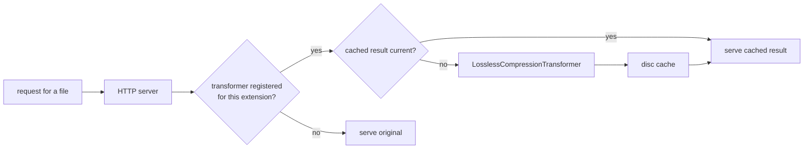

# SysWeaver.HttpTransformer.Compress

[⬆ SysWeaver overview](../README.md)

> File transformer for the SysWeaver web server that re-compresses served files losslessly (smaller files, identical content), caching the results on disc.

| | |
|---|---|
| **Layer** | HTTP (transformer plug-in) |
| **Kind** | Cached file transformer (manifest-creatable) |

## Purpose

Transformers let the web server deliver a *processed* version of a file without anyone preparing it in advance. This transformer re-compresses served files losslessly (smaller files, identical content). Results are cached on disc and rebuilt only when the source changes, so the cost is paid once per file version.

## How it fits into SysWeaver



The transformer is a `CachedTransformer`, which implements the server's transformer-service interface; the HTTP server service attaches it automatically when it is registered. Folders marked as dynamic in the file module bypass transformer chains.

## Limitations and considerations

- Content types where a better lossless encoding exists.
- The disc cache grows with the number of distinct files and versions; entries unused for a while are removed.
- This project is not included in the main solution file and must be added to your build explicitly.

## Using it

```json
{ "Type": "SysWeaver.HttpTransformer.LosslessCompressionTransformer, SysWeaver.HttpTransformer.Compress" }
```

## Relationships

- **Project:** [`SysWeaver.HttpTransformer.Compress.csproj`](SysWeaver.HttpTransformer.Compress.csproj)
- **Builds on:** [SysWeaver.HttpServer](../SysWeaver.HttpServer/README.md)
