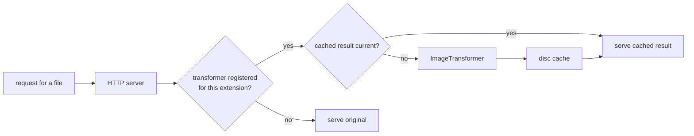

# SysWeaver.HttpTransformer.Image

[⬆ SysWeaver overview](../README.md)

> File transformer for the SysWeaver web server that converts and processes served images with ImageMagick, caching the results on disc.

| | |
|---|---|
| **Layer** | HTTP (transformer plug-in) |
| **Kind** | Cached file transformer (manifest-creatable) |

## Purpose

Transformers let the web server deliver a *processed* version of a file without anyone preparing it in advance. This transformer converts and processes served images with ImageMagick. Results are cached on disc and rebuilt only when the source changes, so the cost is paid once per file version.

## How it fits into SysWeaver



The transformer is a `CachedTransformer`, which implements the server's transformer-service interface; the HTTP server service attaches it automatically when it is registered. Folders marked as dynamic in the file module bypass transformer chains.

## Limitations and considerations

- Image formats supported by ImageMagick; processing is CPU and memory intensive.
- The disc cache grows with the number of distinct files and versions; entries unused for a while are removed.
- This project is not included in the main solution file and must be added to your build explicitly.

## Using it

```json
{ "Type": "SysWeaver.HttpTransformer.ImageTransformer, SysWeaver.HttpTransformer.Image" }
```

## Relationships

- **Project:** [`SysWeaver.HttpTransformer.Image.csproj`](SysWeaver.HttpTransformer.Image.csproj)
- **Builds on:** [SysWeaver.HttpServer](../SysWeaver.HttpServer/README.md)
