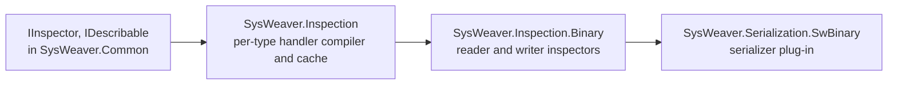

# SysWeaver.Inspection

[⬆ SysWeaver overview](../README.md)

> A reflection-driven "inspection" engine that compiles, per type, the code needed to walk an object's data in a versioned way — the foundation of SysWeaver's own binary serialization.

| | |
|---|---|
| **Layer** | Foundation (serialization infrastructure) |
| **Kind** | Library |

## Purpose

Instead of hand-writing read/write code, a type is *inspected*: fields are visited through an `IInspector`, which can be a reader, a writer or anything else (copy, compare, describe). This project builds and caches the per-type handlers (as compiled expression trees) that drive an inspector over an object.

## How it fits into SysWeaver

## Key features

- Handlers generated once per type and cached.
- Versioning support so data written by older type versions can be detected.
- Type name handling with configurable qualification.
- Efficient handling of unmanaged memory blocks.

## Limitations and considerations

- An internal building block; application code normally uses a serializer rather than inspectors directly.
- The binary format produced through it is SysWeaver specific (not interoperable with other ecosystems).

## Relationships

- **Project:** [`SysWeaver.Inspection.csproj`](SysWeaver.Inspection.csproj)
- **Builds on:** [SysWeaver.Common](../SysWeaver.Common/README.md)
- **Used by:** [SysWeaver.Inspection.Binary](../SysWeaver.Inspection.Binary/README.md)
