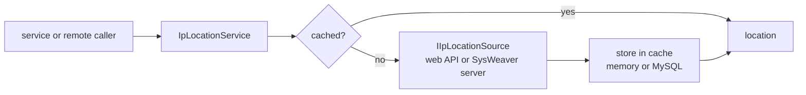

# SysWeaver.IpLocation

[⬆ SysWeaver overview](../README.md)

> IP geolocation as a service, with pluggable data sources (commercial web APIs or another SysWeaver server) and pluggable caches.

| | |
|---|---|
| **Layer** | Networking |
| **Kind** | Micro service + sources |

## Purpose

Answer "where is this IP address?" for features like localisation, analytics or fraud checks, while keeping costs and latency low through caching and letting one central server serve many.

## How it fits into SysWeaver



## Key features

- Multiple interchangeable sources, including chaining to another SysWeaver instance.
- In-memory cache built in; persistent cache via [SysWeaver.IpLocation.MySqlCache](../SysWeaver.IpLocation.MySqlCache/README.md).
- Retries with back-off.
- A service-token protected API so other servers can use this one as their source.

## Limitations and considerations

- Requires at least one source; commercial sources need API keys and are subject to quotas.
- Geolocation accuracy is inherently limited by the source data.

## Using it

Register a source (and optionally a cache) before the service:

```json
[
  { "Type": "SysWeaver.IpLocation.Sources.Ip2locationIoSource, SysWeaver.IpLocation", "Params": { } },
  { "Type": "SysWeaver.IpLocation.IpLocationService, SysWeaver.IpLocation" }
]
```

## Relationships

- **Project:** [`SysWeaver.IpLocation.csproj`](SysWeaver.IpLocation.csproj)
- **Builds on:** [SysWeaver.MicroServices.ServiceManager](../SysWeaver.MicroServices.ServiceManager/README.md)
- **Used by:** [SysWeaver.IpLocation.MySqlCache](../SysWeaver.IpLocation.MySqlCache/README.md)
