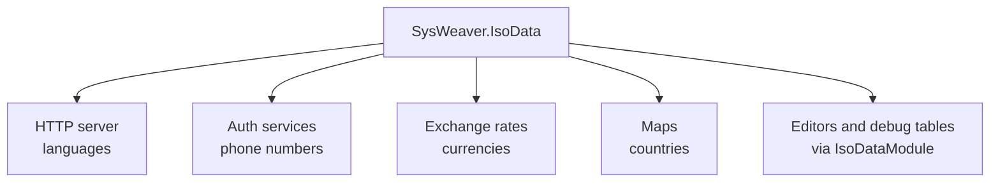

# SysWeaver.IsoData

[⬆ SysWeaver overview](../README.md)

> Built-in reference data for countries, currencies, languages and international phone prefixes, with currency-aware amount formatting.

| | |
|---|---|
| **Layer** | Foundation |
| **Kind** | Library (embedded data, no dependencies beyond Common) |

## Purpose

Gives every service the same authoritative lists of ISO countries, currencies, languages and phone prefixes without a database or web lookup. Many features rely on it: language negotiation in the HTTP server, phone/e-mail validation during login and sign-up, currency handling for exchange rates, maps, and editor drop-downs.

## How it fits into SysWeaver

## Key features

- Countries, currencies (including display formatting options), languages and phone prefixes as typed objects.
- Amount formatting helpers for displaying money correctly per currency.

## Limitations and considerations

- Static data compiled into the assembly; updates (new currencies, renamed countries) require a new build.

## Using it

Reference it and use the static lookups; to browse the data in the web UI add [SysWeaver.HttpServer.IsoDataModule](../SysWeaver.HttpServer.IsoDataModule/README.md).

## Relationships

- **Project:** [`SysWeaver.IsoData.csproj`](SysWeaver.IsoData.csproj)
- **Builds on:** [SysWeaver.Common](../SysWeaver.Common/README.md)
- **Used by:** [SysWeaver.AI.OpenAI](../SysWeaver.AI.OpenAI/README.md), [SysWeaver.ExchangeRate](../SysWeaver.ExchangeRate/README.md), [SysWeaver.HttpServer](../SysWeaver.HttpServer/README.md), [SysWeaver.HttpServer.IsoDataModule](../SysWeaver.HttpServer.IsoDataModule/README.md), [SysWeaver.Knowledge](../SysWeaver.Knowledge/README.md), [SysWeaver.LanguageIdentifier.FastText](../SysWeaver.LanguageIdentifier.FastText/README.md), [SysWeaver.Map](../SysWeaver.Map/README.md), [SysWeaver.MicroService.Auth](../SysWeaver.MicroService.Auth/README.md), [SysWeaver.MicroService.Translation](../SysWeaver.MicroService.Translation/README.md), [SysWeaver.MicroService.TranslationDbCache](../SysWeaver.MicroService.TranslationDbCache/README.md), [SysWeaver.Security](../SysWeaver.Security/README.md), [SysWeaver.TextMessage.Fake](../SysWeaver.TextMessage.Fake/README.md), [SysWeaver.Translation.Google](../SysWeaver.Translation.Google/README.md)
