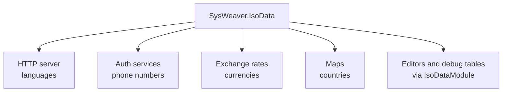

# SysWeaver.IsoData

[⬆ SysWeaver overview](../README.md)

> Built-in reference data for countries, currencies, languages and international phone prefixes, with currency-aware amount formatting.

| | |
|---|---|
| **Layer** | Foundation |
| **Kind** | Library (embedded data, no dependencies beyond Common) |

## Purpose

Gives every service the same authoritative lists of ISO countries, currencies, languages and phone prefixes without a database or web lookup. Many features rely on it: language validation and the default target-language list in the HTTP server, phone number validation during login and sign-up, currency handling for exchange rates, country data for maps and certificates, and editor drop-downs.

## How it fits into SysWeaver

## Key features

- `IsoCountry`: ISO 3166 Alpha 2 code, official/common name, main currency, population, land area and spoken languages. Lookup by code (`TryGet`) or fuzzy name/nick name/abbreviation (`TryGetName`, `Aliases`).
- `IsoCurrency`: ISO 4217 code and number, symbol, under units, separators and the "biggest" user country. Lookup by code or number (`TryGet`, `Validate`), formatting via `ToString(amount, CurrencyFormatOptions, ...)`, plus `CurrencyGlyphs`/`IsCurrencyGlyph` (all chars needed to render amounts, e.g. for font subsets).
- `CurrencyFormatOptions`: flags selecting ISO prefix/suffix or symbol style, thousands separator, forced rounding and automatic removal of zero under units.
- `IsoLanguage`: ISO 639-1/639-2 codes and names. Lookup by code (`TryGet`, also accepts regional codes like `en-GB`), by name (`TryGetName`), normalization (`Validate`), countries using a language (`GetCountries`) and `Common` (languages used in countries with 10M+ people in total).
- `PhonePrefix`: international calling codes (with region prefixes, dialing prefixes and valid local digit counts). `Identify` finds the code(s) of a partial number; `GetValidatedPhoneNumber` validates a full number and splits it into prefix and local number (throwing with a human readable message when invalid).
- `AmountExt`: `Amount.CurrencyInfo()` and `Amount.ToAmountString()` for displaying money correctly per currency.
- Data classes are annotated with table-data attributes so they render nicely (flags, links) in debug tables.

## Limitations and considerations

- Static data compiled into the assembly; updates (new currencies, renamed countries) require a new build.
- Data is curated rather than authoritative: population/area figures are approximate (around 2020, zero when unknown) and some currency minor units differ from ISO 4217 (e.g. JPY and KRW are formatted with two decimals).
- Validation methods differ in style: `IsoCurrency.Validate` returns null for unknown input, while `IsoLanguage.Validate` and `PhonePrefix.GetValidatedPhoneNumber` throw.
- `IsoLanguage.TryGet(out country, code)` matches the language part case sensitively (lower case expected), unlike `TryGet(code)`.

## Using it

Reference it and use the static lookups (e.g. `IsoCountry.TryGet("SE")`, `IsoCurrency.TryGet("USD").ToString(12.5M, CurrencyFormatOptions.Symbol)`, `PhonePrefix.GetValidatedPhoneNumber(...)`); to browse the data in the web UI add [SysWeaver.HttpServer.IsoDataModule](../SysWeaver.HttpServer.IsoDataModule/README.md).

## Relationships

- **Project:** [`SysWeaver.IsoData.csproj`](SysWeaver.IsoData.csproj)
- **Builds on:** [SysWeaver.Common](../SysWeaver.Common/README.md)
- **Used by:** [SysWeaver.AI](../SysWeaver.AI/README.md), [SysWeaver.AI.OpenAI](../SysWeaver.AI.OpenAI/README.md), [SysWeaver.ExchangeRate](../SysWeaver.ExchangeRate/README.md), [SysWeaver.HttpServer](../SysWeaver.HttpServer/README.md), [SysWeaver.HttpServer.IsoDataModule](../SysWeaver.HttpServer.IsoDataModule/README.md), [SysWeaver.Knowledge](../SysWeaver.Knowledge/README.md), [SysWeaver.LanguageIdentifier.FastText](../SysWeaver.LanguageIdentifier.FastText/README.md), [SysWeaver.Map](../SysWeaver.Map/README.md), [SysWeaver.MicroService.Auth](../SysWeaver.MicroService.Auth/README.md), [SysWeaver.MicroService.Translation](../SysWeaver.MicroService.Translation/README.md), [SysWeaver.MicroService.TranslationDbCache](../SysWeaver.MicroService.TranslationDbCache/README.md), [SysWeaver.Security](../SysWeaver.Security/README.md), [SysWeaver.TextMessage.Fake](../SysWeaver.TextMessage.Fake/README.md), [SysWeaver.Translation.Google](../SysWeaver.Translation.Google/README.md)
