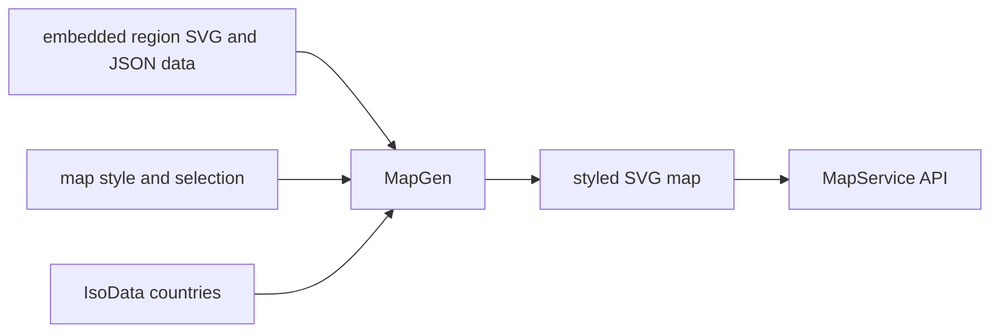

# SysWeaver.Map

[⬆ SysWeaver overview](../README.md)

> Generates styled SVG maps — world, continents, individual countries and country regions — from embedded map data.

| | |
|---|---|
| **Layer** | Media |
| **Kind** | Library with embedded data |

## Purpose

Visualise geographic data (e.g. users per country, highlighted regions) without an external map service.

## How it fits into SysWeaver

## Limitations and considerations

- Map data is a static snapshot; border changes require new data and a rebuild.
- Regional detail is limited to the regions present in the embedded data.

## Relationships

- **Project:** [`SysWeaver.Map.csproj`](SysWeaver.Map.csproj)
- **Builds on:** [SysWeaver.Common](../SysWeaver.Common/README.md), [SysWeaver.Compression](../SysWeaver.Compression/README.md), [SysWeaver.IsoData](../SysWeaver.IsoData/README.md), [SysWeaver.Media.Svg](../SysWeaver.Media.Svg/README.md), [SysWeaver.Serialization](../SysWeaver.Serialization/README.md)
- **Used by:** [SysWeaver.MicroService.Map](../SysWeaver.MicroService.Map/README.md)
