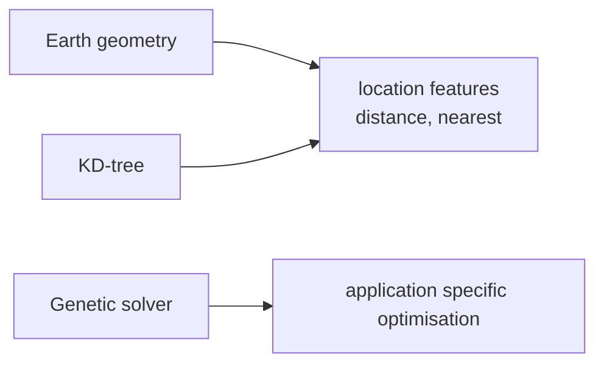

# SysWeaver.Math

[⬆ SysWeaver overview](../README.md)

> Algorithms that do not belong in the general toolbox: spatial search (KD-trees), earth geometry, bounded priority lists, rational numbers and a genetic-algorithm optimiser.

| | |
|---|---|
| **Layer** | Foundation |
| **Kind** | Library |

## Purpose

A home for reusable numeric and spatial algorithms used by location-aware and optimisation features, kept separate so that services that do not need them do not carry them.

## Key features

| Area | Capability |
|---|---|
| Spatial search | KD-tree for nearest-neighbour queries in N dimensions, hyper-rectangles, bounded (top-N) priority lists, array-backed binary tree navigation |
| Geometry | Conversion between latitude/longitude and cartesian coordinates, angular differences, great-circle distance on Earth |
| Optimisation | Genetic-algorithm solver: you implement the state operations (create, mutate, cross-over, score) and the solver searches for an optimum |
| Numbers | Helpers for big rational numbers |

## How it fits into SysWeaver



## Limitations and considerations

- Earth calculations use a simple geometric model, suitable for estimates rather than survey-grade geodesy.
- The genetic solver is generic: quality depends entirely on the operators you provide.

## Using it

```csharp
using SysWeaver.Geometry;
double km = Earth.DistanceKm(latA, lonA, latB, lonB);
```

## Relationships

- **Project:** [`SysWeaver.Math.csproj`](SysWeaver.Math.csproj)
- **Builds on:** [SysWeaver.Common](../SysWeaver.Common/README.md)
