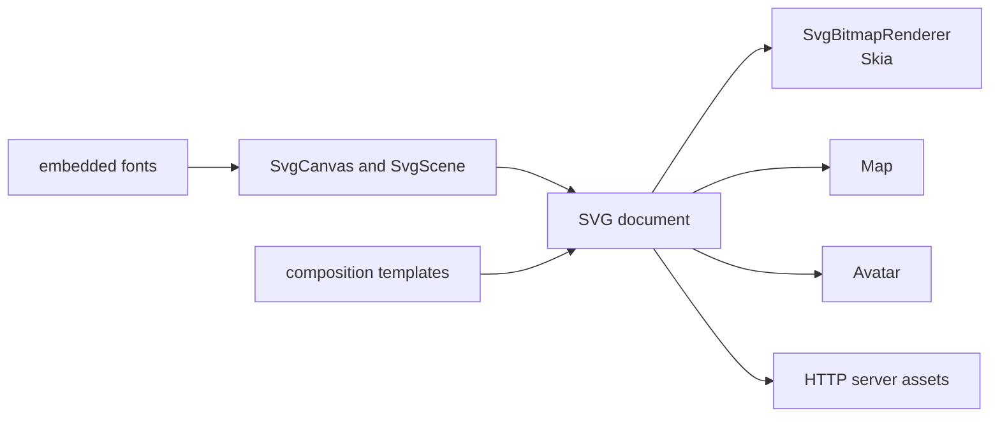

# SysWeaver.Media.Svg

[⬆ SysWeaver overview](../README.md)

> Programmatic SVG creation and rendering: a canvas/scene API with paths, shapes, gradients, shadows, 3D-style extrusion, text with embedded fonts, barcodes, composition templates, and SVG-to-bitmap rendering.

| | |
|---|---|
| **Layer** | Media |
| **Kind** | Library |

## Purpose

Generate vector graphics on the server — maps, avatars, QR/barcodes, badges, charts, templated images — and rasterise them when a bitmap is required.

## How it fits into SysWeaver

## Key features

- Vector drawing API with styling primitives and effects.
- Text layout using embedded font glyphs (text converted to paths where needed).
- Code 128, Code 39 and ITF-14 barcodes.
- Reusable composition templates with caching.
- Rendering to bitmaps via Skia.

## Limitations and considerations

- Only the embedded fonts are available for glyph-based text.
- Rendering fidelity follows the Skia-based SVG renderer's feature coverage.

## Relationships

- **Project:** [`SysWeaver.Media.Svg.csproj`](SysWeaver.Media.Svg.csproj)
- **Builds on:** [SysWeaver.Common](../SysWeaver.Common/README.md), [SysWeaver.Compression](../SysWeaver.Compression/README.md)
- **Used by:** [SysWeaver.HttpServer](../SysWeaver.HttpServer/README.md), [SysWeaver.Map](../SysWeaver.Map/README.md), [SysWeaver.MicroService.Avatar](../SysWeaver.MicroService.Avatar/README.md)
