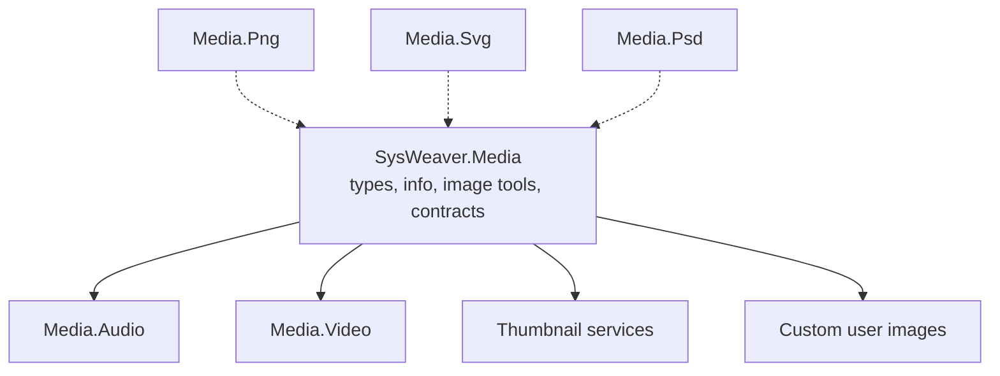

# SysWeaver.Media

[⬆ SysWeaver overview](../README.md)

> Media fundamentals shared by the media-related services: media type classification, media information, image processing helpers built on ImageMagick, and the contracts for screenshot and web-thumbnail services.

| | |
|---|---|
| **Layer** | Media |
| **Kind** | Library |

## Purpose

Provide the common media vocabulary so thumbnails, uploads, user images and the media viewer agree on file types, sizes and processing.

## How it fits into SysWeaver

## Key features

- Classification of files into media types.
- Image operations and colour-space handling via ImageMagick.
- Screenshot request/response contracts used by browser-based rendering.
- The web thumbnail service contract.

## Limitations and considerations

- ImageMagick is a large native dependency; image processing is CPU and memory intensive.

## Relationships

- **Project:** [`SysWeaver.Media.csproj`](SysWeaver.Media.csproj)
- **Builds on:** [SysWeaver.CommandLine](../SysWeaver.CommandLine/README.md), [SysWeaver.Storage](../SysWeaver.Storage/README.md)
- **Used by:** [SysWeaver.Media.Audio](../SysWeaver.Media.Audio/README.md), [SysWeaver.Media.Video](../SysWeaver.Media.Video/README.md), [SysWeaver.MicroService.CustomUserImage](../SysWeaver.MicroService.CustomUserImage/README.md), [SysWeaver.MicroService.MediaThumbnail](../SysWeaver.MicroService.MediaThumbnail/README.md), [SysWeaver.MicroService.Thumbnail](../SysWeaver.MicroService.Thumbnail/README.md), [SysWeaver.MicroService.Thumbnail.Web](../SysWeaver.MicroService.Thumbnail.Web/README.md)
