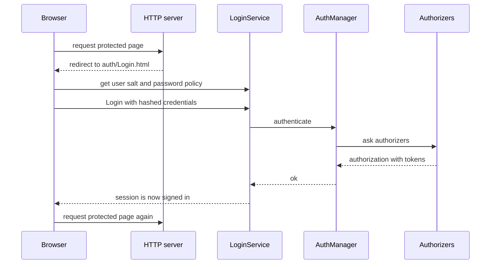

# SysWeaver.MicroService.Auth

[⬆ SysWeaver overview](../README.md)

> The login front-end of SysWeaver: creates and registers the `AuthManager`, serves the login pages, and provides login, one-time-token login and input validation APIs.

| | |
|---|---|
| **Layer** | Security (service integration) |
| **Kind** | Micro services |

## Purpose

Turn [SysWeaver.Auth.Core](../SysWeaver.Auth.Core/README.md) into a working login experience for a web application: a manifest entry adds the auth manager to the server, and the login service provides the APIs and pages the browser uses.

## How it fits into SysWeaver



## Key concepts

| Service | Role |
|---|---|
| **Auth manager service** | Collects authorizers (present and future), creates the `AuthManager`, and wires user image providers so the UI can show avatars. |
| **Login service** | Login, logout-related info, one-time token login (hand-offs between devices/apps), salts, password policies, e-mail and international phone number validation. |

## Key features

- Browser login pages shipped as embedded assets.
- Salted client-side hashing flow.
- One-time token login.
- Validation helpers backed by ISO phone data.

## Limitations and considerations

- **Ordering:** the HTTP server service reads the auth manager once at construction, so the auth manager service must be listed *before* the server service. Authorizers may be registered before or after it.
- Only one auth manager per process is intended.

## Using it

```json
[
  { "Type": "SysWeaver.Auth.SimpleAuthorizer, SysWeaver.Auth.Core", "Params": { "Users": [ "admin:…:Admin" ] } },
  { "Type": "SysWeaver.MicroService.AuthManagerService, SysWeaver.MicroService.Auth" },
  { "Type": "SysWeaver.MicroService.LoginService, SysWeaver.MicroService.Auth" },
  { "Type": "SysWeaver.MicroService.NetHttpServerService, SysWeaver.MicroService.NetHttpServer",
    "Params": { "ListenOn": [ { "Prefix": "http://localhost:8080" } ] } }
]
```

## Relationships

- **Project:** [`SysWeaver.MicroService.Auth.csproj`](SysWeaver.MicroService.Auth.csproj)
- **Builds on:** [SysWeaver.Auth.Core](../SysWeaver.Auth.Core/README.md), [SysWeaver.HttpServer](../SysWeaver.HttpServer/README.md), [SysWeaver.IsoData](../SysWeaver.IsoData/README.md), [SysWeaver.MicroServices.ServiceManager](../SysWeaver.MicroServices.ServiceManager/README.md)
- **Used by:** [SysWeaver.MicroService.CustomUserImage](../SysWeaver.MicroService.CustomUserImage/README.md), [SysWeaver.MicroService.PassKey](../SysWeaver.MicroService.PassKey/README.md), [SysWeaver.MicroService.UserManager](../SysWeaver.MicroService.UserManager/README.md)
