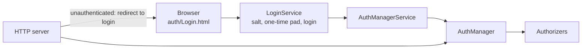

# SysWeaver.MicroService.Auth

[⬆ SysWeaver overview](../README.md)

> The login front-end of SysWeaver: creates and registers the `AuthManager`, serves the login pages and user images, and provides login, one-time-token login and input validation APIs.

| | |
|---|---|
| **Layer** | Security |
| **Kind** | Micro services |

## Purpose

Turn [SysWeaver.Auth.Core](../SysWeaver.Auth.Core/README.md) into a working login experience for a web application: one manifest entry adds the auth manager to the server, another adds the login APIs and pages the browser uses.

## How it fits into SysWeaver


```mermaid
flowchart LR
  B["Browser<br/>auth/Login.html"] --> L["LoginService<br/>salt, one-time pad, login"]
  L --> AMS["AuthManagerService"]
  AMS --> AM["AuthManager"]
  AM --> Z["Authorizers"]
  S["HTTP server"] -->|"unauthenticated: redirect to login"| B
  S --> AM
```

`AuthManagerService` collects all authorizers in the service manager (including ones added later), creates the `AuthManager` and registers it so the HTTP server can use it. `LoginService` hands out a salt and a one-time pad, then validates the hashed credentials and signs the session in.

## Key features

- Browser login and logout pages, plus the *User* menu with *Sign in* (`LoginService`) and *Sign out* (`AuthManagerService`, order 1000: always the last item), shipped as embedded assets
- Salted client-side hashing with a one-time pad: `GetUserSalt` answers `[salt, pad]` (legacy authorizers) or `[salt, pad, "s1", scramSalt, iterations, binding]` (SCRAM, see `SysWeaver.Auth.Core/Scram.cs`); `Login` takes `{OneTimePad, Hash}` (legacy) or `{OneTimePad, ClientNonce, ClientProof}` (SCRAM). Neither can be replayed, and with SCRAM the stored verifier can't be used to sign in. `auth/Auth.js` computes PBKDF2 with `crypto.subtle`, with a pure JS fallback on plain HTTP
- One-time token login (`TokenAuth`), typically used to hand a session over from another page or app
- Current user information (`GetUser`) and per-user password policies for the UI
- E-mail address and international phone number validation APIs (backed by ISO phone prefix data)
- User images under `auth/UserImages/[Guid]/[Size]`, served by any registered `IUserImageHandler` (for example [CustomUserImage](../SysWeaver.MicroService.CustomUserImage/README.md)), falling back to an `IDefaultUserImageHandler` (for example [Avatar](../SysWeaver.MicroService.Avatar/README.md)) or a generated SVG
- Login calls are audited (only the user name of the one-time pad is logged, never the hash or proof)
- `GetUserSalt`, `Login` and `GetPasswordPolicy` (and the passkey sign in calls of [SysWeaver.MicroService.PassKey](../SysWeaver.MicroService.PassKey/README.md)) are rate limited per process (permissive) and per client address (`[WebApiIpRateLimit]`, conservative; `GetPasswordPolicy` allows a bit more per address, the sign in pages ask whenever the user name changes); being audited, `Login` also counts for the intrusion detection of [SysWeaver.HttpServer](../SysWeaver.HttpServer/README.md). There is no Basic fallback in the sign in page: header auth is for API keys (see `SimpleAuthorizer` in [SysWeaver.Auth.Core](../SysWeaver.Auth.Core/README.md))
- Forced password change: an authorizer throws `PasswordChangeRequiredException` (only after the password was verified, ex: `UserManagerService.ForcePasswordReset`); `Login` then creates no session and answers `AuthInfo.PasswordChangeRequired` with `SentTo` (where the link and code to choose a new password were sent), the sign in page shows that

## Key components

- [`AuthManagerService`](AuthManagerService.cs) — creates the `AuthManager`, tracks authorizers, serves user images and validation APIs
- [`LoginService`](LoginService.cs) — salt, password policy and login APIs used by the login page
- [`AuthManagerServiceParams`](AuthManagerServiceParams.cs) — service parameters (`SiteName`, `AllowEmailIps`, `TransparentUserImage`, plus the `AuthManagerParams` of SysWeaver.Auth.Core)
- [`AuthInfo`](AuthInfo.cs) — what the browser gets back about the signed in user (also `AccountDisabled`, `PasswordChangeRequired`)

## Using it

```json
[
  { "Type": "SysWeaver.Auth.SimpleAuthorizer, SysWeaver.Auth.Core", "Params": { "Users": [ "admin:…:Admin" ] } },
  { "Type": "SysWeaver.MicroService.AuthManagerService, SysWeaver.MicroService.Auth" },
  { "Type": "SysWeaver.MicroService.LoginService, SysWeaver.MicroService.Auth" },
  { "Type": "SysWeaver.MicroService.NetHttpServerService, SysWeaver.MicroService.NetHttpServer",
    "Params": { "ListenOn": [ { "Prefix": "http://localhost:8080" } ] } }
]
```

## Limitations and considerations

- **Ordering:** the HTTP server service reads the auth manager once at construction, so the auth manager service must be listed *before* the server service; authorizers may be registered before or after it
- At least one authorizer is required, and only one auth manager per process is intended
- `LoginService` requires `AuthManagerService`

## Folder layout

| Folder | Content |
|---|---|
| [`srcWeb/`](srcWeb/README.md) | Embedded web assets: login / logout pages, `Auth.js`, `AuthUi.js`, icons |

## Relationships

- **Project:** [`SysWeaver.MicroService.Auth.csproj`](SysWeaver.MicroService.Auth.csproj)
- **Builds on:** [SysWeaver.Auth.Core](../SysWeaver.Auth.Core/README.md), [SysWeaver.HttpServer](../SysWeaver.HttpServer/README.md), [SysWeaver.IsoData](../SysWeaver.IsoData/README.md), [SysWeaver.MicroServices.ServiceManager](../SysWeaver.MicroServices.ServiceManager/README.md)
- **Used by:** [SysWeaver.MicroService.CustomUserImage](../SysWeaver.MicroService.CustomUserImage/README.md), [SysWeaver.MicroService.PassKey](../SysWeaver.MicroService.PassKey/README.md), [SysWeaver.MicroService.UserManager](../SysWeaver.MicroService.UserManager/README.md), and the services [ExchangeRateService](https://github.com/dosh1974/SysWeaver.Services/blob/main/ExchangeRateService/README.md), [FakeEmailService](https://github.com/dosh1974/SysWeaver.Services/blob/main/FakeEmailService/README.md), [FakeTextService](https://github.com/dosh1974/SysWeaver.Services/blob/main/FakeTextService/README.md), [IpLocationService](https://github.com/dosh1974/SysWeaver.Services/blob/main/IpLocationService/README.md), [ReverseProxyClient](https://github.com/dosh1974/SysWeaver.Services/blob/main/ReverseProxyClient/README.md), [ReverseProxyServer](https://github.com/dosh1974/SysWeaver.Services/blob/main/ReverseProxyServer/README.md), [SwLanCertManager](https://github.com/dosh1974/SysWeaver.Services/blob/main/SwLanCertManager/README.md), [SwServerManager](https://github.com/dosh1974/SysWeaver.Services/blob/main/SwServerManager/README.md), [TranslationService](https://github.com/dosh1974/SysWeaver.Services/blob/main/TranslationService/README.md), [WebServerService](https://github.com/dosh1974/SysWeaver.Services/blob/main/WebServerService/README.md)
