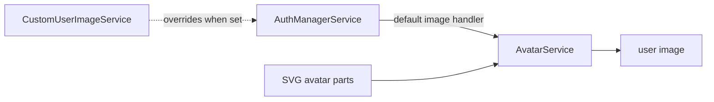

# SysWeaver.MicroService.Avatar

[⬆ SysWeaver overview](../README.md)

> Generated default profile pictures, composed from a library of SVG avatar parts.

| | |
|---|---|
| **Layer** | Users |
| **Kind** | Micro service (default user image provider) |

## Purpose

Every user gets a recognisable picture even without uploading one. The auth manager service picks up this provider as the default user image handler.

## How it fits into SysWeaver

## Limitations and considerations

- Generated pictures are decorative; for real photos add [SysWeaver.MicroService.CustomUserImage](../SysWeaver.MicroService.CustomUserImage/README.md).

## Relationships

- **Project:** [`SysWeaver.MicroService.Avatar.csproj`](SysWeaver.MicroService.Avatar.csproj)
- **Builds on:** [SysWeaver.HttpServer](../SysWeaver.HttpServer/README.md), [SysWeaver.Media.Svg](../SysWeaver.Media.Svg/README.md)
