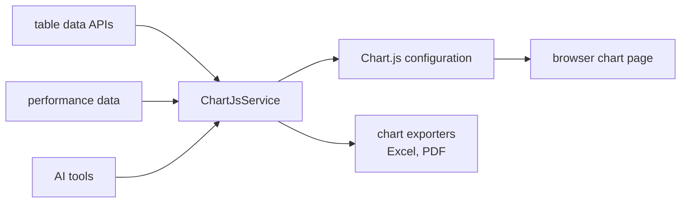

# SysWeaver.MicroService.ChartJs

[⬆ SysWeaver overview](../README.md)

> Charts for SysWeaver using Chart.js: a typed chart configuration model, automatic charts from table data, performance charts, chart export and AI tool integration.

| | |
|---|---|
| **Layer** | Visualisation |
| **Kind** | Micro service |

## Purpose

Let services return charts as data — and let users chart any table — with rendering done in the browser by Chart.js.

## How it fits into SysWeaver

## Key features

- Server-side model of Chart.js configuration (datasets, scales, legends, tooltips, plugins).
- Charting of table-data APIs whose columns are chartable.
- Chart exporters registered by other services.
- Exposed as AI tools so assistants can produce charts in chat.

## Limitations and considerations

- Rendering happens client-side; charts are only as capable as the bundled Chart.js version.

## Relationships

- **Project:** [`SysWeaver.MicroService.ChartJs.csproj`](SysWeaver.MicroService.ChartJs.csproj)
- **Builds on:** [SysWeaver.Serialization.NewtonsoftJson](../Serialization/SysWeaver.Serialization.NewtonsoftJson/README.md), [SysWeaver.MicroServices.ServiceManager](../SysWeaver.MicroServices.ServiceManager/README.md)
- **Used by:** [SysWeaver.MicroService.ChartJs.Excel](../SysWeaver.MicroService.ChartJs.Excel/README.md), [SysWeaver.MicroService.ServerManager](../SysWeaver.MicroService.ServerManager/README.md)
