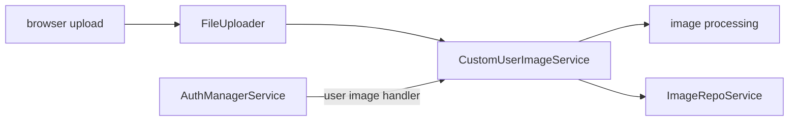

# SysWeaver.MicroService.CustomUserImage

[⬆ SysWeaver overview](../README.md)

> User-uploaded profile pictures, processed into standard sizes and stored in an image repository.

| | |
|---|---|
| **Layer** | Users |
| **Kind** | Micro services |

## Purpose

Let users upload their own picture, which then replaces the generated avatar wherever the UI shows the user.

## How it fits into SysWeaver

## Limitations and considerations

- Requires the file uploader and media services; image processing costs CPU on upload.

## Relationships

- **Project:** [`SysWeaver.MicroService.CustomUserImage.csproj`](SysWeaver.MicroService.CustomUserImage.csproj)
- **Builds on:** [SysWeaver.HttpServer](../SysWeaver.HttpServer/README.md), [SysWeaver.Media](../SysWeaver.Media/README.md), [SysWeaver.MicroService.Auth](../SysWeaver.MicroService.Auth/README.md), [SysWeaver.MicroService.FileUploader](../SysWeaver.MicroService.FileUploader/README.md)
